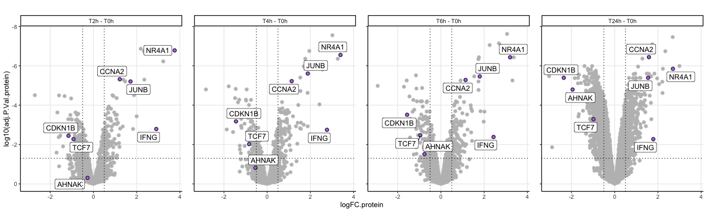

Differential expression analysis proteomics
================
Kaspar Bresser

- [Import and tidy data](#import-and-tidy-data)
- [Test differences](#test-differences)
- [Plotting](#plotting)
- [Pathway analysis](#pathway-analysis)
  - [top bottom 10](#top-bottom-10)

Pre-processing of the MS data from the activation time-course.

First load packages

``` r
library(tidyverse)
library(broom) 
library(limma)
library(ggrepel)
library(readxl)
library(circlize)
library(ComplexHeatmap)
library(cluster)
library(lemon)
#library(clusterProfiler)
library(org.Hs.eg.db)
library(msigdbr)
library(fgsea)
library(gghighlight)
library(ggpubr)
library(ggrastr)
library(ggridges)
library(corrplot)
```

### Import and tidy data

Selecting the proteins that have a “proteotypic” count of more than 1.

``` r
read_tsv("Data/20240625_Timecourse_report.pr_matrix.tsv") %>% 
  dplyr::select(Protein.Group, Genes, Proteotypic, Precursor.Id, matches('\\.d$')) %>%
    gather('Sample', 'Intensity', matches('\\.d$')) %>%
    filter(!is.na(Intensity)) %>%
    filter(Proteotypic == T) %>% #<< cuts a lot of proteins
    group_by(Protein.Group) %>%
    distinct(Precursor.Id, .keep_all = T) %>%
    summarise(count = n()) %>%
    filter(count > 1)  %>%
    dplyr::pull(Protein.Group) -> select.prots

str(select.prots)
```

    ##  chr [1:6777] "A0A075B6T6" "A0A0B4J245" "A0A0U1RRE5" "A0AVK6" "A0AVT1" ...

import proteomic quantification data

``` r
dat <- read_tsv("Data/20240625_Timecourse_report.pg_matrix.tsv")

dat
```

    ## # A tibble: 8,037 × 19
    ##    Protein.Group     Protein.Ids      Protein.Names Genes First.Protein.Descri…¹
    ##    <chr>             <chr>            <chr>         <chr> <chr>                 
    ##  1 A0A024RBG1;Q9NZJ9 Q9NZJ9;Q8NFP7;Q… NUD4B_HUMAN;… NUDT… Diphosphoinositol pol…
    ##  2 A0A075B6T6        A0A075B6T6       TVAL2_HUMAN   TRAV… T cell receptor alpha…
    ##  3 A0A0B4J241        A0A0B4J241       TVAM1_HUMAN   TRAV… T cell receptor alpha…
    ##  4 A0A0B4J245        A0A0B4J245       TVAL1_HUMAN   TRAV… T cell receptor alpha…
    ##  5 A0A0B4J279        A0A0B4J279       TVA21_HUMAN   TRAV… T cell receptor alpha…
    ##  6 A0A0B4J2D5;P0DPI2 P0DPI2;A0A0B4J2… GAL3A_HUMAN;… GATD… Glutamine amidotransf…
    ##  7 A0A0B4J2E0;P01733 P01733;A0A0B4J2… TVBL3_HUMAN;… TRBV… T cell receptor beta …
    ##  8 A0A0B4J2F0        A0A0B4J2F0       PIOS1_HUMAN   PIGB… Protein PIGBOS1       
    ##  9 A0A0B4J2F2;P57059 A0A0B4J2F2;P570… SIK1B_HUMAN;… SIK1… Probable serine/threo…
    ## 10 A0A0U1RRE5        A0A0U1RRE5       NBDY_HUMAN    NBDY  Negative regulator of…
    ## # ℹ 8,027 more rows
    ## # ℹ abbreviated name: ¹​First.Protein.Description
    ## # ℹ 14 more variables:
    ## #   `C:\\Users\\massspecuser\\Desktop\\20240622_Carmen\\RES00360_Anouk_Jurgens\\20240620_AnoukJurgens_Timecourse\\1_0h_Donor1_2_S2-A4_1_9368.d` <dbl>,
    ## #   `C:\\Users\\massspecuser\\Desktop\\20240622_Carmen\\RES00360_Anouk_Jurgens\\20240620_AnoukJurgens_Timecourse\\2_2h_Donor1_S2-B5_1_9369.d` <dbl>,
    ## #   `C:\\Users\\massspecuser\\Desktop\\20240622_Carmen\\RES00360_Anouk_Jurgens\\20240620_AnoukJurgens_Timecourse\\3_4h_Donor1_S2-C5_1_9370.d` <dbl>,
    ## #   `C:\\Users\\massspecuser\\Desktop\\20240622_Carmen\\RES00360_Anouk_Jurgens\\20240620_AnoukJurgens_Timecourse\\4_6h_Donor1_S2-D5_1_9371.d` <dbl>, …

Tidy up a bit, and convert abundances to log2

``` r
dat %>% 
  filter(Protein.Group %in% select.prots) %>% 
  pivot_longer(contains("Users"), names_to = "sample", values_to = "LFQ") %>% 
  mutate(sample = str_extract(sample, "\\d+_\\d+h_.+onor\\d+")) %>% 
  separate(sample, into = c("sample.nr", "timepoint",  "donor")) %>% 
  mutate(donor = str_to_lower(donor)) %>% 
  mutate(LFQ = log2(LFQ)) %>% 
  mutate(timepoint = paste0("T", timepoint)) %>%   
  mutate(timepoint = case_when(timepoint == "T16h" ~ "T24h", TRUE ~ timepoint)) %>% 
  mutate(timepoint = factor(timepoint, levels = c("T0h", "T2h", "T4h", "T6h", "T24h"))) %>% 
  dplyr::rename(gene.name = Genes) %>% 
  dplyr::select(-c(Protein.Group, Protein.Names, First.Protein.Description)) -> dat

dat
```

    ## # A tibble: 94,878 × 6
    ##    Protein.Ids gene.name sample.nr timepoint donor    LFQ
    ##    <chr>       <chr>     <chr>     <fct>     <chr>  <dbl>
    ##  1 A0A075B6T6  TRAV12-2  1         T0h       donor1  11.7
    ##  2 A0A075B6T6  TRAV12-2  2         T2h       donor1  11.3
    ##  3 A0A075B6T6  TRAV12-2  3         T4h       donor1  11.2
    ##  4 A0A075B6T6  TRAV12-2  4         T6h       donor1  10.7
    ##  5 A0A075B6T6  TRAV12-2  5         T24h      donor1  11.1
    ##  6 A0A075B6T6  TRAV12-2  6         T0h       donor2  11.2
    ##  7 A0A075B6T6  TRAV12-2  7         T2h       donor2  11.5
    ##  8 A0A075B6T6  TRAV12-2  8         T4h       donor2  11.4
    ##  9 A0A075B6T6  TRAV12-2  9         T6h       donor2  11.4
    ## 10 A0A075B6T6  TRAV12-2  10        T24h      donor2  11.3
    ## # ℹ 94,868 more rows

Output cleaned up table

``` r
write_tsv(dat, "Output/proteomic_data_clean.tsv")
```

### Test differences

will test for differences using limma

first set up a design matrix, we want to compare between time-points

``` r
dat %>% 
#  mutate(sample.nr = paste0("sample.", sample.nr)) %>% 
  dplyr::select(sample.nr, timepoint, donor) %>% 
  distinct() -> pheno

design <- model.matrix(~0+ pheno$timepoint)
colnames(design) <- unique(pheno$timepoint)

design
```

    ##    T0h T2h T4h T6h T24h
    ## 1    1   0   0   0    0
    ## 2    0   1   0   0    0
    ## 3    0   0   1   0    0
    ## 4    0   0   0   1    0
    ## 5    0   0   0   0    1
    ## 6    1   0   0   0    0
    ## 7    0   1   0   0    0
    ## 8    0   0   1   0    0
    ## 9    0   0   0   1    0
    ## 10   0   0   0   0    1
    ## 11   0   1   0   0    0
    ## 12   0   0   1   0    0
    ## 13   0   0   0   1    0
    ## 14   0   0   0   0    1
    ## attr(,"assign")
    ## [1] 1 1 1 1 1
    ## attr(,"contrasts")
    ## attr(,"contrasts")$`pheno$timepoint`
    ## [1] "contr.treatment"

Get the LFQ values for all samples and fit linear model.

lmFit needs samples to be columns, and genes to be row names.

``` r
dat %>% 
  pivot_wider(names_from = c(sample.nr, timepoint, donor), values_from = LFQ) %>% 
  na.omit() %>% 
  distinct(gene.name, .keep_all = T) %>% 
  column_to_rownames("gene.name") %>% 
  dplyr::select(contains("donor")) %>% 
  lmFit(., design) -> lm.fit

design
```

    ##    T0h T2h T4h T6h T24h
    ## 1    1   0   0   0    0
    ## 2    0   1   0   0    0
    ## 3    0   0   1   0    0
    ## 4    0   0   0   1    0
    ## 5    0   0   0   0    1
    ## 6    1   0   0   0    0
    ## 7    0   1   0   0    0
    ## 8    0   0   1   0    0
    ## 9    0   0   0   1    0
    ## 10   0   0   0   0    1
    ## 11   0   1   0   0    0
    ## 12   0   0   1   0    0
    ## 13   0   0   0   1    0
    ## 14   0   0   0   0    1
    ## attr(,"assign")
    ## [1] 1 1 1 1 1
    ## attr(,"contrasts")
    ## attr(,"contrasts")$`pheno$timepoint`
    ## [1] "contr.treatment"

Make a contrast matrix for the comparisons of interest, will compare
everything against 0h and everything against 24h.

``` r
contrast.matrix <- makeContrasts(
  
  T2h - T0h,
  T4h - T0h,
  T6h - T0h,
  T24h - T0h,
  T2h - T24h,
  T4h - T24h,
  T6h - T24h,

  
  levels = colnames(design))

contrast.matrix
```

    ##       Contrasts
    ## Levels T2h - T0h T4h - T0h T6h - T0h T24h - T0h T2h - T24h T4h - T24h
    ##   T0h         -1        -1        -1         -1          0          0
    ##   T2h          1         0         0          0          1          0
    ##   T4h          0         1         0          0          0          1
    ##   T6h          0         0         1          0          0          0
    ##   T24h         0         0         0          1         -1         -1
    ##       Contrasts
    ## Levels T6h - T24h
    ##   T0h           0
    ##   T2h           0
    ##   T4h           0
    ##   T6h           1
    ##   T24h         -1

Compute differential expression

``` r
# fit contrasts
lm.fit2 <- contrasts.fit(lm.fit, contrast.matrix)
# ebayes
lm.fit2 <- eBayes(lm.fit2)
```

Check number of significant DE proteins

``` r
results <- decideTests(lm.fit2, p.value = 0.05, adjust.method = 'BH', lfc = 0.5)
summary(results)
```

    ##        T2h - T0h T4h - T0h T6h - T0h T24h - T0h T2h - T24h T4h - T24h
    ## Down          96        82       134        666        522        227
    ## NotSig      6321      6325      6255       5406       5452       5828
    ## Up            93       103       121        438        536        455
    ##        T6h - T24h
    ## Down          158
    ## NotSig       5982
    ## Up            370

Set function to extract all results

``` r
get_DE <- function(fit, comp){
  
  topTable(fit, number = Inf, coef = comp, sort.by = 'none') %>% 
    mutate(comparison = comp)
}
```

Extract all results

``` r
comparisons <- colnames(lm.fit2$coefficients)

comparisons %>% 
  map( ~get_DE(lm.fit2, .)) %>% 
  map(rownames_to_column, "gene.name") %>% 
  list_rbind() %>% 
  as_tibble() %>% 
  dplyr::rename(logFC.protein = logFC, adj.P.Val.protein = adj.P.Val) -> all.DE.protein

all.DE.protein
```

    ## # A tibble: 45,570 × 8
    ##    gene.name logFC.protein AveExpr       t P.Value adj.P.Val.protein     B
    ##    <chr>             <dbl>   <dbl>   <dbl>   <dbl>             <dbl> <dbl>
    ##  1 TRAV12-2        -0.148     11.2 -0.691  0.503               0.771 -6.59
    ##  2 NBDY            -0.753     10.7 -3.08   0.00960             0.122 -3.12
    ##  3 UBA6            -0.125     14.8 -1.82   0.0934              0.385 -5.27
    ##  4 ESYT2            0.0606    15.5  0.738  0.475               0.755 -6.56
    ##  5 MED19            0.203     12.1  1.49   0.161               0.478 -5.75
    ##  6 UHRF1BP1L        0.136     11.6  0.829  0.423               0.719 -6.48
    ##  7 TMEM223          0.0115    12.2  0.0941 0.927               0.973 -6.84
    ##  8 ARHGAP10         0.378     10.2  1.54   0.150               0.467 -5.69
    ##  9 ILVBL            0.195     15.0  2.79   0.0163              0.166 -3.64
    ## 10 ZC3H12D         -0.651     10.3 -2.42   0.0325              0.236 -4.30
    ## # ℹ 45,560 more rows
    ## # ℹ 1 more variable: comparison <chr>

save DE genes

``` r
write_tsv(all.DE.protein, "Output/proteomic_DE_all.tsv")
```

### Plotting

Plot example proteins

``` r
genes <- c( "AHNAK", "CDKN1B", "TCF7",
            "NR4A1", "IFNG", "JUNB", "CCNA2")

all.DE.protein %>% 
  filter(str_detect(comparison, "0h$")) %>% 
  mutate(comparison = fct_relevel(comparison, "T2h - T0h", "T4h - T0h", "T6h - T0h")) %>% 
ggplot(aes( x = logFC.protein, y = log10(adj.P.Val.protein), label = gene.name) )+ 
  rasterise(geom_point(shape = 21, fill = "#b57bfd", size = 2), dpi = 300, scale = 1.0)+
  facet_rep_wrap(~comparison, nrow = 1)+
  scale_y_reverse()+
  labs(title = "")+
  gghighlight(gene.name %in% genes, label_key = gene.name, 
              unhighlighted_params = list(shape =21, fill = "grey"), use_direct_label = T)+
  theme_classic()+
  theme(legend.position = "none", plot.title = element_text(hjust = 0.5),
        panel.grid.major = element_line())+
  #  xlim(-0.4,0.6)+
  geom_vline(xintercept = c(0.5, -0.5), linetype ="dotted")+
  geom_hline(yintercept = log10(0.05), linetype ="dotted")
```



``` r
ggsave("Figs/DE_protein/Protein_volcanos.pdf", width = 15, height = 4)
```

Function to plot volcano’s with counts

``` r
plt_volcanos <- function(dat, title){
  
  dat %>% 
    group_by(col) %>%
    count(adj.P.Val.protein < 0.05) %>% 
    pull(n) %>% 
    as.character() -> cnts
  
  ggplot(dat, aes( x = logFC.protein, y = log10(adj.P.Val.protein)))+ 
  rasterise(geom_point(aes(fill = col), shape = 21, size = 2), dpi = 300, scale = 1.0)+
  scale_fill_manual(values = c( "#4796C5","#C23A3B"))+
  scale_y_reverse()+
  labs(title = "")+
  gghighlight(adj.P.Val.protein < 0.05 & abs(logFC.protein) > 0.5,  
              unhighlighted_params = list(shape = 21, fill = "grey"),  use_group_by = F)+
  theme_classic()+
  theme(legend.position = "none", plot.title = element_text(hjust = 0.5),
        panel.grid.major = element_line())+
    xlim(-4,4)+
    ylim(0, -8)+
  geom_vline(xintercept = c(0.5, -0.5), linetype ="dotted")+
  geom_hline(yintercept = log10(0.05), linetype ="dotted")+
  annotate(geom = "text", label = cnts[2], x=-3.5, y=-8, color = "#4796C5", fontface =2)+
  annotate(geom = "text", label =cnts[4], x=3.5, y=-8, color = "#C23A3B", fontface =2)+
  ggtitle(title)

}
```

Plot volcano’s with counts

``` r
all.DE.protein %>% 
  filter(str_detect(comparison, "0h$")) %>% 
  mutate(comparison = fct_relevel(comparison, "T2h - T0h", "T4h - T0h", "T6h - T0h"),
         comparison = fct_recode(comparison, T2h = "T2h - T0h", T4h = "T4h - T0h", T6h = "T6h - T0h", T24h = "T24h - T0h"),
         col = case_when(logFC.protein > 0 ~ "up", TRUE ~ "down")) -> for.plot


for.plot %>% 
  nest(data = -comparison) %>% 
  mutate(plots = map2(data, comparison, plt_volcanos)) %>% 
  pull(plots) %>% 
  ggpubr::ggarrange(plotlist = . , ncol = 4)
```


``` r
ggsave("Figs/DE_protein/protein_volcanos_DE.pdf", width = 12, height = 4)
```

## Pathway analysis

glance at pathway collections

``` r
msigdbr::msigdbr_collections()
```

    ##    gs_collection gs_subcollection                   gs_collection_name
    ## 1             C1                                            Positional
    ## 2             C2              CGP   Chemical and Genetic Perturbations
    ## 3             C2               CP                   Canonical Pathways
    ## 4             C2      CP:BIOCARTA                    BioCarta Pathways
    ## 5             C2   CP:KEGG_LEGACY                 KEGG Legacy Pathways
    ## 6             C2  CP:KEGG_MEDICUS                KEGG Medicus Pathways
    ## 7             C2           CP:PID                         PID Pathways
    ## 8             C2      CP:REACTOME                    Reactome Pathways
    ## 9             C2  CP:WIKIPATHWAYS                         WikiPathways
    ## 10            C3        MIR:MIRDB                                miRDB
    ## 11            C3   MIR:MIR_LEGACY                           MIR_Legacy
    ## 12            C3         TFT:GTRD                                 GTRD
    ## 13            C3   TFT:TFT_LEGACY                           TFT_Legacy
    ## 14            C4              3CA Curated Cancer Cell Atlas gene sets 
    ## 15            C4              CGN            Cancer Gene Neighborhoods
    ## 16            C4               CM                       Cancer Modules
    ## 17            C5            GO:BP                GO Biological Process
    ## 18            C5            GO:CC                GO Cellular Component
    ## 19            C5            GO:MF                GO Molecular Function
    ## 20            C5              HPO             Human Phenotype Ontology
    ## 21            C6                                   Oncogenic Signature
    ## 22            C7      IMMUNESIGDB                          ImmuneSigDB
    ## 23            C7              VAX                HIPC Vaccine Response
    ## 24            C8                                   Cell Type Signature
    ## 25             H                                              Hallmark
    ##    num_genesets
    ## 1           302
    ## 2          3494
    ## 3            19
    ## 4           292
    ## 5           186
    ## 6           658
    ## 7           196
    ## 8          1736
    ## 9           830
    ## 10         2377
    ## 11          221
    ## 12          505
    ## 13          610
    ## 14          148
    ## 15          427
    ## 16          431
    ## 17         7608
    ## 18         1026
    ## 19         1820
    ## 20         5653
    ## 21          189
    ## 22         4872
    ## 23          347
    ## 24          840
    ## 25           50

We’ll be plotting a number of Reactome pathways

### top bottom 10

First I’ll be getting the top and bottom 10 pathways for each
comparison.

To do this, set a function to perform the pathway analysis using
fast-gsea.

``` r
get_pathways <- function(comps){
 
   all.DE.protein %>% 
    filter(comparison == comps) %>% 
    dplyr::select(gene.name, logFC.protein) %>% 
    deframe() %>% 
    sort(decreasing = T) -> stats
  
  pathways <- split(pathways$gene_symbol, pathways$gs_name)
  
  fgseaMultilevel(pathways, stats, minSize = 20) %>% mutate(comparison = comps)

}
```

Apply the function on the Reactome pathways

``` r
pathways <- msigdbr(species = "Homo sapiens", db_species = "HS", collection = "C2",subcollection =  "CP:REACTOME") 

fgseaRes.all <- map(comparisons[1:4], get_pathways) %>% bind_rows()
```

Set a function to get all the data for plotting. This retrieves the top
and bottom 10 pathways, plus all the DE stats of the genes within those
pathways.

``` r
plot_enrichment <- function(comps){
  
  all.DE.protein %>% 
    filter(comparison == comps) -> sub.DE
  
  pathways <- split(pathways$gene_symbol, pathways$gs_name)

  
  fgseaRes.all %>%
    filter(comparison == comps) %>% 
   filter(padj < 0.05) %>% 
    filter(min_rank(NES) <= 10 | min_rank(dplyr::desc(NES)) <= 10) %>%
    dplyr::select(pathway, padj, NES) -> p
  
  pathways[p$pathway] %>% 
    map(~filter(sub.DE, gene.name %in% . )) %>% 
    bind_rows(.id = "pathway") %>% 
    left_join(p)
  
}
```

Run the function.

``` r
plot.dat <-  map(comparisons[1:4] , plot_enrichment) %>% bind_rows
```

Output pathway analysis

``` r
write_tsv(fgseaRes.all, "Output/pathway_analysis.tsv")
```
