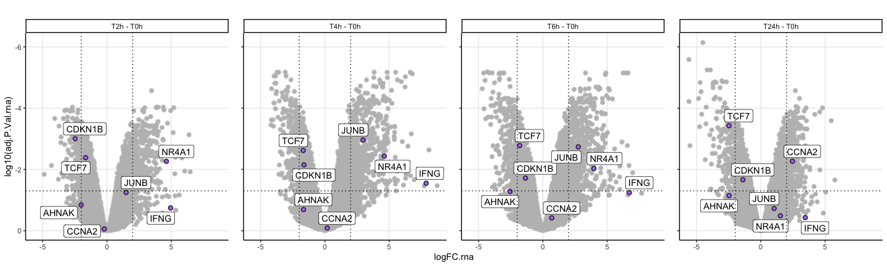
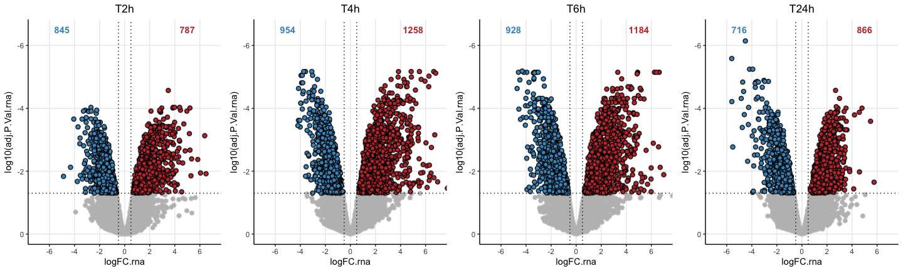

Differential expression analysis RNA
================
Kaspar Bresser

- [Import](#import)
- [Tidy data](#tidy-data)
- [DE testing](#de-testing)
- [extract comparisons](#extract-comparisons)
- [Plotting](#plotting)

DE analysis RNAseq.

First load packages

``` r
library(tidyverse)
library(lemon)
library(ggpubr)
library(limma)
library(gghighlight)
library(ggrastr)
```

### Import

Import RNA data

``` r
dat.rna <- read_tsv("Data/RNAseq_CPM.tsv")

dat.rna
```

    ## # A tibble: 10,578 × 17
    ##    ensembl.id     `D1-00h` `D1-02h` `D1-04h` `D1-06h` `D1-24h` `D2-00h` `D2-02h`
    ##    <chr>             <dbl>    <dbl>    <dbl>    <dbl>    <dbl>    <dbl>    <dbl>
    ##  1 ENSG000000004…    2.82      4.19     3.93     3.30     3.90     2.93     3.86
    ##  2 ENSG000000004…    2.71      2.58     3.11     2.30     2.32     3.87     3.11
    ##  3 ENSG000000004…    0.708     1.23     2.92     1.40     2.13     1.26     3.31
    ##  4 ENSG000000009…    3.73      4.91     1.92     2.56     2.68     2.49     1.69
    ##  5 ENSG000000010…    2.46      3.34     2.13     2.08     1.80     2.43     2.07
    ##  6 ENSG000000010…    3.90      5.31     4.50     4.98     3.91     3.38     3.30
    ##  7 ENSG000000011…    3.07      3.34     5.00     3.84     3.22     3.94     4.96
    ##  8 ENSG000000014…    4.78      2.58     3.59     4.05     3.43     5.71     4.13
    ##  9 ENSG000000014…    4.76      1.15     5.93     5.83     5.43     5.21     5.24
    ## 10 ENSG000000016…    4.45      4.05     4.64     4.31     4.51     4.74     5.13
    ## # ℹ 10,568 more rows
    ## # ℹ 9 more variables: `D2-04h` <dbl>, `D2-06h` <dbl>, `D2-24h` <dbl>,
    ## #   `D3-00h` <dbl>, `D3-02h` <dbl>, `D3-04h` <dbl>, `D3-06h` <dbl>,
    ## #   `D3-24h` <dbl>, gene.name <chr>

### Tidy data

tidy up RNA data

``` r
dat.rna %>% 
  dplyr::select(-ensembl.id) %>% 
  pivot_longer(-gene.name, names_to = "sample", values_to = "logTPM") %>% 
  separate(sample, into = c("donor", "timepoint")) %>% 
  mutate(timepoint = paste0("T", str_remove(timepoint, "0"))) %>% 
  mutate(timepoint = factor(timepoint, levels = c("T0h", "T2h", "T4h", "T6h", "T24h"))) -> dat.rna
  
dat.rna
```

    ## # A tibble: 158,670 × 4
    ##    gene.name donor timepoint logTPM
    ##    <chr>     <chr> <fct>      <dbl>
    ##  1 DPM1      D1    T0h         2.82
    ##  2 DPM1      D1    T2h         4.19
    ##  3 DPM1      D1    T4h         3.93
    ##  4 DPM1      D1    T6h         3.30
    ##  5 DPM1      D1    T24h        3.90
    ##  6 DPM1      D2    T0h         2.93
    ##  7 DPM1      D2    T2h         3.86
    ##  8 DPM1      D2    T4h         3.86
    ##  9 DPM1      D2    T6h         3.59
    ## 10 DPM1      D2    T24h        3.23
    ## # ℹ 158,660 more rows

### DE testing

first set up a design matrix, we want to compare between time-points

``` r
dat.rna %>% 
#  mutate(sample.nr = paste0("sample.", sample.nr)) %>% 
  dplyr::select( timepoint, donor) %>% 
  distinct() -> pheno

design <- model.matrix(~0+ pheno$timepoint)
colnames(design) <- unique(pheno$timepoint)

design
```

    ##    T0h T2h T4h T6h T24h
    ## 1    1   0   0   0    0
    ## 2    0   1   0   0    0
    ## 3    0   0   1   0    0
    ## 4    0   0   0   1    0
    ## 5    0   0   0   0    1
    ## 6    1   0   0   0    0
    ## 7    0   1   0   0    0
    ## 8    0   0   1   0    0
    ## 9    0   0   0   1    0
    ## 10   0   0   0   0    1
    ## 11   1   0   0   0    0
    ## 12   0   1   0   0    0
    ## 13   0   0   1   0    0
    ## 14   0   0   0   1    0
    ## 15   0   0   0   0    1
    ## attr(,"assign")
    ## [1] 1 1 1 1 1
    ## attr(,"contrasts")
    ## attr(,"contrasts")$`pheno$timepoint`
    ## [1] "contr.treatment"

Get the LFQ values for all samples and fit linear model.

lmFit needs samples to be columns, and genes to be row names.

``` r
dat.rna %>% 
  na.omit %>% 
 # filter(logTPM > 0) %>% 
  pivot_wider(names_from = c(timepoint, donor), values_from = logTPM) %>%
  na.omit() %>% 
  distinct(gene.name, .keep_all = T) %>% 
  column_to_rownames("gene.name") %>% 
  lmFit(., design) -> lm.fit
```

Make a contrast matrix for the comparisons of interest

``` r
contrast.matrix <- makeContrasts(
  

  T2h - T0h,
  T4h - T0h,
  T6h - T0h,
  T24h - T0h,
  T2h - T24h,
  T4h - T24h,
  T6h - T24h,

  
  levels = design)

contrast.matrix
```

    ##       Contrasts
    ## Levels T2h - T0h T4h - T0h T6h - T0h T24h - T0h T2h - T24h T4h - T24h
    ##   T0h         -1        -1        -1         -1          0          0
    ##   T2h          1         0         0          0          1          0
    ##   T4h          0         1         0          0          0          1
    ##   T6h          0         0         1          0          0          0
    ##   T24h         0         0         0          1         -1         -1
    ##       Contrasts
    ## Levels T6h - T24h
    ##   T0h           0
    ##   T2h           0
    ##   T4h           0
    ##   T6h           1
    ##   T24h         -1

Compute differential expression

``` r
# fit contrasts
lm.fit.rna <- contrasts.fit(lm.fit, contrast.matrix)
# ebayes
lm.fit.rna <- eBayes(lm.fit.rna)
```

### extract comparisons

``` r
get_DE <- function(fit, comp){
  
  topTable(fit, number = Inf, coef = comp, sort.by = 'none') %>% 
    mutate(comparison = comp)
}
```

``` r
comparisons <- colnames(lm.fit.rna$coefficients)

comparisons %>% 
  map( ~get_DE(lm.fit.rna, .)) %>% 
  map(rownames_to_column, "gene.name") %>% 
  list_rbind() %>% 
  as_tibble() %>% 
  dplyr::rename(logFC.rna = logFC, adj.P.Val.rna = adj.P.Val) -> all.DE.rna

all.DE.rna
```

    ## # A tibble: 74,025 × 8
    ##    gene.name logFC.rna AveExpr      t P.Value adj.P.Val.rna      B comparison
    ##    <chr>         <dbl>   <dbl>  <dbl>   <dbl>         <dbl>  <dbl> <chr>     
    ##  1 DPM1         1.11      3.53  4.22  0.00114        0.0138 -0.875 T2h - T0h 
    ##  2 SCYL3       -0.539     3.03 -1.37  0.197          0.434  -5.75  T2h - T0h 
    ##  3 FIRRM        1.88      2.28  2.96  0.0117         0.0672 -3.17  T2h - T0h 
    ##  4 FGR         -0.181     2.28 -0.217 0.832          0.972  -6.65  T2h - T0h 
    ##  5 FUCA2        0.0362    2.31  0.104 0.919          0.998  -6.67  T2h - T0h 
    ##  6 GCLC         0.308     4.09  0.661 0.521          0.776  -6.44  T2h - T0h 
    ##  7 NFYA         0.784     4.24  1.59  0.138          0.345  -5.46  T2h - T0h 
    ##  8 NIPAL3      -1.74      4.06 -4.12  0.00135        0.0154 -1.05  T2h - T0h 
    ##  9 LAS1L       -0.982     5.25 -1.20  0.251          0.506  -5.94  T2h - T0h 
    ## 10 ANKIB1       0.0951    4.70  0.283 0.782          0.950  -6.63  T2h - T0h 
    ## # ℹ 74,015 more rows

Save data

``` r
write_tsv(all.DE.rna, "Output/RNA_DE_all.tsv")
```

### Plotting

``` r
genes <- c( "AHNAK", "CDKN1B", "TCF7",
            "NR4A1", "IFNG", "JUNB", "CCNA2")

all.DE.rna %>% 
  filter(str_detect(comparison, "0h$")) %>% 
  mutate(comparison = fct_relevel(comparison, "T2h - T0h", "T4h - T0h", "T6h - T0h")) %>% 
ggplot(aes( x = logFC.rna, y = log10(adj.P.Val.rna), label = gene.name) )+ 
  rasterise(geom_point(shape = 21, fill = "#b57bfd", size = 2), dpi = 300, scale = 1.0)+
  facet_rep_wrap(~comparison, nrow = 1)+
  scale_y_reverse()+
  labs(title = "")+
  gghighlight(gene.name %in% genes, label_key = gene.name, 
              unhighlighted_params = list(shape =21, fill = "grey"), use_direct_label = T)+
  theme_classic()+
  theme(legend.position = "none", plot.title = element_text(hjust = 0.5),
        panel.grid.major = element_line())+
  #  xlim(-0.4,0.6)+
  geom_vline(xintercept = c(2, -2), linetype ="dotted")+
  geom_hline(yintercept = log10(0.05), linetype ="dotted")
```



``` r
ggsave("Figs/DE_RNA/RNA_volcanos.pdf", width = 15, height = 4)
```

Function to plot volcano’s with counts

``` r
plt_volcanos <- function(dat, title){
  
  dat %>% 
    group_by(col) %>%
    count(adj.P.Val.rna < 0.05) %>% 
    pull(n) %>% 
    as.character() -> cnts
  
ggplot(dat, aes( x = logFC.rna, y = log10(adj.P.Val.rna)))+ 
  rasterise(geom_point(aes(fill = col), shape = 21, size = 2), dpi = 300, scale = 1.0)+
  scale_fill_manual(values = c( "#4796C5","#C23A3B"))+
  scale_y_reverse()+
  labs(title = "")+
  gghighlight(adj.P.Val.rna < 0.05 & abs(logFC.rna) > 0.5,  
              unhighlighted_params = list(shape = 21, fill = "grey"),  use_group_by = F)+
  theme_classic()+
  theme(legend.position = "none", plot.title = element_text(hjust = 0.5),
        panel.grid.major = element_line())+
    scale_x_continuous(breaks=c(-6,-4, -2, 0, 2, 4, 6))+
    coord_cartesian(xlim = c(-7, 7), ylim =  c(0, -6.5))+
  geom_vline(xintercept = c(0.5, -0.5), linetype ="dotted")+
  geom_hline(yintercept = log10(0.05), linetype ="dotted")+
  annotate(geom = "text", label = cnts[2], x=-5, y=-6.5, color = "#4796C5", fontface =2)+
  annotate(geom = "text", label =cnts[4], x=5, y=-6.5, color = "#C23A3B", fontface =2)+
  ggtitle(title)

}
```

Plot volcano’s with counts

``` r
all.DE.rna %>% 
  filter(str_detect(comparison, "0h$")) %>% 
  mutate(comparison = fct_relevel(comparison, "T2h - T0h", "T4h - T0h", "T6h - T0h"),
         comparison = fct_recode(comparison, T2h = "T2h - T0h", T4h = "T4h - T0h", T6h = "T6h - T0h", T24h = "T24h - T0h"),
         col = case_when(logFC.rna > 0 ~ "up", TRUE ~ "down")) -> for.plot


for.plot %>% 
  nest(data = -comparison) %>% 
  mutate(plots = map2(data, comparison, plt_volcanos)) %>% 
  pull(plots) %>% 
  ggpubr::ggarrange(plotlist = . , ncol = 4)
```



``` r
ggsave("Figs/DE_RNA/RNA_volcanos_DE.pdf", width = 12, height = 4)
```
