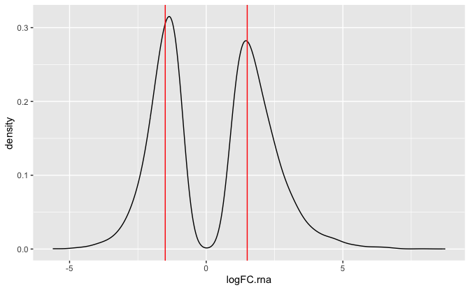
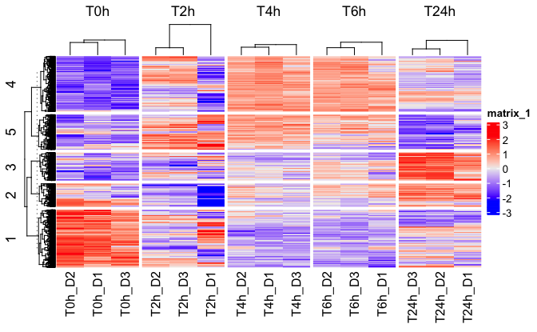
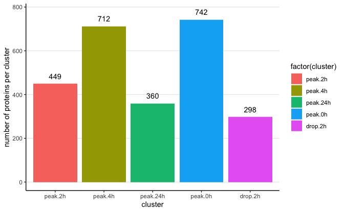
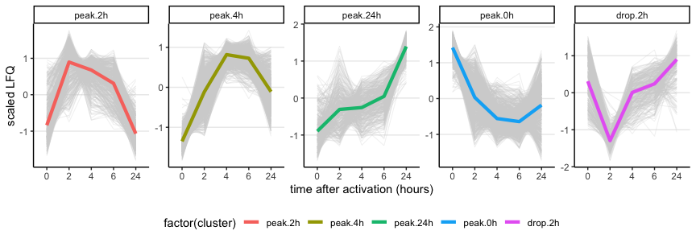
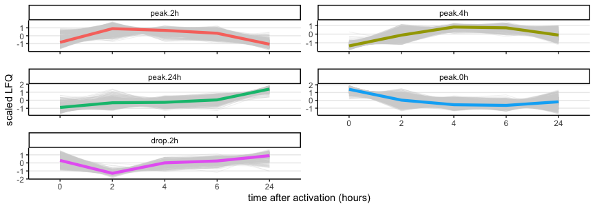
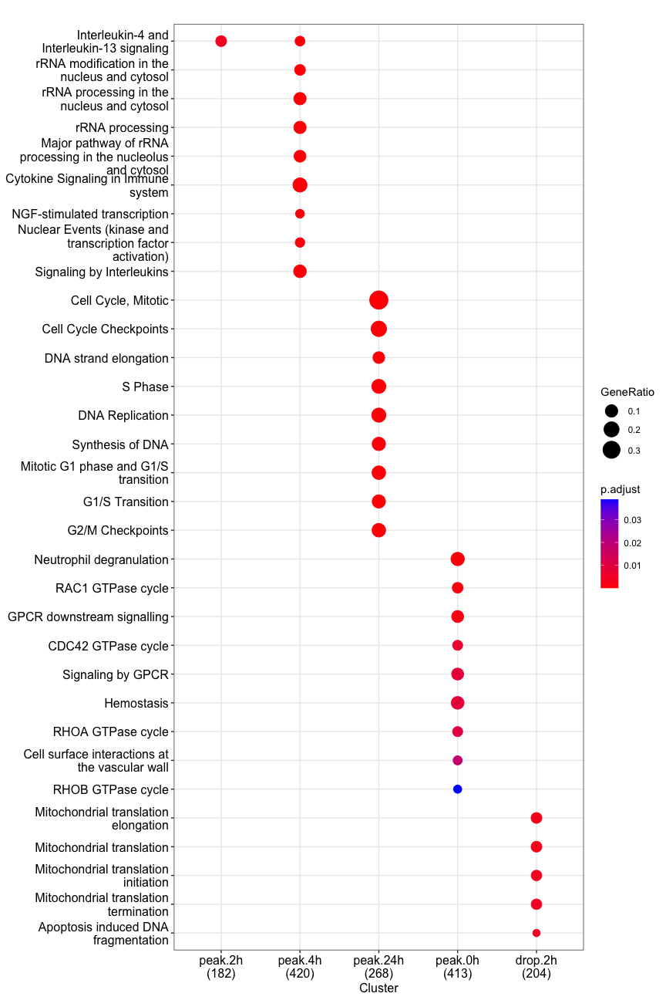
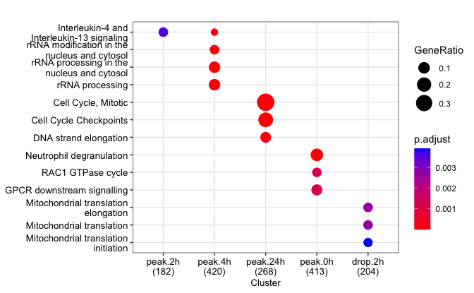
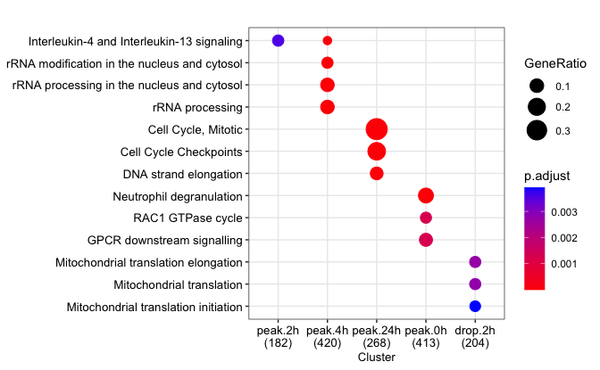

Generate clusters based on RNA data
================
Kaspar Bresser

- [Import data](#import-data)
- [Make K means clusters](#make-k-means-clusters)
- [plotting](#plotting)
- [pathway enrichment](#pathway-enrichment)

First load packages

``` r
library(tidyverse)
library(lemon)
library(ggpubr)
library(gghighlight)
library(ComplexHeatmap)
library(clusterProfiler)
library(ReactomePA)
library(ggrastr)
```

## Import data

Import RNA CPMs

``` r
dat.rna <- read_tsv("Data/RNAseq_CPM.tsv")

dat.rna %>% 
  dplyr::select(-ensembl.id) %>% 
  pivot_longer(-gene.name, names_to = "sample", values_to = "logTPM") %>% 
  separate(sample, into = c("donor", "timepoint")) %>% 
  mutate(timepoint = paste0("T", str_remove(timepoint, "0"))) %>% 
  mutate(timepoint = factor(timepoint, levels = c("T0h", "T2h", "T4h", "T6h", "T24h"))) -> dat.rna
```

and DE data

``` r
dat.rna.DE <- read_tsv("Output/RNA_DE_all.tsv")
```

## Make K means clusters

Select only RNAs that are significant in any comparison

Inspect the log2FC distribution, select genes that display a strong
movement

``` r
dat.rna.DE %>% 
  filter(adj.P.Val.rna < 0.05) %>% 
  ggplot(aes(x = logFC.rna))+
  geom_density()+
  geom_vline(xintercept = c(1.5, -1.5), color = "red")
```



Went with 1.5. Turn this into a character vector

``` r
dat.rna.DE %>% 
  filter(adj.P.Val.rna < 0.05 & abs(logFC.rna) > 1.5) %>%
  pull(gene.name) %>% 
  unique() -> sig.rna
```

Perform k means clustering, using only significant proteins.

Both kmeans function and heatmap require the data as a scaled matrix.
Will convert first

``` r
dat.rna %>% 
  na.omit() %>% 
  pivot_wider(names_from = c(timepoint, donor), values_from = logTPM) %>% 
  distinct(gene.name, .keep_all = T) %>% 
  filter(gene.name %in% sig.rna) %>% 
  column_to_rownames("gene.name") %>% 
  dplyr::select(contains("D")) %>% 
  t() %>%
  scale() %>%
  t() -> dat.mat

scale_this <- function(x){
  (x - mean(x, na.rm=TRUE)) / sd(x, na.rm=TRUE)
}
```

Perform k means clustering

``` r
set.seed(2112)

k <- 5

cluster.allocation <- kmeans(x = dat.mat, centers = k)
```

Plot heatmap

``` r
hm <- Heatmap(dat.mat, 
    #cluster_columns = F,
    cluster_column_slices = F,
    show_row_names = F,
    show_row_dend = T,
    show_column_dend = T,
    show_column_names = T,
    # col = colorRamp2(c(-18, 0, 8),c('blue', 'white', 'red')),
    column_split = dat.rna %>% distinct(timepoint, donor, .keep_all = T) %>% pull(timepoint) ,
    row_split = cluster.allocation$cluster,
    row_names_gp = grid::gpar(fontsize = 8))#,cluster_columns = T, km = 3)

hm
```



``` r
pdf("Figs/protein_clustering/RNAClusters_Heatmap.pdf", width = 6, height = 4)
hm
dev.off()
```

    ## quartz_off_screen 
    ##                 2

To nicely visualize the clusters, will calculate the mean LFQ of each
timepoint, and scale these within genes

``` r
# define function for sd scaling of count data
scale_this <- function(x){
  (x - mean(x, na.rm=TRUE)) / sd(x, na.rm=TRUE)
}

dat.rna %>% 
  na.omit() %>% 
  filter(gene.name %in% sig.rna) %>% 
  group_by(gene.name) %>% 
  mutate(scaled.TPM = scale_this(logTPM)) %>% 
  group_by(gene.name,  timepoint) %>% 
  summarise(logTPM = mean(logTPM),
            scaled.TPM = mean(scaled.TPM)) %>% 
  ungroup() -> dat.scaled
```

Add cluster annotations of the genes

``` r
cluster.allocation$cluster %>% 
  enframe(name = "gene.name", value = "cluster") %>% 
  mutate(cluster = as.character(cluster)) %>% 
  inner_join(dat.scaled) %>% 
  dplyr::mutate(cluster = case_when(cluster == "1" ~ "peak.0h",
                                    cluster == "2" ~ "drop.2h",
                                    cluster == "3" ~ "peak.24h",
                                    cluster == "4" ~ "peak.4h",
                                    cluster == "5" ~ "peak.2h"),
             #   cluster = factor(cluster, levels = c("early.up", "gradual.up", "late.up", "gradual.down", "down.up")),
                cluster = factor(cluster, levels = c("peak.2h", "peak.4h", "peak.24h", "peak.0h", "drop.2h"))) -> dat.scaled
```

Number of RNA per cluster

``` r
dat.scaled %>% 
  distinct(gene.name, cluster) %>% 
  count(cluster)
```

    ## # A tibble: 5 × 2
    ##   cluster      n
    ##   <fct>    <int>
    ## 1 peak.2h    449
    ## 2 peak.4h    712
    ## 3 peak.24h   360
    ## 4 peak.0h    742
    ## 5 drop.2h    298

``` r
dat.scaled %>% 
  distinct(gene.name, cluster) %>% 
  count(cluster) %>% 
ggplot(aes(x = cluster, y = n, label = n, fill = factor(cluster)))+
   geom_bar(stat = "identity")+
    theme_classic()+
    theme(panel.grid.major.y = element_line())+
    geom_text(nudge_y = 35)+
    labs(y = "number of proteins per cluster", x = "cluster")
```



``` r
ggsave("Figs/rna_clustering/RNA_PerCluster.pdf", width = 5, height = 3)
```

write data

``` r
write_tsv(dat.scaled, "Output/abundances_rna_clustered.tsv")
```

## plotting

Plot clusters

``` r
dat.scaled %>% 
    mutate(timepoint = str_remove_all(timepoint, "T|h")) %>% 
    mutate(timepoint = factor(timepoint, levels = c("0", "2", "4", "6", "24"))) %>% 
ggplot(aes(x = timepoint, y = scaled.TPM, group = gene.name))+
  geom_line(color = "lightgrey", linewidth = .1)+
  stat_summary(aes(group=cluster, color = factor(cluster)), fun = median, geom = "line", linewidth = 1.5)+
  facet_wrap(~cluster, scales = "free_y", nrow = 1)+
  theme_classic()+
  theme(panel.grid.major.y = element_line(), legend.position = "bottom")+
  labs(x = "time after activation (hours)", y = "scaled LFQ")
```



``` r
ggsave("Figs/rna_clustering/RNAClusters.pdf", width = 10, height = 3)
```

Plot clusters

``` r
dat.scaled %>% 
    mutate(timepoint = str_remove_all(timepoint, "T|h")) %>% 
    mutate(timepoint = factor(timepoint, levels = c("0", "2", "4", "6", "24"))) %>% 
ggplot(aes(x = timepoint, y = scaled.TPM, group = gene.name))+
  geom_line(color = "lightgrey", linewidth = .1)+
  stat_summary(aes(group=cluster, color = factor(cluster)), fun = median, geom = "line", linewidth = 1.5)+
  facet_rep_wrap(~cluster, scales = "free_y", ncol = 2)+
  theme_classic()+
  theme(panel.grid.major.y = element_line(), legend.position = "none")+
  labs(x = "time after activation (hours)", y = "scaled LFQ")
```



``` r
ggsave("Figs/rna_clustering/RNAClusters2.pdf", width = 45, height = 60, units = "mm", scale = 2)
```

## pathway enrichment

``` r
library(clusterProfiler)
bitr(dat.scaled$gene.name, fromType="SYMBOL", toType="ENTREZID", OrgDb="org.Hs.eg.db") %>% 
  as_tibble() %>% 
  inner_join(dat.scaled, by = c("SYMBOL" = "gene.name")) %>% 
  distinct(ENTREZID, .keep_all = T) -> dat.clusters
```

    ## Warning in bitr(dat.scaled$gene.name, fromType = "SYMBOL", toType = "ENTREZID",
    ## : 7.18% of input gene IDs are fail to map...

``` r
bitr(unique(dat.rna$gene.name), fromType="SYMBOL", toType="ENTREZID", OrgDb="org.Hs.eg.db") %>% 
  as_tibble() %>% 
  pull(ENTREZID) -> uni
```

    ## Warning in bitr(unique(dat.rna$gene.name), fromType = "SYMBOL", toType =
    ## "ENTREZID", : 3.8% of input gene IDs are fail to map...

``` r
res <- compareCluster(geneClusters = ENTREZID~cluster, data = dat.clusters, fun="enrichPathway", universe = uni,
                      readable = TRUE)

dotplot(res, showCategory = 9, size = "geneRatio")
```



``` r
ggsave("Figs/RNA_clustering/RNAClusters_Reactome.pdf", width = 8, height = 12)
```

``` r
dotplot(res, showCategory = 3, size = "geneRatio", font.size = 10)
```



``` r
ggsave("Figs/RNA_clustering/RNAClusters_Reactome_small.pdf", width = 6, height = 6.5)
```

``` r
dotplot(res, showCategory = 3, size = "geneRatio", font.size = 10, label_format = 60)
```



``` r
ggsave("Figs/RNA_clustering/RNAClusters_Reactome_small2.pdf", width = 110, height = 60, units = "mm", scale = 2)
```
