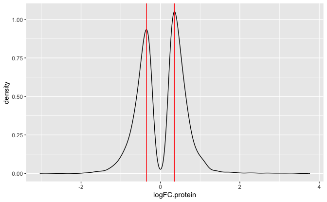
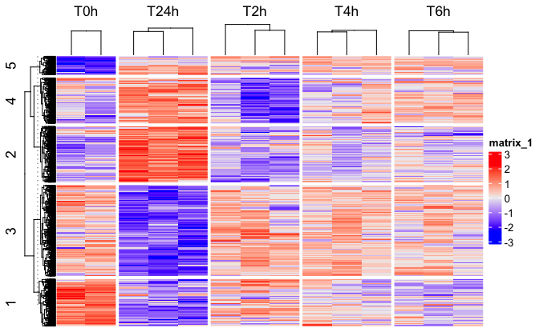
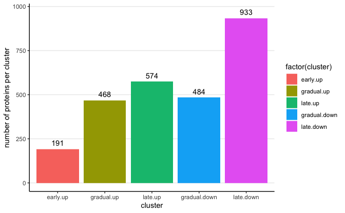
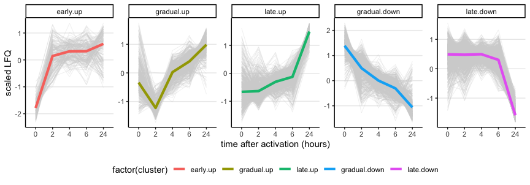
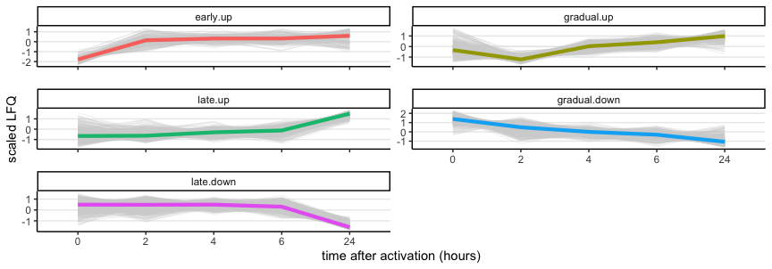
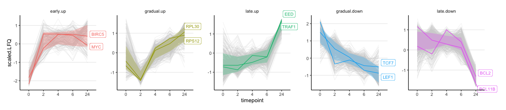
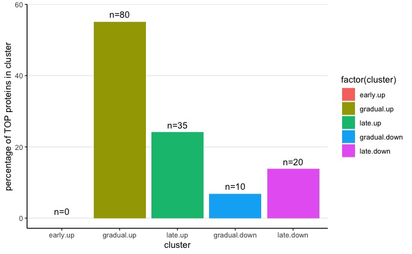
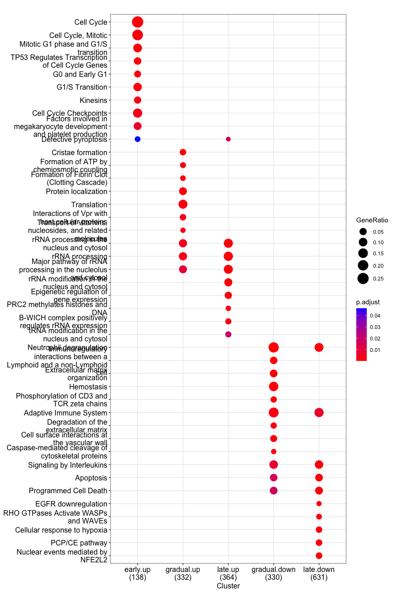
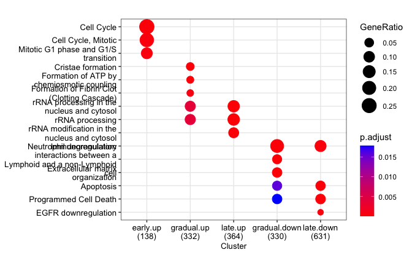
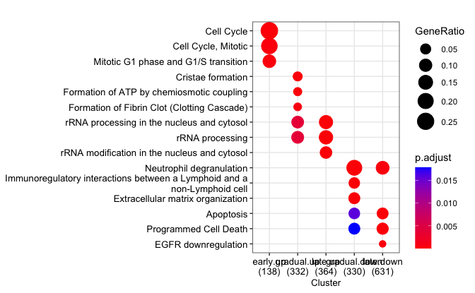

Generate clusters based on proteomic data
================
Kaspar Bresser

- [Import data](#import-data)
- [Make K means clusters](#make-k-means-clusters)
- [plotting](#plotting)
- [Check TOP](#check-top)
- [pathway enrichment](#pathway-enrichment)
- [Plot examples](#plot-examples)

First load packages

``` r
library(tidyverse)
library(lemon)
library(ggpubr)
library(gghighlight)
library(ComplexHeatmap)
library(clusterProfiler)
library(ReactomePA)
library(ggrastr)
```

## Import data

Protein abundance data

``` r
dat.prot <- read_tsv("Output/proteomic_data_clean.tsv")
```

and DE data for protein

``` r
dat.prot.DE <- read_tsv("Output/proteomic_DE_all.tsv")
```

## Make K means clusters

Select only proteins that are significant in any comparison

Now I inspect the log2FC distribution, to pick a cutoff to restrict the
proteins included to those that have a strong up-/down-regulation

``` r
dat.prot.DE %>% 
  filter(adj.P.Val.protein < 0.05) %>% 
  ggplot(aes(x = logFC.protein))+
  geom_density()+
  geom_vline(xintercept = c(0.35, -0.35), color = "red")
```



Went with 0.35. Convert to character vector

``` r
dat.prot.DE %>% 
  filter(adj.P.Val.protein < 0.05 & abs(logFC.protein) > 0.35) %>%
  pull(gene.name) %>% 
  unique() -> sig.prots
```

Perform k means clustering, using only significant proteins.

Both kmeans function and heatmap require the data as a scaled matrix.
Will convert first

``` r
dat.prot %>% 
  pivot_wider(names_from = c(sample.nr, timepoint, donor), values_from = LFQ) %>% 
  na.omit() %>% 
  distinct(gene.name, .keep_all = T) %>% 
  filter(gene.name %in% sig.prots) %>% 
  column_to_rownames("gene.name") %>% 
  dplyr::select(contains("donor")) %>% 
  t() %>%
  scale() %>%
  t() -> dat.mat

scale_this <- function(x){
  (x - mean(x, na.rm=TRUE)) / sd(x, na.rm=TRUE)
}
```

Perform k means clustering

``` r
set.seed(2112)

k <- 5

cluster.allocation <- kmeans(x = dat.mat, centers = k)
```

Plot heatmap

``` r
hm <- Heatmap(dat.mat, 
    #cluster_columns = F,
    cluster_column_slices = F,
    show_row_names = F,
    show_row_dend = T,
    show_column_dend = T,
    show_column_names = F,
    # col = colorRamp2(c(-18, 0, 8),c('blue', 'white', 'red')),
    column_split = dat.prot %>% distinct(sample.nr, .keep_all = T) %>% pull(timepoint),
    row_split = cluster.allocation$cluster,
    row_names_gp = grid::gpar(fontsize = 8))#,cluster_columns = T, km = 3)

hm
```



``` r
pdf("Figs/protein_clustering/proteinClusters_Heatmap.pdf", width = 6, height = 4)
hm
dev.off()
```

    ## quartz_off_screen 
    ##                 2

To nicely visualize the clusters, will calculate the mean LFQ of each
timepoint, and scale these within genes

``` r
# define function for sd scaling of count data
scale_this <- function(x){
  (x - mean(x, na.rm=TRUE)) / sd(x, na.rm=TRUE)
}

dat.prot %>% 
  na.omit() %>% 
  filter(gene.name %in% sig.prots) %>% 
  group_by(gene.name) %>% 
  mutate(scaled.LFQ = scale_this(LFQ)) %>% 
  group_by(gene.name,  timepoint) %>% 
  summarise(LFQ = mean(LFQ),
            scaled.LFQ = mean(scaled.LFQ)) %>% 
  ungroup() -> dat.scaled
```

Add cluster annotations of the genes

``` r
cluster.allocation$cluster %>% 
  enframe(name = "gene.name", value = "cluster") %>% 
  mutate(cluster = as.character(cluster)) %>% 
  inner_join(dat.scaled) %>% 
  dplyr::mutate(cluster = case_when(cluster == "1" ~ "gradual.down",
                                    cluster == "2" ~ "late.up",
                                    cluster == "3" ~ "late.down",
                                    cluster == "4" ~ "gradual.up",
                                    cluster == "5" ~ "early.up"),
                cluster = factor(cluster, levels = c("early.up", "gradual.up", "late.up", "gradual.down", "late.down"))) -> dat.scaled
```

Number of proteins per cluster

``` r
dat.scaled %>% 
  distinct(gene.name, cluster) %>% 
  count(cluster)
```

    ## # A tibble: 5 × 2
    ##   cluster          n
    ##   <fct>        <int>
    ## 1 early.up       191
    ## 2 gradual.up     468
    ## 3 late.up        574
    ## 4 gradual.down   484
    ## 5 late.down      933

``` r
dat.scaled %>% 
  distinct(gene.name, cluster) %>% 
  count(cluster) %>% 
ggplot(aes(x = cluster, y = n, label = n, fill = factor(cluster)))+
   geom_bar(stat = "identity")+
    theme_classic()+
    theme(panel.grid.major.y = element_line())+
    geom_text(nudge_y = 35)+
    labs(y = "number of proteins per cluster", x = "cluster")
```



``` r
ggsave("Figs/protein_clustering/proteinsPerCluster.pdf", width = 5, height = 3)
```

write data

``` r
write_tsv(dat.scaled, "Output/abundances_protein_clustered.tsv")
```

## plotting

Plot clusters

``` r
dat.scaled %>% 
    mutate(timepoint = str_remove_all(timepoint, "T|h")) %>% 
    mutate(timepoint = factor(timepoint, levels = c("0", "2", "4", "6", "24"))) %>% 
ggplot(aes(x = timepoint, y = scaled.LFQ, group = gene.name))+
  geom_line(color = "lightgrey", linewidth = .1)+
  stat_summary(aes(group=cluster, color = factor(cluster)), fun = median, geom = "line", linewidth = 1.5)+
  facet_wrap(~cluster, scales = "free_y", nrow = 1)+
  theme_classic()+
  theme(panel.grid.major.y = element_line(), legend.position = "bottom")+
  labs(x = "time after activation (hours)", y = "scaled LFQ")
```



``` r
ggsave("Figs/protein_clustering/proteinClusters.pdf", width = 10, height = 3)
```

Plot clusters

``` r
dat.scaled %>% 
    mutate(timepoint = str_remove_all(timepoint, "T|h")) %>% 
    mutate(timepoint = factor(timepoint, levels = c("0", "2", "4", "6", "24"))) %>% 
ggplot(aes(x = timepoint, y = scaled.LFQ, group = gene.name))+
  geom_line(color = "lightgrey", linewidth = .1)+
  stat_summary(aes(group=cluster, color = factor(cluster)), fun = median, geom = "line", linewidth = 1.5)+
  facet_rep_wrap(~cluster, scales = "free_y", ncol = 2)+
  theme_classic()+
  theme(panel.grid.major.y = element_line(), legend.position = "none")+
  labs(x = "time after activation (hours)", y = "scaled LFQ")
```



``` r
ggsave("Figs/protein_clustering/proteinClusters2.pdf", width = 45, height = 60, units = "mm", scale = 2)
```

Some highlighted proteins

``` r
dat.scaled %>% 
    mutate(timepoint = str_remove_all(timepoint, "T|h")) %>% 
    mutate(timepoint = factor(timepoint, levels = c("0", "2", "4", "6", "24"))) %>% 
    group_by(cluster, timepoint) %>% 
    mutate(avg = mean(scaled.LFQ),
           SE.low = avg - (1*sd(scaled.LFQ)),
           SE.high = avg + (1*sd(scaled.LFQ))) %>% 
ggplot(aes(x = timepoint, y = scaled.LFQ, group = gene.name))+
  geom_line(aes(color = cluster), linewidth = 0.5, linetype = "solid")+
  gghighlight(gene.name %in% c("MYC","BIRC5","TCF7", "LEF1", "RPS12", "RPL30", "BCL11B", "BCL2", "EED", "TRAF1"),
              use_direct_label = T, calculate_per_facet = T, 
              unhighlighted_params = list(linewidth = 0.1,
                                          colour = "lightgrey",
                                          linetype = "solid"), 
              label_params = list(size = 3, nudge_x = 0.3, xlim = c(-10, 10), ylim = c(-100, 100)))+
  geom_ribbon(aes(ymin=SE.low, ymax=SE.high, fill = cluster),  alpha=0.15)+
  coord_cartesian(clip = "off")+
#  geom_line(data = . %>% filter(str_detect(gene.name, "^TCF7|LEF1")), color = "red")+
  facet_wrap(~cluster, scales = "free_y", nrow = 1)+
  theme_classic()+
  theme(panel.grid.major.y = element_line(), legend.position = "bottom", 
        strip.background = element_blank(),
        panel.spacing = unit(2, "lines"),
        plot.margin = margin(.5, 1.5, .5, .5, "cm"))
```

    ## Warning: Tried to calculate with group_by(), but the calculation failed.
    ## Falling back to ungrouped filter operation...



``` r
ggsave("Figs/protein_clustering/proteinClusters_GeneLabels.pdf", width = 14, height = 3)
```

## Check TOP

Test for the presence of TOP-motif containing mRNA’s for the proteins in
each cluster

Import list of TOP proteins

``` r
TOP.list <- read_tsv("./Data/TOP_proteins.tsv") %>% mutate(genename = str_to_upper(Gene.symbol))
```

Count within each cluster

``` r
dat.scaled %>% 
  mutate(TOP = case_when(gene.name %in% TOP.list$genename ~ "TOP", TRUE ~ "nonTOP")) %>% 
  count(cluster, TOP) %>% 
  pivot_wider(names_from = TOP, values_from = n, values_fill = 0) %>% 
  mutate(perc = (TOP/(TOP+nonTOP)*100))
```

    ## # A tibble: 5 × 4
    ##   cluster      nonTOP   TOP  perc
    ##   <fct>         <int> <int> <dbl>
    ## 1 early.up        955     0 0    
    ## 2 gradual.up     2260    80 3.42 
    ## 3 late.up        2835    35 1.22 
    ## 4 gradual.down   2410    10 0.413
    ## 5 late.down      4645    20 0.429

``` r
dat.scaled %>% 
  mutate(TOP = case_when(gene.name %in% TOP.list$genename ~ "TOP", TRUE ~ "nonTOP")) %>% 
  count(cluster, TOP) %>% 
  complete(cluster, TOP, fill = list(n=0)) %>% 
  filter(TOP == "TOP") %>% 
  mutate(total = sum(n)) %>% 
  mutate(perc = (n/total)*100) -> dat.TOP
```

Number of proteins per cluster plotted

``` r
dat.TOP %>% 
ggplot(aes(x = cluster, y = perc, label =paste0("n=", n), fill = factor(cluster)))+
   geom_bar(stat = "identity")+
    theme_classic()+
    theme(panel.grid.major.y = element_line())+
    geom_text(nudge_y = 2)+
    labs(y = "percentage of TOP proteins in cluster", x = "cluster")
```



``` r
ggsave("Figs/protein_clustering/TOP_proteins_in_clusters.pdf", width = 5, height = 3)
```

## pathway enrichment

add ENTREZ ID

``` r
library(clusterProfiler)
bitr(dat.scaled$gene.name, fromType="SYMBOL", toType="ENTREZID", OrgDb="org.Hs.eg.db") %>% 
  as_tibble() %>% 
  inner_join(dat.scaled, by = c("SYMBOL" = "gene.name")) %>% 
  distinct(ENTREZID, .keep_all = T) -> dat.clusters
```

    ## Warning in bitr(dat.scaled$gene.name, fromType = "SYMBOL", toType = "ENTREZID",
    ## : 0.53% of input gene IDs are fail to map...

Define universe

``` r
bitr(unique(dat.prot$gene.name), fromType="SYMBOL", toType="ENTREZID", OrgDb="org.Hs.eg.db") %>% 
  as_tibble() %>% 
  pull(ENTREZID) -> uni
```

    ## Warning in bitr(unique(dat.prot$gene.name), fromType = "SYMBOL", toType =
    ## "ENTREZID", : 0.43% of input gene IDs are fail to map...

Perform analysis and plot

``` r
res <- compareCluster(geneClusters = ENTREZID~cluster, data = dat.clusters, fun="enrichPathway", universe = uni,
                      readable = TRUE)

dotplot(res, showCategory = 9, size = "geneRatio")
```



``` r
ggsave("Figs/protein_clustering/proteinClusters_Reactome.pdf", width = 8, height = 12)
```

Different versions of the plot

``` r
dotplot(res, showCategory = 3, size = "geneRatio", font.size = 10)
```



``` r
ggsave("Figs/protein_clustering/proteinClusters_Reactome_small.pdf", width = 6, height = 6.5)
```

``` r
dotplot(res, showCategory = 3, size = "geneRatio", font.size = 10, label_format = 60)
```



``` r
ggsave("Figs/protein_clustering/proteinClusters_Reactome_small2.pdf", width = 110, height = 60, units = "mm", scale = 2)
```

## Plot examples

``` r
results.clusters <- as_tibble(res)

results.clusters
```

    ## # A tibble: 329 × 11
    ##    Cluster  cluster ID    Description GeneRatio BgRatio  pvalue p.adjust  qvalue
    ##    <fct>    <chr>   <chr> <chr>       <chr>     <chr>     <dbl>    <dbl>   <dbl>
    ##  1 early.up early   R-HS… Cell Cycle  36/138    488/46… 1.49e-7  7.40e-5 6.01e-5
    ##  2 early.up early   R-HS… Cell Cycle… 30/138    398/46… 1.35e-6  2.85e-4 2.31e-4
    ##  3 early.up early   R-HS… Mitotic G1… 15/138    118/46… 1.71e-6  2.85e-4 2.31e-4
    ##  4 early.up early   R-HS… TP53 Regul… 8/138     32/4603 3.05e-6  3.80e-4 3.08e-4
    ##  5 early.up early   R-HS… G0 and Ear… 6/138     17/4603 6.14e-6  6.12e-4 4.97e-4
    ##  6 early.up early   R-HS… G1/S Trans… 13/138    107/46… 1.45e-5  1.21e-3 9.80e-4
    ##  7 early.up early   R-HS… Kinesins    7/138     32/4603 3.36e-5  2.39e-3 1.94e-3
    ##  8 early.up early   R-HS… Cell Cycle… 18/138    214/46… 5.66e-5  3.53e-3 2.86e-3
    ##  9 early.up early   R-HS… Factors in… 10/138    80/4603 1.16e-4  6.39e-3 5.19e-3
    ## 10 early.up early   R-HS… alpha-lino… 4/138     10/4603 1.41e-4  6.39e-3 5.19e-3
    ## # ℹ 319 more rows
    ## # ℹ 2 more variables: geneID <chr>, Count <int>

``` r
results.clusters %>% 
  group_by(Cluster) %>% 
  slice_min(order_by = p.adjust, n = 5) %>% 
  separate_longer_delim(geneID, delim = "/") %>% 
  count(geneID) %>% 
  slice_max(order_by = n, n = 5)
```

    ## # A tibble: 60 × 3
    ## # Groups:   Cluster [5]
    ##    Cluster    geneID      n
    ##    <fct>      <chr>   <int>
    ##  1 early.up   CCNA2       5
    ##  2 early.up   CDK2        5
    ##  3 early.up   PCNA        5
    ##  4 early.up   RBL1        5
    ##  5 early.up   CCNB1       4
    ##  6 early.up   CDKN1A      4
    ##  7 early.up   MYC         4
    ##  8 early.up   TOP2A       4
    ##  9 gradual.up ATP5F1C     2
    ## 10 gradual.up ATP5F1D     2
    ## # ℹ 50 more rows

c(“MYC”,“CCNA2”,“PCNA”,“CDK2”,“POLA1”,)

``` r
genes <- c("MYC","CCNA2","CDK2","TBX21","JUN",
           "ATP5PF","MTX1","SAMM50", "UTP20","NOP56",
           "PES1","NOP2","EOMES","EED","SUZ12",
           "CD8A","LAT","CD47","TCF7","LEF1",
           "MIF","S100B","FOXO3","BCL2","DFFA")
```

``` r
library(scales)
dat.prot %>% 
  filter(gene.name %in% genes) %>% 
  left_join(dat.clusters %>% dplyr::select(SYMBOL, cluster), by = c("gene.name" = "SYMBOL")) %>% 
  mutate(timepoint = str_remove_all(timepoint, "T|h")) %>% 
  mutate(timepoint = factor(timepoint, levels = c("0", "2", "4", "6", "24"))) %>% 
    mutate(gene.name = factor(gene.name, levels = genes)) %>% 
ggplot(aes(x = timepoint, y = LFQ, fill = cluster))+
  geom_point(shape = 21)+
  facet_rep_wrap(~gene.name, scales = "free_y", ncol = 5, dir = "h")+
    scale_y_continuous(
    labels = scales::number_format(accuracy = .1),
    breaks = scales::breaks_pretty(n = 3))+
  theme_classic()+
  theme(panel.grid.major.y = element_line(), strip.background = element_blank(), 
        legend.position = "bottom", panel.spacing.y = unit(-.36, "lines"))
```


``` r
ggsave("Figs/protein_clustering/examples_clusters.pdf", width = 5, height = 4.4)
```
