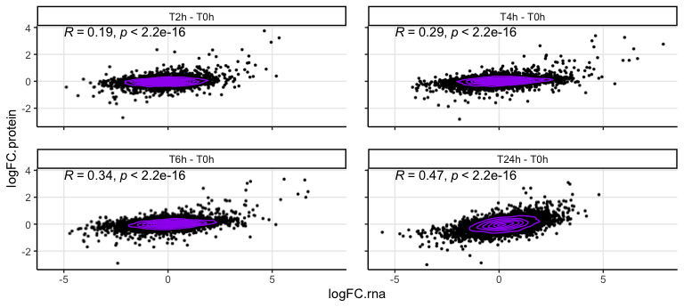
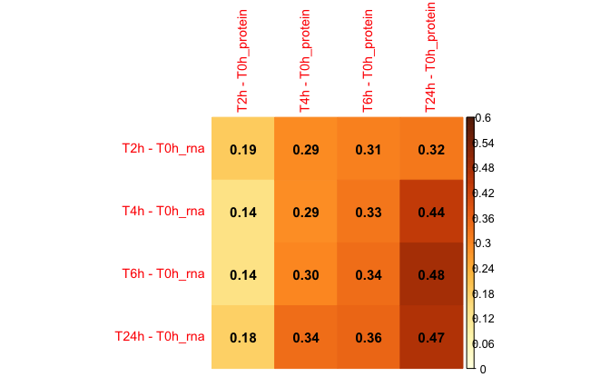
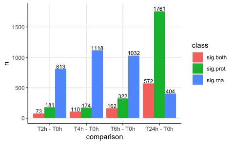
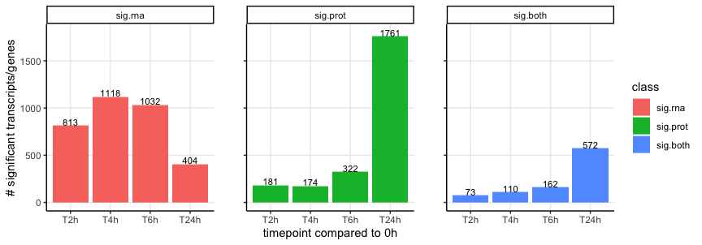

Compare mass-spec and RNAseq data
================
Kaspar Bresser

- [Import](#import)
- [Plotting](#plotting)
- [check numbers](#check-numbers)

Integrate the RNAseq data with the proteomics.

First load packages

``` r
library(tidyverse)
library(lemon)
library(ggpubr)
library(gghighlight)
library(rstatix)
library(RColorBrewer)
library(ggrastr)
library(corrplot)
```

## Import

Import protein DE data

``` r
dat.protein <- read_tsv("Output/proteomic_DE_all.tsv")

dat.protein
```

    ## # A tibble: 45,570 × 8
    ##    gene.name logFC.protein AveExpr       t P.Value adj.P.Val.protein     B
    ##    <chr>             <dbl>   <dbl>   <dbl>   <dbl>             <dbl> <dbl>
    ##  1 TRAV12-2        -0.148     11.2 -0.691  0.503               0.771 -6.59
    ##  2 NBDY            -0.753     10.7 -3.08   0.00960             0.122 -3.12
    ##  3 UBA6            -0.125     14.8 -1.82   0.0934              0.385 -5.27
    ##  4 ESYT2            0.0606    15.5  0.738  0.475               0.755 -6.56
    ##  5 MED19            0.203     12.1  1.49   0.161               0.478 -5.75
    ##  6 UHRF1BP1L        0.136     11.6  0.829  0.423               0.719 -6.48
    ##  7 TMEM223          0.0115    12.2  0.0941 0.927               0.973 -6.84
    ##  8 ARHGAP10         0.378     10.2  1.54   0.150               0.467 -5.69
    ##  9 ILVBL            0.195     15.0  2.79   0.0163              0.166 -3.64
    ## 10 ZC3H12D         -0.651     10.3 -2.42   0.0325              0.236 -4.30
    ## # ℹ 45,560 more rows
    ## # ℹ 1 more variable: comparison <chr>

Import RNA DE data

``` r
dat.rna <- read_tsv("Output/RNA_DE_all.tsv")

dat.rna
```

    ## # A tibble: 74,025 × 8
    ##    gene.name logFC.rna AveExpr      t P.Value adj.P.Val.rna      B comparison
    ##    <chr>         <dbl>   <dbl>  <dbl>   <dbl>         <dbl>  <dbl> <chr>     
    ##  1 DPM1         1.11      3.53  4.22  0.00114        0.0138 -0.875 T2h - T0h 
    ##  2 SCYL3       -0.539     3.03 -1.37  0.197          0.434  -5.75  T2h - T0h 
    ##  3 FIRRM        1.88      2.28  2.96  0.0117         0.0672 -3.17  T2h - T0h 
    ##  4 FGR         -0.181     2.28 -0.217 0.832          0.972  -6.65  T2h - T0h 
    ##  5 FUCA2        0.0362    2.31  0.104 0.919          0.998  -6.67  T2h - T0h 
    ##  6 GCLC         0.308     4.09  0.661 0.521          0.776  -6.44  T2h - T0h 
    ##  7 NFYA         0.784     4.24  1.59  0.138          0.345  -5.46  T2h - T0h 
    ##  8 NIPAL3      -1.74      4.06 -4.12  0.00135        0.0154 -1.05  T2h - T0h 
    ##  9 LAS1L       -0.982     5.25 -1.20  0.251          0.506  -5.94  T2h - T0h 
    ## 10 ANKIB1       0.0951    4.70  0.283 0.782          0.950  -6.63  T2h - T0h 
    ## # ℹ 74,015 more rows

Select the relevant comparisons and combine the data

``` r
comparisons <- unique(dat.protein$comparison)[1:4]

comparisons
```

    ## [1] "T2h - T0h"  "T4h - T0h"  "T6h - T0h"  "T24h - T0h"

``` r
dat.rna %>% 
  filter(comparison %in% comparisons) %>% 
  dplyr::select(contains(c("gene", "log", "adj", "comp"))) %>% 
  inner_join(dplyr::select(dat.protein, contains(c("gene", "log", "adj", "comp")))) %>%   
  mutate(comparison = factor(comparison, levels = comparisons)) -> all.DE.combined
```

## Plotting

Make the scatterplots

``` r
ggplot(all.DE.combined , aes(x = logFC.rna, y = logFC.protein))+
  rasterise(geom_point(size = .35), dpi = 400, scale = 1.0)+
  geom_density2d(contour_var = "density", color = "purple")+
  facet_rep_wrap(~comparison, nrow = 2)+
  theme_classic()+
  theme(panel.grid.major = element_line())+
  stat_cor(method = "spearman", label.x = -5, label.y = 3.6)
```



``` r
ggsave("Figs/compare_DE/DE_proteinVersusRNA.pdf", width = 40, height = 40, units = "mm", scale = 2.4)
```

Make the heatmap showing the spearman correlations

``` r
all.DE.combined %>% 
  select(gene.name, comparison, logFC.rna, logFC.protein) %>% 
  pivot_longer(-c(gene.name, comparison), names_to = "metric", values_to = "logFC") %>% 
  mutate(metric = str_remove(metric, "logFC.")) %>% 
  pivot_wider(names_from = c(comparison, metric), values_from = logFC) -> dat

my.cor <- cor(dat[,c(2,4,6,8)], 
              dat[, c(3,5,7,9)], 
              method = "spearman")
corrplot(my.cor,
         is.corr = F,
         method = "color",
         tl.cex = 0.9,
         number.cex = 0.95,
         addCoef.col = "black",
         col.lim=c(0.0, 0.6))
```



## check numbers

Calculate the number of genes that are significant for either LC-MS or
RNAseq and plot.

``` r
all.DE.combined %>% 
  mutate(class = case_when(adj.P.Val.protein < 0.05 & adj.P.Val.rna < 0.05 ~ "sig.both",
                           adj.P.Val.protein < 0.05 & adj.P.Val.rna > 0.05 ~ "sig.prot",
                           adj.P.Val.protein > 0.05 & adj.P.Val.rna < 0.05 ~ "sig.rna",
                           TRUE ~ NA)) %>% 
  na.omit() %>% 
  count(comparison, class) -> dat.counts

ggplot(dat.counts, aes(x = comparison, y = n, fill = class, label = n))+
  geom_bar(stat = "identity", position = "dodge")+
  theme_classic()+
  geom_text( position = position_dodge(width = .9), size = 3, aes(y = n+40))+
  theme(panel.grid.major = element_line())
```



``` r
ggsave("Figs/compare_DE/DE_proteinVersusRNA_counts.pdf", width = 6, height = 3)
```

``` r
dat.counts %>% 
  mutate(comparison = str_remove(comparison, " - T0h"),
         comparison = factor(comparison, levels = unique(comparison)),
         class = factor(class, levels = c("sig.rna", "sig.prot", "sig.both"))) %>% 
ggplot(aes(x = comparison, y = n, fill = class, label = n),)+
  geom_bar(stat = "identity", position = "dodge")+
  theme_classic()+
  facet_rep_wrap(~class)+
  geom_text(size = 3, aes(y = n+40))+
  theme(panel.grid.major = element_line())+
  labs(x = "timepoint compared to 0h", y = "# significant transcripts/genes")
```



``` r
ggsave("Figs/compare_DE/DE_proteinVersusRNA_counts2.pdf", width = 7, height = 3.6)
```
