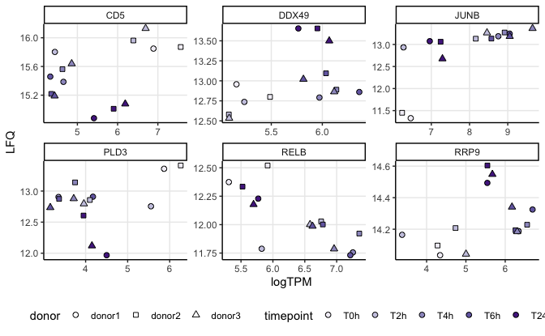
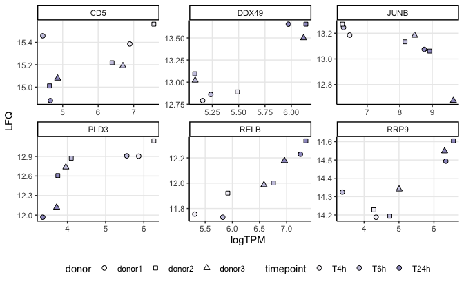
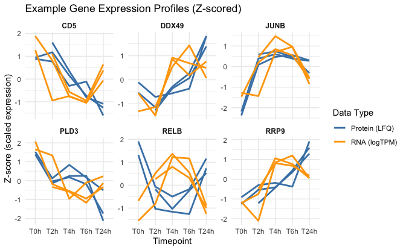
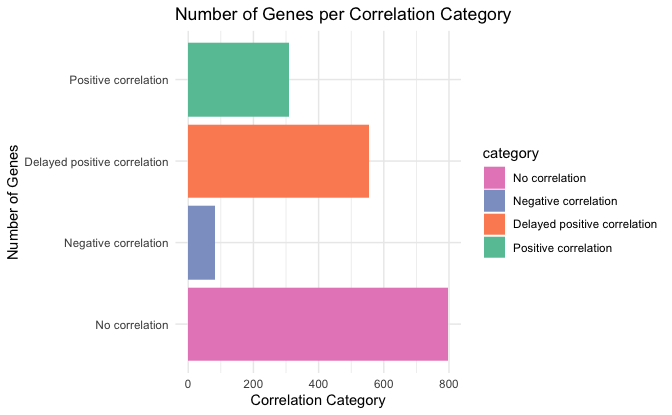
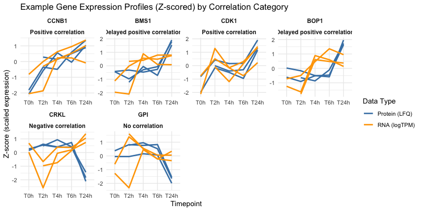
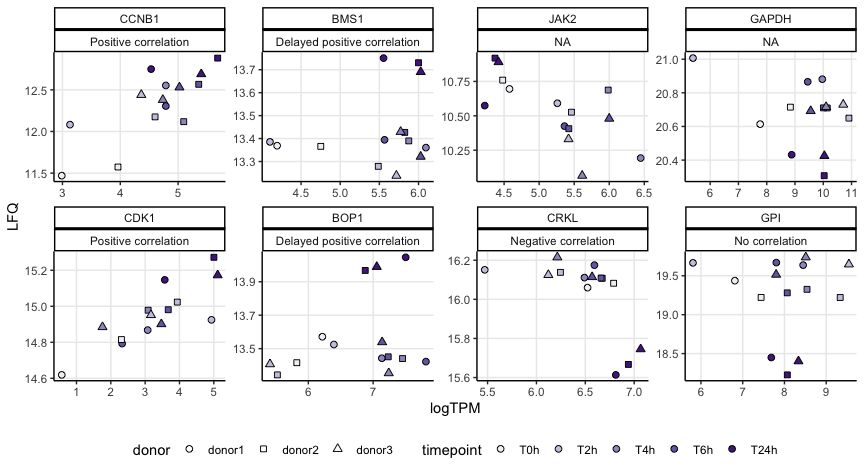
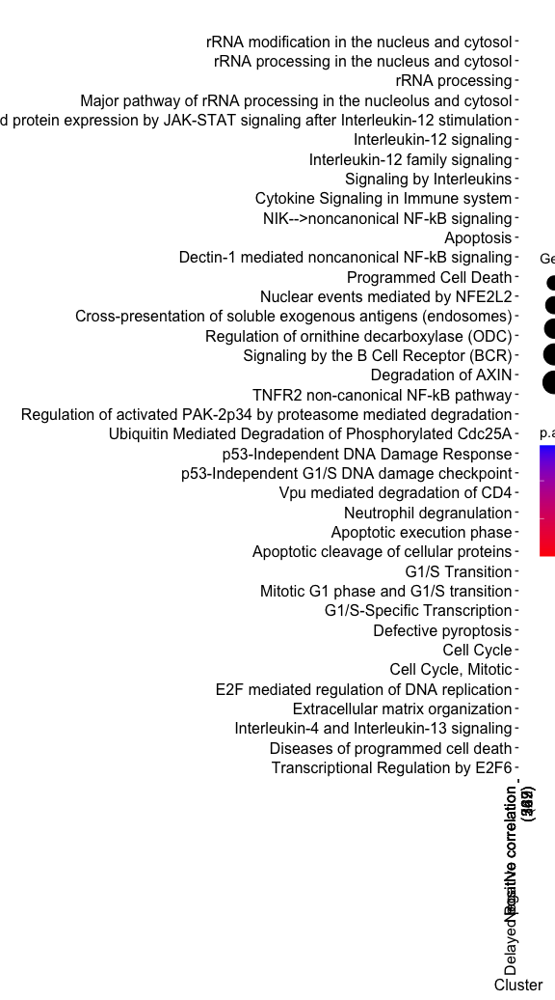
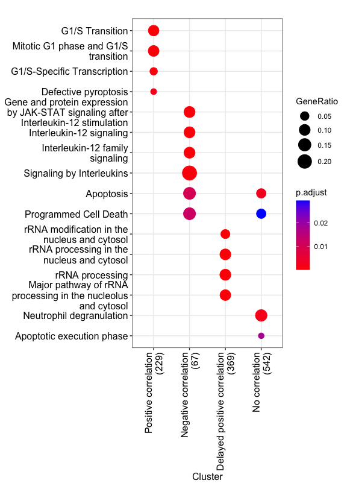
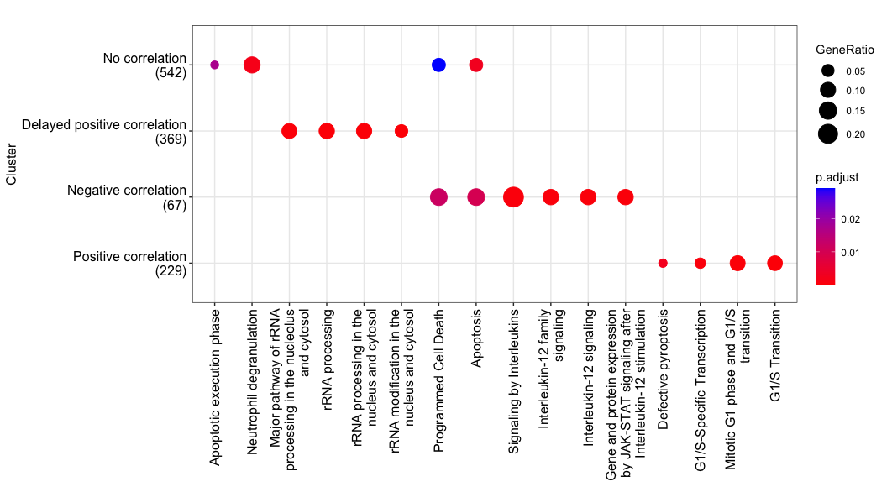

Classify genes by their protein-mRNA association
================
Kaspar Bresser

- [Import DE data](#import-de-data)
- [Import abundance data](#import-abundance-data)
- [Within gene correlations](#within-gene-correlations)
- [Example genes](#example-genes)
- [Set classes and plot](#set-classes-and-plot)
  - [Plot examples](#plot-examples)
- [Test for pathways](#test-for-pathways)

Compare the RNAseq data with the proteomics.

First load packages

``` r
library(tidyverse)
library(lemon)
library(ggpubr)
library(gghighlight)
library(msigdbr)
library(rstatix)
library(RColorBrewer)
library(clusterProfiler)
library(ReactomePA)
library(msigdbr)
library(msigdbdf)
library(zoo)
```

## Import DE data

Import DE data

``` r
dat.protein <- read_tsv("Output/proteomic_DE_all.tsv")
dat.rna <- read_tsv("Output/RNA_DE_all.tsv")
```

Combine

``` r
comparisons <- unique(dat.protein$comparison)[1:4]

dat.rna %>% 
  dplyr::select(contains(c("gene", "log", "adj", "comp"))) %>% 
  inner_join(dplyr::select(dat.protein, contains(c("gene", "log", "adj", "comp")))) %>%   
  mutate(comparison = factor(comparison, levels = comparisons)) %>% 
  na.omit() -> all.DE.combined
```

Get differentially expressed proteins

``` r
all.DE.combined %>% 
  filter(adj.P.Val.protein < 0.05 & abs(logFC.protein) > 0.35) %>% 
  pull(gene.name) -> prots.change
```

## Import abundance data

Import protein abunfance data

``` r
dat.protein.all <- read_tsv("Output/proteomic_data_clean.tsv")
```

Import RNA count data, and tidy

``` r
dat.rna <- read_tsv("Data/RNAseq_CPM.tsv")

dat.rna %>% 
  dplyr::select(-ensembl.id) %>% 
  pivot_longer(-gene.name, names_to = "sample", values_to = "logTPM") %>% 
  separate(sample, into = c("donor", "timepoint")) %>% 
  mutate(timepoint = paste0("T", str_remove(timepoint, "0"))) %>% 
  mutate(donor = case_when(donor == "D1" ~ "donor1", donor == "D2" ~ "donor2", TRUE ~ "donor3")) %>% 
  mutate(timepoint = factor(timepoint, levels = c("T0h", "T2h", "T4h", "T6h", "T24h"))) %>% 
  group_by(donor, timepoint) %>% 
  distinct(gene.name, .keep_all = T) %>% 
  ungroup() -> dat.rna
  
dat.rna
```

    ## # A tibble: 158,640 × 4
    ##    gene.name donor  timepoint logTPM
    ##    <chr>     <chr>  <fct>      <dbl>
    ##  1 DPM1      donor1 T0h         2.82
    ##  2 DPM1      donor1 T2h         4.19
    ##  3 DPM1      donor1 T4h         3.93
    ##  4 DPM1      donor1 T6h         3.30
    ##  5 DPM1      donor1 T24h        3.90
    ##  6 DPM1      donor2 T0h         2.93
    ##  7 DPM1      donor2 T2h         3.86
    ##  8 DPM1      donor2 T4h         3.86
    ##  9 DPM1      donor2 T6h         3.59
    ## 10 DPM1      donor2 T24h        3.23
    ## # ℹ 158,630 more rows

Combine protein and RNA data

``` r
dat.protein.all %>% 
  dplyr::select(gene.name, donor, LFQ, timepoint) %>% 
  group_by(donor, timepoint) %>% 
  distinct(gene.name, .keep_all = T) %>% 
  ungroup() %>% 
  inner_join(dat.rna) %>%
  mutate(timepoint = factor(timepoint, levels = c("T0h", "T2h", "T4h", "T6h", "T24h"))) %>% 
  na.omit() -> dat.counts.combined

dat.counts.combined
```

    ## # A tibble: 84,023 × 5
    ##    gene.name donor    LFQ timepoint logTPM
    ##    <chr>     <chr>  <dbl> <fct>      <dbl>
    ##  1 E2F8      donor1  9.33 T0h         1.64
    ##  2 E2F8      donor1 10.1  T2h         1.90
    ##  3 E2F8      donor1 10.1  T4h         2.65
    ##  4 E2F8      donor1  9.35 T6h         2.78
    ##  5 E2F8      donor1  9.99 T24h        4.26
    ##  6 E2F8      donor2 10.1  T2h         3.66
    ##  7 E2F8      donor2  9.70 T4h         2.47
    ##  8 E2F8      donor2  9.65 T6h         3.21
    ##  9 E2F8      donor2 10.1  T24h        5.18
    ## 10 E2F8      donor3 10.2  T2h         3.57
    ## # ℹ 84,013 more rows

Extract the proteins that change

``` r
dat.counts.combined %>% 
  filter(gene.name %in% prots.change) %>% 
  group_by(gene.name) %>% 
  filter(n() > 6) %>% 
  ungroup() -> dat.input

dat.input
```

    ## # A tibble: 24,444 × 5
    ##    gene.name donor    LFQ timepoint logTPM
    ##    <chr>     <chr>  <dbl> <fct>      <dbl>
    ##  1 GTPBP10   donor1  11.8 T0h         2.36
    ##  2 GTPBP10   donor1  11.4 T2h         1.85
    ##  3 GTPBP10   donor1  11.3 T4h         3.03
    ##  4 GTPBP10   donor1  11.4 T6h         2.74
    ##  5 GTPBP10   donor1  12.0 T24h        3.07
    ##  6 GTPBP10   donor2  11.8 T0h         2.68
    ##  7 GTPBP10   donor2  11.1 T2h         2.17
    ##  8 GTPBP10   donor2  11.5 T4h         2.33
    ##  9 GTPBP10   donor2  11.4 T6h         2.79
    ## 10 GTPBP10   donor2  12.0 T24h        2.89
    ## # ℹ 24,434 more rows

## Within gene correlations

Set function to calculate shifted correlations

``` r
calc_shifted_cor <- function(data, shift){
  
  data %>% 
    group_by(gene.name) %>% 
    filter(n() > 6) %>% 
    group_by(gene.name, donor) %>% 
    mutate(logTPM = lag(logTPM, shift)) %>% 
    filter(!is.na(logTPM)) %>%
    group_by(gene.name) %>% 
    rstatix::cor_test(LFQ, logTPM, method = "sp") %>% 
    mutate(lag = shift)
}
```

Calculate shifted correlations between mRNA and protein at shifts of 0,
1, and 2

``` r
dat.cors <- map2(list(dat.input), c(0,1,2), calc_shifted_cor)
```

Re-shape and tidy correlation output

``` r
dat.cors %>% 
  bind_rows() %>%
  group_by(gene.name) %>% 
  slice_max(order_by = abs(cor), n = 1, with_ties = F) %>% 
  transmute(gene.name = gene.name, best.cor = cor, best.p = p, lag = lag) -> dat.tmp

dat.cors %>% 
  bind_rows() %>% 
  filter(lag == 0) %>% 
  transmute(gene.name = gene.name, cor = cor, p = p) %>% 
  inner_join(dat.tmp, by = "gene.name") -> dat.lagged.cors

dat.lagged.cors
```

    ## # A tibble: 1,746 × 6
    ##    gene.name    cor      p best.cor  best.p   lag
    ##    <chr>      <dbl>  <dbl>    <dbl>   <dbl> <dbl>
    ##  1 AAK1      -0.095 0.75       0.58 0.0655      1
    ##  2 AAMP       0.47  0.0938     0.52 0.197       2
    ##  3 AAR2       0.21  0.473      0.95 0.00114     2
    ##  4 ABCB10     0.64  0.0163     0.64 0.0163      0
    ##  5 ABCD3      0.59  0.0303     0.59 0.0303      0
    ##  6 ABCF2      0.18  0.532      0.67 0.0831      2
    ##  7 ABHD14B   -0.15  0.616      0.4  0.225       1
    ##  8 ABI1      -0.24  0.417      0.25 0.451       1
    ##  9 ABI3      -0.31  0.281     -0.31 0.281       0
    ## 10 ABL1      -0.13  0.671     -0.19 0.665       2
    ## # ℹ 1,736 more rows

## Example genes

Plot some examples

``` r
dat.counts.combined %>% 
  filter(gene.name %in% c("DDX49", "JUNB", "CD5", "RRP9", "PLD3", "RELB")) %>% 
  ggplot(aes(x = logTPM, y = LFQ, shape = donor, fill = timepoint))+
  geom_point( size = 2)+
  scale_shape_manual(values = c(21, 22, 24))+
  scale_fill_manual(values = brewer.pal(5, "Purples"))+
  facet_rep_wrap(~gene.name, scales = "free")+
  theme_classic()+
  theme(panel.grid.major = element_line(), legend.position = "bottom")+
  guides(fill = guide_legend("timepoint", override.aes = list(shape = 21)))
```



Plot some examples, with a shift of 2

``` r
dat.counts.combined %>% 
    group_by( donor,gene.name) %>% 
    mutate(logTPM = lag(logTPM, 2)) %>% 
  na.omit() %>% 
  filter(gene.name %in% c("DDX49", "JUNB", "CD5", "RRP9", "PLD3", "RELB")) %>% 
ggplot(aes(x = logTPM, y = LFQ, shape = donor, fill = timepoint))+
  geom_point( size = 2)+
  scale_shape_manual(values = c(21, 22, 24))+
  scale_fill_manual(values = brewer.pal(5, "Purples"))+
  facet_rep_wrap(~gene.name, scales = "free")+
  theme_classic()+
  theme(panel.grid.major = element_line(), legend.position = "bottom")+
  guides(fill = guide_legend("timepoint", override.aes = list(shape = 21)))
```



Plot the examples as lines over time

``` r
# Prepare data for plotting
plot_data <- dat.input %>%
  filter(gene.name %in% c("DDX49", "JUNB", "CD5", "RRP9", "PLD3", "RELB")) %>% 
  group_by(gene.name) %>%
  mutate(
    LFQ_scaled = (LFQ - mean(LFQ, na.rm = TRUE)) / sd(LFQ, na.rm = TRUE),
    logTPM_scaled = (logTPM - mean(logTPM, na.rm = TRUE)) / sd(logTPM, na.rm = TRUE)
  ) %>%
  ungroup()


ggplot(plot_data, aes(x = timepoint, group = interaction(gene.name, donor))) +
  geom_line(aes(y = LFQ_scaled, color = "Protein (LFQ)"), size = 1) +
  geom_line(aes(y = logTPM_scaled, color = "RNA (logTPM)"), size = 1, linetype = "solid") +
  facet_wrap(~ gene.name, scales = "free_y") +
  scale_color_manual(values = c("Protein (LFQ)" = "steelblue", "RNA (logTPM)" = "orange")) +
  theme_minimal() +
  theme(strip.text = element_text(face = "bold", size = 9)) +
  labs(title = "Example Gene Expression Profiles (Z-scored)",
       x = "Timepoint",
       y = "Z-score (scaled expression)",
       color = "Data Type")
```

    ## Warning: Using `size` aesthetic for lines was deprecated in ggplot2 3.4.0.
    ## ℹ Please use `linewidth` instead.
    ## This warning is displayed once every 8 hours.
    ## Call `lifecycle::last_lifecycle_warnings()` to see where this warning was
    ## generated.



## Set classes and plot

Set classes

``` r
results.classes <- dat.lagged.cors %>%
  mutate(
    category = case_when(
      abs(cor) <= 0.5 & best.cor >= 0.5  ~ "Delayed positive correlation",
#      p > 0.05 & best.p < 0.05 & best.cor <= -0.2  ~ "Delayed negative correlation",
      cor >= 0.5 ~ "Positive correlation",
      cor <= -0.5 ~ "Negative correlation",
      TRUE ~ "No correlation"
    )
  )
```

Count per category and plot

``` r
# Count genes per category
results.classes %>%
  count(category) %>%
  arrange(desc(n)) %>%
  mutate(category = factor(category, levels = rev(c("Positive correlation", "Delayed positive correlation", 
                                                "Negative correlation", "No correlation")))) -> category.counts

# Barplot
ggplot(category.counts, aes(y = (category), x = n, fill = category)) +
  geom_col() +
  scale_fill_brewer(palette = "Set2", direction = -1) +
  labs(title = "Number of Genes per Correlation Category",
       x = "Correlation Category",
       y = "Number of Genes") +
  theme_minimal() +
  theme(legend.position = "right")
```



``` r
ggsave("Figs/correlations/cor_counts_r05cutoff2.pdf", width = 7, height = 2.5)
```

### Plot examples

Output data

``` r
results.classes %>% 
  inner_join(all.DE.combined) -> dat.cors.DE

write_tsv(results.classes, "Output/dat_cor_DE.tsv")

results.classes <- read_tsv("Output/dat_cor_DE.tsv")
```

Plot examples

``` r
# Pick 2 example genes per category (excluding 'No correlation' or adjust as needed)
set.seed(42)
example_genes <- c("TNFRSF9","PDCD11", "FDPS", "TMED8",
                   "NR4A1","TNFRSF18", "ALKBH5", "SPIN1")

example_genes <- c("CCNB1","BMS1", "JAK2", "GAPDH",
                   "CDK1","BOP1", "CRKL", "GPI")


# Prepare data for plotting
plot_data <- dat.input %>%
  filter(gene.name %in% example_genes) %>%
  left_join(results.classes %>% dplyr::select(gene.name, category), by = "gene.name")


plot_data_scaled <- plot_data %>%
  group_by(gene.name) %>%
  mutate(
    LFQ_scaled = (LFQ - mean(LFQ, na.rm = TRUE)) / sd(LFQ, na.rm = TRUE),
    logTPM_scaled = (logTPM - mean(logTPM, na.rm = TRUE)) / sd(logTPM, na.rm = TRUE)
  ) %>%
  ungroup() %>% 
  mutate(gene.name = factor(gene.name, levels = example_genes))


ggplot(plot_data_scaled, aes(x = timepoint, group = interaction(gene.name, donor))) +
  geom_line(aes(y = LFQ_scaled, color = "Protein (LFQ)"), size = 1) +
  geom_line(aes(y = logTPM_scaled, color = "RNA (logTPM)"), size = 1, linetype = "solid") +
  facet_rep_wrap(~ gene.name + category , scales = "free", ncol = 4) +
  scale_color_manual(values = c("Protein (LFQ)" = "steelblue", "RNA (logTPM)" = "orange")) +
  theme_minimal() +
  theme(strip.text = element_text(face = "bold", size = 9)) +
  labs(title = "Example Gene Expression Profiles (Z-scored) by Correlation Category",
       x = "Timepoint",
       y = "Z-score (scaled expression)",
       color = "Data Type")
```



``` r
ggsave("Figs/correlations/Cors_examples_lines.pdf", width = 10, height = 5)
```

Plot examples

``` r
dat.counts.combined %>% 
  filter(gene.name %in% example_genes) %>%
  left_join(results.classes %>% dplyr::select(gene.name, category), by = "gene.name") %>% 
  mutate(gene.name = factor(gene.name, levels = (example_genes))) %>% 
ggplot(aes(x = logTPM, y = LFQ, shape = donor, fill = timepoint))+
  geom_point( size = 2)+
  scale_shape_manual(values = c(21, 22, 24))+
  scale_fill_manual(values = brewer.pal(5, "Purples"))+
  facet_rep_wrap(~gene.name + category, scales = "free", ncol = 4)+
  theme_classic()+
  theme(panel.grid.major = element_line(), legend.position = "bottom")+
  guides(fill = guide_legend("timepoint", override.aes = list(shape = 21)))
```



``` r
ggsave("Figs/correlations/Cors_examples_dots2.pdf", width = 8, height = 5)
```

## Test for pathways

get clusters

``` r
bitr(results.classes$gene.name, fromType="SYMBOL", toType="ENTREZID", OrgDb="org.Hs.eg.db") %>% 
  as_tibble() %>% 
  inner_join(results.classes, by = c("SYMBOL" = "gene.name")) %>% 
  distinct(ENTREZID, .keep_all = T) -> dat.cluster
```

Get universe and test

``` r
bitr(unique(all.DE.combined$gene.name), fromType="SYMBOL", toType="ENTREZID", OrgDb="org.Hs.eg.db") %>% 
  as_tibble() %>% 
  pull(ENTREZID) -> uni
```

    ## Warning in bitr(unique(all.DE.combined$gene.name), fromType = "SYMBOL", : 0.1%
    ## of input gene IDs are fail to map...

``` r
res <- compareCluster(geneClusters = ENTREZID~category, data = dat.cluster , fun="enrichPathway", universe = uni)
```

Plots

``` r
desired.order <- c("Positive correlation", 
                   "Negative correlation", 
                   "Delayed positive correlation",
                   "No correlation")

res@compareClusterResult$Cluster <- factor(
  res@compareClusterResult$Cluster,
  levels = desired.order)

res@compareClusterResult <- res@compareClusterResult %>%
  group_by(Cluster) %>%
  mutate(
    Description = fct_reorder(Description, p.adjust, .desc = FALSE)
  ) %>%
  ungroup()

dotplot(res, showCategory = 20, size = "geneRatio", label_format = 100)+
 theme(axis.text.x = element_text(angle = 90, vjust = 0.5, hjust=1))
```



``` r
ggsave("Figs/Cors_pathways_all.pdf", width = 10, height = 18)
```

``` r
# Get the data
df <- res@compareClusterResult

# Set Cluster order
df$Cluster <- factor(df$Cluster, levels = desired.order)

# Arrange Description factor to group by Cluster and sort within by p.adjust
df <- df %>%
  arrange(Cluster, p.adjust) %>%
  mutate(Description = factor(Description, levels = unique(Description)))

res@compareClusterResult <- df

dotplot(res, showCategory = 4, size = "geneRatio")+
 theme(axis.text.x = element_text(angle = 90, vjust = 0.5, hjust=1))
```



``` r
ggsave("Figs/correlations/Cors_pathways2.pdf", width = 5.5, height = 10)
```

``` r
dotplot(res, showCategory = 4, size = "geneRatio")+
 theme(axis.text.x = element_text(angle = 90, vjust = 0.5, hjust=1))+
  coord_flip()
```



``` r
ggsave("Figs/correlations/Cors_pathways.pdf", width = 10, height = 5.5)
```
