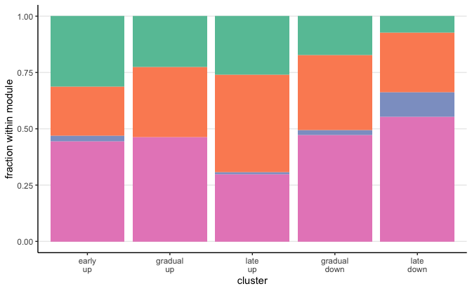
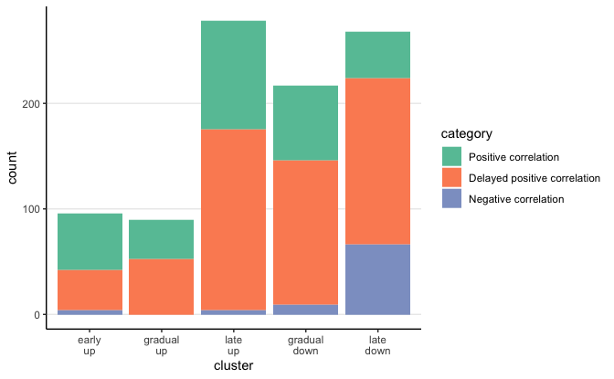
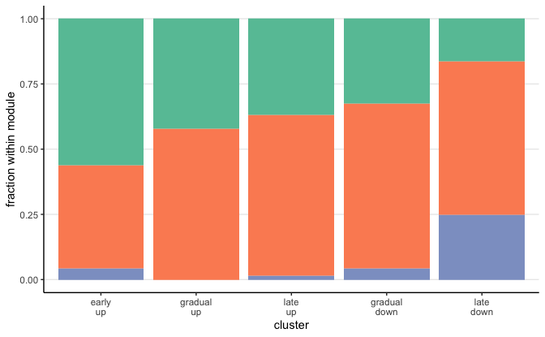
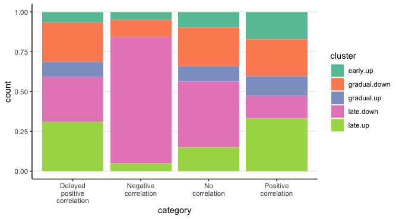

Compare correlation clusters and protein expression modules
================
Kaspar Bresser

- [Import and pre-process](#import-and-pre-process)
- [plot clusters](#plot-clusters)
- [other side](#other-side)

First load packages

``` r
library(tidyverse)
library(lemon)
library(ggpubr)
library(gghighlight)
library(rstatix)
library(RColorBrewer)
```

## Import and pre-process

Import protein expression modules and the association clusters

``` r
dat.cor.clusters <- read_tsv("Output/dat_cor_DE.tsv")
  
dat.prot.clusters <- read_tsv("Output/abundances_protein_clustered.tsv")
```

``` r
dat.prot.clusters %>% 
  distinct(gene.name, cluster) %>% 
  inner_join(dat.cor.clusters) %>%
    mutate(cluster = factor(cluster, levels = c("early.up", "gradual.up", "late.up", "gradual.down", "late.down")),
           cluster = fct_relabel(cluster, ~str_replace(., "\\.", "\n")),
         category = factor(category, levels = c("Positive correlation", "Delayed positive correlation", 
                                                "Negative correlation", "No correlation"))) -> to.plot

dat.prot.clusters %>% 
  distinct(gene.name, cluster) %>% 
  inner_join(dat.cor.clusters) %>%
write_tsv( "Output/Modules_correlations.tsv")
```

``` r
dat.prot.clusters %>% 
  distinct(gene.name, cluster) %>% 
  inner_join(dat.cor.clusters) %>%
  count(category) 
```

    ## # A tibble: 4 × 2
    ##   category                         n
    ##   <chr>                        <int>
    ## 1 Delayed positive correlation   556
    ## 2 Negative correlation            83
    ## 3 No correlation                 797
    ## 4 Positive correlation           310

## plot clusters

``` r
to.plot %>% 
ggplot(aes(x = cluster, fill = category))+
  geom_bar(position = "fill")+
  scale_fill_brewer(palette = "Set2")+
  theme_classic()+
  theme(panel.grid.major.y = element_line(), legend.position = "none")+
  labs(y = "fraction within module")
```



``` r
ggsave("Figs/corr_module_comparison/comparison_fill.pdf", width = 3.1, height = 2.8)
```

``` r
to.plot %>% 
  filter(category !="No correlation") %>% 
ggplot(aes(x = cluster, fill = category))+
  geom_bar(position = "stack")+
  scale_fill_brewer(palette = "Set2")+
  theme_classic()+
  theme(panel.grid.major.y = element_line())
```



``` r
ggsave("Figs/corr_module_comparison/comparison_woNoCor_stack.pdf", width = 5.5, height = 3)
```

``` r
to.plot %>% 
  filter(category !="No correlation") %>% 
ggplot(aes(x = cluster, fill = category))+
  geom_bar(position = "fill")+
  scale_fill_brewer(palette = "Set2")+
  theme_classic()+
  theme(panel.grid.major.y = element_line(), legend.position = "none")+
  labs(y = "fraction within module")
```



``` r
ggsave("Figs/corr_module_comparison/comparison_woNoCor_fill.pdf", width = 3.1, height = 2.8)
```

## other side

``` r
dat.prot.clusters %>% 
  distinct(gene.name, cluster) %>% 
  inner_join(dat.cor.clusters) %>%
  mutate(category = str_replace_all(category, " ", "\n")) %>%
ggplot(aes(x = category, fill = cluster))+
  geom_bar(position = "fill")+
  scale_fill_brewer(palette = "Set2")+
  theme_classic()+
  theme(panel.grid.major.y = element_line())
```


