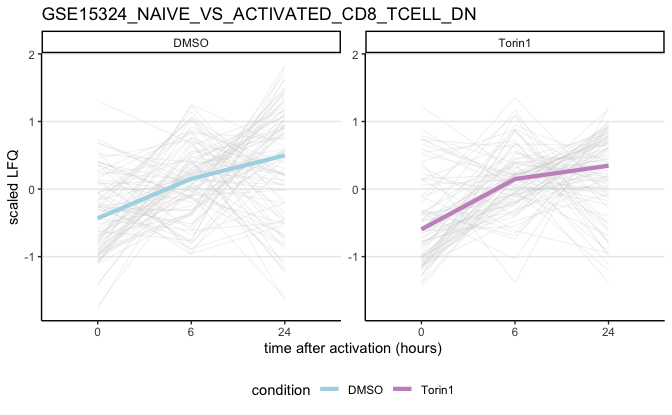
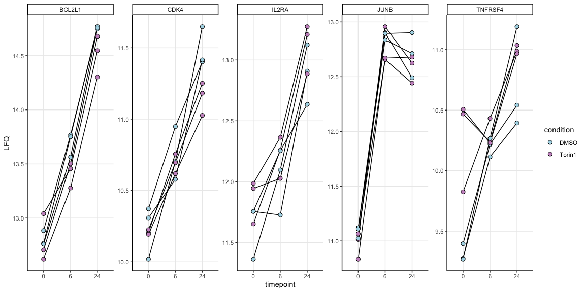
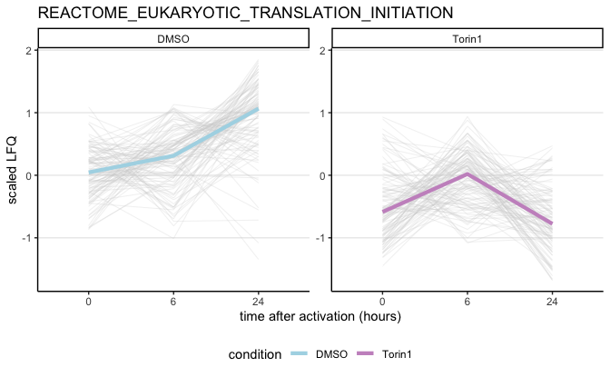
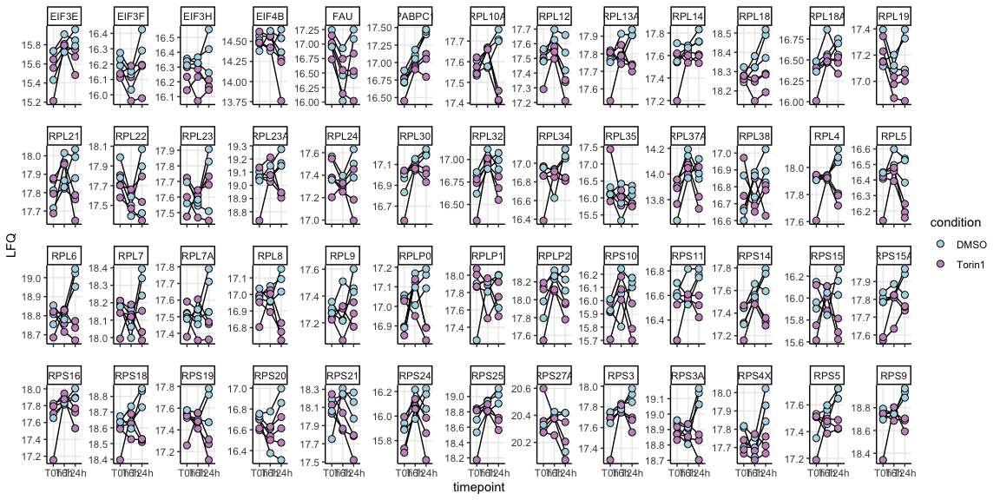
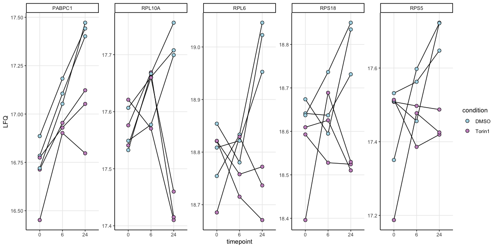

DE analysis Torin-1 treatment
================
Kaspar Bresser

- [Import and tidy data](#import-and-tidy-data)
- [PCA](#pca)
- [Test differences](#test-differences)
- [pathways](#pathways)

First load packages

``` r
library(tidyverse)
library(broom) 
library(limma)
library(ggrepel)
library(readxl)
library(circlize)
library(ComplexHeatmap)
library(cluster)
library(lemon)
library(gghighlight)
#library(clusterProfiler)
library(org.Hs.eg.db)
library(RColorBrewer)
library(msigdbr)
library(msigdbdf)
library(fgsea)
```

## Import and tidy data

Select the proteins that have a “proteotypic” count of more than 1.

``` r
read_tsv("Data/20240624_TOOPS_output_report.pr_matrix.tsv") %>% 
  dplyr::select(Protein.Group, Genes, Proteotypic, Precursor.Id, matches('\\.d$')) %>%
    gather('Sample', 'Intensity', matches('\\.d$')) %>%
    filter(!is.na(Intensity)) %>%
    filter(Proteotypic == T) %>% #<< cuts a lot of proteins
    group_by(Protein.Group) %>%
    distinct(Precursor.Id, .keep_all = T) %>%
    summarise(count = n()) %>%
    filter(count > 1)  %>%
    dplyr::pull(Protein.Group) -> select.prots

str(select.prots)
```

    ##  chr [1:6945] "A0A024RBG1" "A0A075B6T6" "A0A0B4J245" "A0A0U1RRE5" "A0AVK6" ...

import proteomic quantification data

``` r
dat <- read_tsv("Data/20240624_TOOPS_output_report.pg_matrix.tsv")

dat
```

    ## # A tibble: 8,194 × 26
    ##    Protein.Group          Protein.Ids Protein.Names Genes First.Protein.Descri…¹
    ##    <chr>                  <chr>       <chr>         <chr> <chr>                 
    ##  1 A0A024RBG1             A0A024RBG1  NUD4B_HUMAN   NUDT… Diphosphoinositol pol…
    ##  2 A0A024RBG1;O95989;Q9N… Q9NZJ9;Q8N… NUD4B_HUMAN;… NUDT… Diphosphoinositol pol…
    ##  3 A0A024RBG1;Q9NZJ9      Q9NZJ9;A0A… NUD4B_HUMAN;… NUDT… Diphosphoinositol pol…
    ##  4 A0A075B6T6             A0A075B6T6  TVAL2_HUMAN   TRAV… T cell receptor alpha…
    ##  5 A0A087WW87;P01614      P01614;A0A… KV240_HUMAN;… IGKV… Immunoglobulin kappa …
    ##  6 A0A0A6YYC5             A0A0A6YYC5  TVA14_HUMAN   TRAV… T cell receptor alpha…
    ##  7 A0A0A6YYJ7             A0A0A6YYJ7  TVA83_HUMAN   TRAV… T cell receptor alpha…
    ##  8 A0A0A6YYK7             A0A0A6YYK7  TVA19_HUMAN   TRAV… T cell receptor alpha…
    ##  9 A0A0B4J245             A0A0B4J245  TVAL1_HUMAN   TRAV… T cell receptor alpha…
    ## 10 A0A0B4J275             A0A0B4J275  TVA17_HUMAN   TRAV… T cell receptor alpha…
    ## # ℹ 8,184 more rows
    ## # ℹ abbreviated name: ¹​First.Protein.Description
    ## # ℹ 21 more variables:
    ## #   `C:\\Users\\massspecuser\\Desktop\\20240622_Carmen\\RES00360_Anouk_Jurgens\\20240620_AnoukJurgens_TOOPS\\1_0h_DMSO_donor1_S2-A10_1_9342.d` <dbl>,
    ## #   `C:\\Users\\massspecuser\\Desktop\\20240622_Carmen\\RES00360_Anouk_Jurgens\\20240620_AnoukJurgens_TOOPS\\2_0h_6hTorin1_Donor1_S2-B10_1_9343.d` <dbl>,
    ## #   `C:\\Users\\massspecuser\\Desktop\\20240622_Carmen\\RES00360_Anouk_Jurgens\\20240620_AnoukJurgens_TOOPS\\3_0h_24hTorin1_Donor1_S2-C10_1_9344.d` <dbl>,
    ## #   `C:\\Users\\massspecuser\\Desktop\\20240622_Carmen\\RES00360_Anouk_Jurgens\\20240620_AnoukJurgens_TOOPS\\4_6h_DMSO_Donor1_S2-D10_1_9345.d` <dbl>, …

Tidy up a bit, and convert abundances to log2

``` r
dat %>% 
  filter(Protein.Group %in% select.prots) %>% 
  pivot_longer(contains("Users"), names_to = "sample", values_to = "LFQ") %>% 
  mutate(sample = str_extract(sample, "\\d+_\\d+h_.+onor\\d+")) %>% 
  separate(sample, into = c("sample.nr", "timepoint", "condition", "donor")) %>% 
  mutate(donor = str_to_lower(donor)) %>% 
  mutate(LFQ = log2(LFQ)) %>% 
  mutate(condition = factor(condition, levels = c("DMSO", "6hTorin1", "24hTorin1", "Torin1"))) %>% 
  mutate(timepoint = factor(timepoint, levels = c("0h", "6h", "24h")))-> dat

dat
```

    ## # A tibble: 145,845 × 10
    ##    Protein.Group Protein.Ids Protein.Names Genes  First.Protein.Description     
    ##    <chr>         <chr>       <chr>         <chr>  <chr>                         
    ##  1 A0A024RBG1    A0A024RBG1  NUD4B_HUMAN   NUDT4B Diphosphoinositol polyphospha…
    ##  2 A0A024RBG1    A0A024RBG1  NUD4B_HUMAN   NUDT4B Diphosphoinositol polyphospha…
    ##  3 A0A024RBG1    A0A024RBG1  NUD4B_HUMAN   NUDT4B Diphosphoinositol polyphospha…
    ##  4 A0A024RBG1    A0A024RBG1  NUD4B_HUMAN   NUDT4B Diphosphoinositol polyphospha…
    ##  5 A0A024RBG1    A0A024RBG1  NUD4B_HUMAN   NUDT4B Diphosphoinositol polyphospha…
    ##  6 A0A024RBG1    A0A024RBG1  NUD4B_HUMAN   NUDT4B Diphosphoinositol polyphospha…
    ##  7 A0A024RBG1    A0A024RBG1  NUD4B_HUMAN   NUDT4B Diphosphoinositol polyphospha…
    ##  8 A0A024RBG1    A0A024RBG1  NUD4B_HUMAN   NUDT4B Diphosphoinositol polyphospha…
    ##  9 A0A024RBG1    A0A024RBG1  NUD4B_HUMAN   NUDT4B Diphosphoinositol polyphospha…
    ## 10 A0A024RBG1    A0A024RBG1  NUD4B_HUMAN   NUDT4B Diphosphoinositol polyphospha…
    ## # ℹ 145,835 more rows
    ## # ℹ 5 more variables: sample.nr <chr>, timepoint <fct>, condition <fct>,
    ## #   donor <chr>, LFQ <dbl>

``` r
write_tsv(dat, "Output/abundances_protein_all_Torin.tsv")
```

Prep for DE testing

``` r
dat %>% 
  filter(condition != "6hTorin1") %>% 
  mutate(condition = case_when(condition == "24hTorin1" ~ "Torin1",
                               TRUE ~ condition)) %>% 
  mutate(timepoint = paste0("T", timepoint)) %>% 
  dplyr::select(sample.nr, Genes, timepoint, condition, donor, LFQ) %>% 
  group_by(Genes) %>%
  filter(n() < 21) %>% 
  ungroup() -> dat.forDE

dat.forDE
```

    ## # A tibble: 124,758 × 6
    ##    sample.nr Genes  timepoint condition donor    LFQ
    ##    <chr>     <chr>  <chr>     <chr>     <chr>  <dbl>
    ##  1 1         NUDT4B T0h       DMSO      donor1 NA   
    ##  2 3         NUDT4B T0h       Torin1    donor1  9.17
    ##  3 4         NUDT4B T6h       DMSO      donor1  9.59
    ##  4 5         NUDT4B T6h       Torin1    donor1  9.42
    ##  5 6         NUDT4B T24h      DMSO      donor1 10.0 
    ##  6 7         NUDT4B T24h      Torin1    donor1  9.58
    ##  7 8         NUDT4B T0h       DMSO      donor2 NA   
    ##  8 10        NUDT4B T0h       Torin1    donor2  9.95
    ##  9 11        NUDT4B T6h       DMSO      donor2  9.70
    ## 10 12        NUDT4B T6h       Torin1    donor2  9.62
    ## # ℹ 124,748 more rows

## PCA

Prep for PCA

``` r
dat.forDE %>% 
  dplyr::select(-sample.nr) %>% 
  pivot_wider(names_from = c(timepoint, condition, donor), values_from = LFQ) %>% 
  na.omit() %>% 
  column_to_rownames("Genes") -> dat.pca
```

Select for most variable proteins

``` r
var.genes <- apply(dat.pca, 1, var)
head(var.genes)
```

    ##        UBA6       ESYT2       MED19   UHRF1BP1L     TMEM223       ILVBL 
    ## 0.005235615 0.004826508 0.049517154 0.022181800 0.043684827 0.014639782

``` r
select.var <- names(sort(var.genes, decreasing=TRUE))[1:1000]
dat.pca <- dat.pca[select.var, ]
```

Perform PCA

``` r
dat.pca %>% 
  t() %>% 
  as.data.frame() %>% 
  prcomp(center = T, scale = F) -> pca

str(pca)
```

    ## List of 5
    ##  $ sdev    : num [1:18] 8.85 5.36 3.96 2.98 2.8 ...
    ##  $ rotation: num [1:1000, 1:18] 0.1509 -0.1072 0.1044 0.1014 -0.0805 ...
    ##   ..- attr(*, "dimnames")=List of 2
    ##   .. ..$ : chr [1:1000] "EGR2" "TMSB4X" "NFKBID" "STARD4" ...
    ##   .. ..$ : chr [1:18] "PC1" "PC2" "PC3" "PC4" ...
    ##  $ center  : Named num [1:1000] 13.9 19.3 11.1 11.1 13.4 ...
    ##   ..- attr(*, "names")= chr [1:1000] "EGR2" "TMSB4X" "NFKBID" "STARD4" ...
    ##  $ scale   : logi FALSE
    ##  $ x       : num [1:18, 1:18] -10.476 -9.892 3.359 0.859 14.862 ...
    ##   ..- attr(*, "dimnames")=List of 2
    ##   .. ..$ : chr [1:18] "T0h_DMSO_donor1" "T0h_Torin1_donor1" "T6h_DMSO_donor1" "T6h_Torin1_donor1" ...
    ##   .. ..$ : chr [1:18] "PC1" "PC2" "PC3" "PC4" ...
    ##  - attr(*, "class")= chr "prcomp"

plot PCA

``` r
library(RColorBrewer)
as.data.frame(pca$x) %>% 
  rownames_to_column("sample") %>% 
  separate(sample, into = c("timepoint", "treatment", "donor")) %>% 
  ggplot(aes(x = PC2, y = PC1, fill = timepoint, shape = treatment))+
  geom_point( size = 4 )+
  scale_shape_manual(values = c(21, 24))+
  scale_fill_manual(values = brewer.pal(3, "Purples"))+
  ggtitle("PCA 1000 most variable genes")+
  theme_classic()+
  theme(panel.grid.major = element_line())+
  guides(fill = guide_legend("timepoint", override.aes = list(shape = 21)))
```


## Test differences

will test for differences using limma

Set up a design matrix, we want to compare between time-points

``` r
dat.forDE %>% 
  mutate(sample.id = paste0(condition, ".", timepoint)) %>% 
  dplyr::select(sample.nr, sample.id, donor) %>% 
  distinct() %>% 
  mutate(sample.id = as.factor(sample.id))-> pheno

design <- model.matrix(~0+ pheno$sample.id)
colnames(design) <- levels(pheno$sample.id)

design
```

    ##    DMSO.T0h DMSO.T24h DMSO.T6h Torin1.T0h Torin1.T24h Torin1.T6h
    ## 1         1         0        0          0           0          0
    ## 2         0         0        0          1           0          0
    ## 3         0         0        1          0           0          0
    ## 4         0         0        0          0           0          1
    ## 5         0         1        0          0           0          0
    ## 6         0         0        0          0           1          0
    ## 7         1         0        0          0           0          0
    ## 8         0         0        0          1           0          0
    ## 9         0         0        1          0           0          0
    ## 10        0         0        0          0           0          1
    ## 11        0         1        0          0           0          0
    ## 12        0         0        0          0           1          0
    ## 13        1         0        0          0           0          0
    ## 14        0         0        0          1           0          0
    ## 15        0         0        1          0           0          0
    ## 16        0         0        0          0           0          1
    ## 17        0         1        0          0           0          0
    ## 18        0         0        0          0           1          0
    ## attr(,"assign")
    ## [1] 1 1 1 1 1 1
    ## attr(,"contrasts")
    ## attr(,"contrasts")$`pheno$sample.id`
    ## [1] "contr.treatment"

Get the LFQ values for all samples and fit linear model.

lmFit needs samples to be columns, and genes to be row names.

``` r
dat.forDE %>% 
  pivot_wider(names_from = c(sample.nr, condition ,timepoint, donor), values_from = LFQ) %>% 
  na.omit() %>% 
  distinct(Genes, .keep_all = T) %>% 
  column_to_rownames("Genes") %>% 
  dplyr::select(contains("donor")) %>% 
  lmFit(., design) -> lm.fit

str(lm.fit)
```

    ## Formal class 'MArrayLM' [package "limma"] with 1 slot
    ##   ..@ .Data:List of 12
    ##   .. ..$ : num [1:6478, 1:6] 15.3 14.8 11.7 10.8 11.7 ...
    ##   .. .. ..- attr(*, "dimnames")=List of 2
    ##   .. .. .. ..$ : chr [1:6478] "UBA6" "ESYT2" "MED19" "UHRF1BP1L" ...
    ##   .. .. .. ..$ : chr [1:6] "DMSO.T0h" "DMSO.T24h" "DMSO.T6h" "Torin1.T0h" ...
    ##   .. ..$ : int 6
    ##   .. ..$ : int [1:6] 1 1 1 1 1 1
    ##   .. ..$ :List of 5
    ##   .. .. ..$ qr   : num [1:18, 1:6] -1.73 0 0 0 0 ...
    ##   .. .. .. ..- attr(*, "dimnames")=List of 2
    ##   .. .. .. .. ..$ : chr [1:18] "1" "2" "3" "4" ...
    ##   .. .. .. .. ..$ : chr [1:6] "DMSO.T0h" "DMSO.T24h" "DMSO.T6h" "Torin1.T0h" ...
    ##   .. .. .. ..- attr(*, "assign")= int [1:6] 1 1 1 1 1 1
    ##   .. .. .. ..- attr(*, "contrasts")=List of 1
    ##   .. .. .. .. ..$ pheno$sample.id: chr "contr.treatment"
    ##   .. .. ..$ qraux: num [1:6] 1.58 1 1.58 1 1 ...
    ##   .. .. ..$ pivot: int [1:6] 1 2 3 4 5 6
    ##   .. .. ..$ tol  : num 1e-07
    ##   .. .. ..$ rank : int 6
    ##   .. .. ..- attr(*, "class")= chr "qr"
    ##   .. ..$ : int [1:6478] 12 12 12 12 12 12 12 12 12 12 ...
    ##   .. ..$ : Named num [1:6478] 0.0735 0.055 0.2608 0.1708 0.2257 ...
    ##   .. .. ..- attr(*, "names")= chr [1:6478] "UBA6" "ESYT2" "MED19" "UHRF1BP1L" ...
    ##   .. ..$ : num [1:6, 1:6] 0.333 0 0 0 0 ...
    ##   .. .. ..- attr(*, "dimnames")=List of 2
    ##   .. .. .. ..$ : chr [1:6] "DMSO.T0h" "DMSO.T24h" "DMSO.T6h" "Torin1.T0h" ...
    ##   .. .. .. ..$ : chr [1:6] "DMSO.T0h" "DMSO.T24h" "DMSO.T6h" "Torin1.T0h" ...
    ##   .. ..$ : num [1:6478, 1:6] 0.577 0.577 0.577 0.577 0.577 ...
    ##   .. .. ..- attr(*, "dimnames")=List of 2
    ##   .. .. .. ..$ : chr [1:6478] "UBA6" "ESYT2" "MED19" "UHRF1BP1L" ...
    ##   .. .. .. ..$ : chr [1:6] "DMSO.T0h" "DMSO.T24h" "DMSO.T6h" "Torin1.T0h" ...
    ##   .. ..$ : int [1:6] 1 2 3 4 5 6
    ##   .. ..$ : Named num [1:6478] 15.3 14.9 11.7 10.9 11.9 ...
    ##   .. .. ..- attr(*, "names")= chr [1:6478] "UBA6" "ESYT2" "MED19" "UHRF1BP1L" ...
    ##   .. ..$ : chr "ls"
    ##   .. ..$ : num [1:18, 1:6] 1 0 0 0 0 0 1 0 0 0 ...
    ##   .. .. ..- attr(*, "dimnames")=List of 2
    ##   .. .. .. ..$ : chr [1:18] "1" "2" "3" "4" ...
    ##   .. .. .. ..$ : chr [1:6] "DMSO.T0h" "DMSO.T24h" "DMSO.T6h" "Torin1.T0h" ...
    ##   .. .. ..- attr(*, "assign")= int [1:6] 1 1 1 1 1 1
    ##   .. .. ..- attr(*, "contrasts")=List of 1
    ##   .. .. .. ..$ pheno$sample.id: chr "contr.treatment"
    ##   ..$ names: chr [1:12] "coefficients" "rank" "assign" "qr" ...

Make a contrast matrix for the comparisons of interest

``` r
contrast.matrix <- makeContrasts(
  
  Torin1.T6h - Torin1.T0h,
  Torin1.T24h - Torin1.T0h,
  DMSO.T6h - DMSO.T0h,
  DMSO.T24h -DMSO.T0h,
  
  levels = design)

contrast.matrix
```

    ##              Contrasts
    ## Levels        Torin1.T6h - Torin1.T0h Torin1.T24h - Torin1.T0h
    ##   DMSO.T0h                          0                        0
    ##   DMSO.T24h                         0                        0
    ##   DMSO.T6h                          0                        0
    ##   Torin1.T0h                       -1                       -1
    ##   Torin1.T24h                       0                        1
    ##   Torin1.T6h                        1                        0
    ##              Contrasts
    ## Levels        DMSO.T6h - DMSO.T0h DMSO.T24h - DMSO.T0h
    ##   DMSO.T0h                     -1                   -1
    ##   DMSO.T24h                     0                    1
    ##   DMSO.T6h                      1                    0
    ##   Torin1.T0h                    0                    0
    ##   Torin1.T24h                   0                    0
    ##   Torin1.T6h                    0                    0

Compute differential expression

``` r
# fit contrasts
lm.fit2 <- contrasts.fit(lm.fit, contrast.matrix)
# ebayes
lm.fit2 <- eBayes(lm.fit2)
```

Check number of significant DE proteins

``` r
results <- decideTests(lm.fit2, p.value = 0.05, adjust.method = 'BH', lfc = 0.1)
summary(results)
```

    ##        Torin1.T6h - Torin1.T0h Torin1.T24h - Torin1.T0h DMSO.T6h - DMSO.T0h
    ## Down                       134                      790                 213
    ## NotSig                    6118                     4805                5997
    ## Up                         226                      883                 268
    ##        DMSO.T24h - DMSO.T0h
    ## Down                   1376
    ## NotSig                 3978
    ## Up                     1124

Get DE proteins

``` r
comparisons <- colnames(results)


comparisons %>% 
  map( ~topTable(lm.fit2, coef = ., number = Inf, sort.by = 'none')) %>% 
  map2(comparisons, ~mutate(.x, comparison = .y)) %>% 
  map(rownames_to_column, "Genes") %>% 
  list_rbind() %>% 
  mutate(treatment = case_when(str_detect(comparison, "Torin") ~ "Torin", TRUE ~ "DMSO")) -> all.DE.protein
```

## pathways

``` r
scale_this <- function(x){
  (x - mean(x, na.rm=TRUE)) / sd(x, na.rm=TRUE)
}
```

Retreive pathway for T cell activation and plot

``` r
pathways <- msigdbr(species = "Homo sapiens", db_species = "HS", collection = "C7", subcollection =  "IMMUNESIGDB") 

pathways %>% 
  filter(gs_name == "GSE15324_NAIVE_VS_ACTIVATED_CD8_TCELL_DN") %>% 
  pull(gene_symbol) -> tmp

dat.forDE %>% 
  filter(Genes %in% tmp) %>% 
  distinct(Genes) %>% 
  nrow()
```

    ## [1] 88

``` r
dat.forDE %>% 
  filter(Genes %in% tmp) %>% 
  group_by(Genes) %>% 
  mutate(scaled.LFQ = scale_this(LFQ)) %>% 
  group_by(Genes,  timepoint, condition) %>% 
  summarise(LFQ = mean(LFQ),
            scaled.LFQ = mean(scaled.LFQ)) %>% 
  mutate(timepoint = factor(timepoint, levels = c("T0h", "T6h", "T24h")),
         timepoint = fct_relabel(timepoint, str_remove_all, "T|h")) %>% 
ggplot(aes(x = timepoint, y = scaled.LFQ, color = condition))+
  geom_line(color = "lightgrey", linewidth = .1, aes(group = paste0(Genes, condition)))+
  stat_summary(aes(group=condition, color = factor(condition)), fun = median, geom = "line", linewidth = 1.5)+
  facet_rep_wrap(~condition, nrow = 1, repeat.tick.labels = T)+
    scale_color_manual(values = c("lightblue", "#C994C7"))+
  theme_classic()+
  theme(panel.grid.major.y = element_line(), legend.position = "bottom")+
  labs(x = "time after activation (hours)", y = "scaled LFQ", title = "GSE15324_NAIVE_VS_ACTIVATED_CD8_TCELL_DN")
```

    ## Warning: Removed 24 rows containing non-finite outside the scale range
    ## (`stat_summary()`).

    ## Warning: Removed 23 rows containing missing values or values outside the scale range
    ## (`geom_line()`).



``` r
ggsave("Figs/pathways_activated_Tcells.pdf", width = 2.5, height = 3)
```

    ## Warning: Removed 24 rows containing non-finite outside the scale range
    ## (`stat_summary()`).
    ## Removed 23 rows containing missing values or values outside the scale range
    ## (`geom_line()`).

Plot examples T cell activation

``` r
dat.forDE %>% 
  filter(Genes %in% c("JUNB", "BCL2L1", "CDK4", "TNFRSF4", "IL2RA")) %>% 
  mutate(timepoint = factor(timepoint, levels = c("T0h", "T6h", "T24h")),
         timepoint = fct_relabel(timepoint, str_remove_all, "T|h")) %>% 
ggplot(aes(x = timepoint, y = LFQ))+
  geom_line(aes( group = paste0(condition,donor)))+
  geom_point(shape = 21, size = 2.5, aes(fill = condition))+
  facet_rep_wrap(~Genes, nrow = 1, scales = "free_y")+
  scale_fill_manual(values = c("lightblue", "#C994C7"))+
  theme_classic()+
  theme(panel.grid.major = element_line())
```



``` r
ggsave("Figs/pathways_activation_examples.pdf", width = 6, height = 2.5, scale = 1.1)
```

Get pathway for translation and plot

``` r
pathways <- msigdbr(species = "Homo sapiens", db_species = "HS", collection = "C2",subcollection =  "CP:REACTOME") 


pathways %>% 
  filter(gs_name == "REACTOME_EUKARYOTIC_TRANSLATION_INITIATION") %>% 
  pull(gene_symbol) -> tmp


dat.forDE %>% 
  filter(Genes %in% tmp) %>% 
  distinct(Genes) %>% 
  nrow()
```

    ## [1] 109

``` r
dat.forDE %>% 
  filter(Genes %in% tmp) %>% 
  group_by(Genes) %>% 
  mutate(scaled.LFQ = scale_this(LFQ)) %>% 
  group_by(Genes,  timepoint, condition) %>% 
  summarise(LFQ = mean(LFQ),
            scaled.LFQ = mean(scaled.LFQ)) %>% 
  mutate(timepoint = factor(timepoint, levels = c("T0h", "T6h", "T24h")),
         timepoint = fct_relabel(timepoint, str_remove_all, "T|h")) %>% 
ggplot(aes(x = timepoint, y = scaled.LFQ, color = condition))+
 # geom_line(aes(group = paste0(Genes, condition)))+
  geom_line(color = "lightgrey", linewidth = .1, aes(group = paste0(Genes, condition)))+
  stat_summary(aes(group=condition, color = factor(condition)), fun = median, geom = "line", linewidth = 1.5)+
  facet_rep_wrap(~condition, nrow = 1, repeat.tick.labels = T)+
    scale_color_manual(values = c("lightblue", "#C994C7"))+
  theme_classic()+
  theme(panel.grid.major.y = element_line(), legend.position = "bottom")+
  labs(x = "time after activation (hours)", y = "scaled LFQ", title = "REACTOME_EUKARYOTIC_TRANSLATION_INITIATION")
```



``` r
ggsave("Figs/pathways_translation.pdf", width = 2.5, height = 3)
```

Plot TOP-motif mRNA proteins

``` r
read_tsv("Data/TOP_proteins.tsv") %>% 
  pull(Gene.symbol) %>% 
  str_to_upper() %>% 
  intersect(tmp) -> gen

c("RPL10A", "PABPC1", "RPS18", "RPL6", "RPS5", "RPS9")
```

    ## [1] "RPL10A" "PABPC1" "RPS18"  "RPL6"   "RPS5"   "RPS9"

``` r
dat.forDE %>% 
  filter(Genes %in% gen) %>% 
  mutate(timepoint = factor(timepoint, levels = c("T0h", "T6h", "T24h"))) %>% 
ggplot(aes(x = timepoint, y = LFQ))+
  geom_line(aes( group = paste0(condition,donor)))+
  geom_point(shape = 21, size = 2.5, aes(fill = condition))+
  facet_rep_wrap(~Genes, nrow = 4, scales = "free_y")+
  scale_fill_manual(values = c("lightblue", "#C994C7"))+
  theme_classic()+
  theme(panel.grid.major = element_line())
```



``` r
ggsave("Figs/pathways_translation_all_TOP.pdf", width = 14, height = 8, scale = 1.3)
```

Plot translation examples

``` r
read_tsv("Data/TOP_proteins.tsv") %>% 
  pull(Gene.symbol) %>% 
  str_to_upper() %>% 
  intersect(tmp) -> gen


dat.forDE %>% 
  filter(Genes %in% c("RPL10A", "PABPC1", "RPS18", "RPL6", "RPS5")
) %>% 
  mutate(timepoint = factor(timepoint, levels = c("T0h", "T6h", "T24h")),
         timepoint = fct_relabel(timepoint, str_remove_all, "T|h")) %>% 
ggplot(aes(x = timepoint, y = LFQ))+
  geom_line(aes( group = paste0(condition,donor)))+
  geom_point(shape = 21, size = 2.5, aes(fill = condition))+
  facet_rep_wrap(~Genes, nrow = 1, scales = "free_y")+
  scale_fill_manual(values = c("lightblue", "#C994C7"))+
  theme_classic()+
  theme(panel.grid.major = element_line())
```



``` r
ggsave("Figs/pathways_translation_examples.pdf", width = 6, height = 2.5, scale = 1.1)
```
