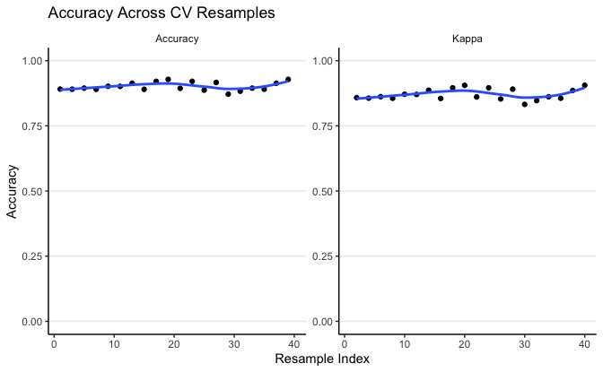
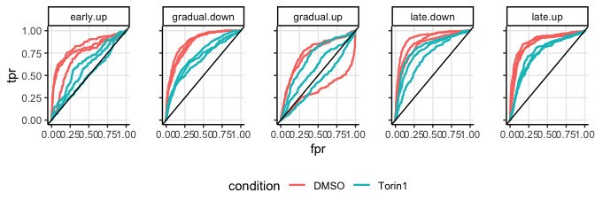
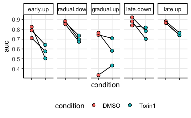

XGB modeling Torin-1 data
================
Kaspar Bresser

- [Import and tidy data](#import-and-tidy-data)
- [modeling](#modeling)
- [Testing on Torin-1 data](#testing-on-torin-1-data)

First load packages

``` r
library(tidyverse)
library(caret)
library(cluster)
library(lemon)
library(AUC)
library(broom)
library(xgboost)
```

## Import and tidy data

Import protein expression clusters

``` r
dat.activation <- read_tsv("Data/abundances_protein_clustered.tsv")

dat.activation
```

    ## # A tibble: 13,250 × 5
    ##    gene.name cluster      timepoint   LFQ scaled.LFQ
    ##    <chr>     <chr>        <chr>     <dbl>      <dbl>
    ##  1 NBDY      gradual.down T0h        11.4     1.77  
    ##  2 NBDY      gradual.down T24h       10.5    -0.383 
    ##  3 NBDY      gradual.down T2h        10.7     0.0774
    ##  4 NBDY      gradual.down T4h        10.6    -0.0555
    ##  5 NBDY      gradual.down T6h        10.3    -0.822 
    ##  6 ZC3H12D   gradual.up   T0h        10.7     0.837 
    ##  7 ZC3H12D   gradual.up   T24h       10.7     0.897 
    ##  8 ZC3H12D   gradual.up   T2h        10.0    -0.790 
    ##  9 ZC3H12D   gradual.up   T4h        10.1    -0.570 
    ## 10 ZC3H12D   gradual.up   T6h        10.3    -0.0951
    ## # ℹ 13,240 more rows

tidy labels

``` r
dat.activation %>% 
  mutate(timepoint = case_when(timepoint == "T16h" ~ "T24h", TRUE ~ timepoint)) %>% 
  filter(timepoint %in% c("T0h", "T6h","T24h")) %>% 
  dplyr::select(gene.name, cluster, timepoint, scaled.LFQ) %>% 
  pivot_wider(names_from = timepoint, values_from = scaled.LFQ) -> dat.activation
```

## modeling

set train control method

``` r
control <- trainControl(method="repeatedcv",
                        number=10,
                        repeats = 2,
                        search="grid",
                        verboseIter = TRUE,
                        sampling = "down",
                        allowParallel = T, 
                        returnData = F)

xgbGrid <- expand.grid(nrounds = 1000,
                       max_depth = 1,
                       colsample_bytree = 0.5,
                       eta = 0.3,
                       gamma=1,
                       min_child_weight = 0.9,
                       subsample = 1)
```

``` r
#dat.activation %>% 
#  inner_join()
```

    ## + Fold01.Rep1: nrounds=1000, max_depth=1, colsample_bytree=0.5, eta=0.3, gamma=1, min_child_weight=0.9, subsample=1

    ## - Fold01.Rep1: nrounds=1000, max_depth=1, colsample_bytree=0.5, eta=0.3, gamma=1, min_child_weight=0.9, subsample=1 
    ## + Fold02.Rep1: nrounds=1000, max_depth=1, colsample_bytree=0.5, eta=0.3, gamma=1, min_child_weight=0.9, subsample=1

    ## - Fold02.Rep1: nrounds=1000, max_depth=1, colsample_bytree=0.5, eta=0.3, gamma=1, min_child_weight=0.9, subsample=1 
    ## + Fold03.Rep1: nrounds=1000, max_depth=1, colsample_bytree=0.5, eta=0.3, gamma=1, min_child_weight=0.9, subsample=1

    ## - Fold03.Rep1: nrounds=1000, max_depth=1, colsample_bytree=0.5, eta=0.3, gamma=1, min_child_weight=0.9, subsample=1 
    ## + Fold04.Rep1: nrounds=1000, max_depth=1, colsample_bytree=0.5, eta=0.3, gamma=1, min_child_weight=0.9, subsample=1

    ## - Fold04.Rep1: nrounds=1000, max_depth=1, colsample_bytree=0.5, eta=0.3, gamma=1, min_child_weight=0.9, subsample=1 
    ## + Fold05.Rep1: nrounds=1000, max_depth=1, colsample_bytree=0.5, eta=0.3, gamma=1, min_child_weight=0.9, subsample=1

    ## - Fold05.Rep1: nrounds=1000, max_depth=1, colsample_bytree=0.5, eta=0.3, gamma=1, min_child_weight=0.9, subsample=1 
    ## + Fold06.Rep1: nrounds=1000, max_depth=1, colsample_bytree=0.5, eta=0.3, gamma=1, min_child_weight=0.9, subsample=1

    ## - Fold06.Rep1: nrounds=1000, max_depth=1, colsample_bytree=0.5, eta=0.3, gamma=1, min_child_weight=0.9, subsample=1 
    ## + Fold07.Rep1: nrounds=1000, max_depth=1, colsample_bytree=0.5, eta=0.3, gamma=1, min_child_weight=0.9, subsample=1

    ## - Fold07.Rep1: nrounds=1000, max_depth=1, colsample_bytree=0.5, eta=0.3, gamma=1, min_child_weight=0.9, subsample=1 
    ## + Fold08.Rep1: nrounds=1000, max_depth=1, colsample_bytree=0.5, eta=0.3, gamma=1, min_child_weight=0.9, subsample=1

    ## - Fold08.Rep1: nrounds=1000, max_depth=1, colsample_bytree=0.5, eta=0.3, gamma=1, min_child_weight=0.9, subsample=1 
    ## + Fold09.Rep1: nrounds=1000, max_depth=1, colsample_bytree=0.5, eta=0.3, gamma=1, min_child_weight=0.9, subsample=1

    ## - Fold09.Rep1: nrounds=1000, max_depth=1, colsample_bytree=0.5, eta=0.3, gamma=1, min_child_weight=0.9, subsample=1 
    ## + Fold10.Rep1: nrounds=1000, max_depth=1, colsample_bytree=0.5, eta=0.3, gamma=1, min_child_weight=0.9, subsample=1

    ## - Fold10.Rep1: nrounds=1000, max_depth=1, colsample_bytree=0.5, eta=0.3, gamma=1, min_child_weight=0.9, subsample=1 
    ## + Fold01.Rep2: nrounds=1000, max_depth=1, colsample_bytree=0.5, eta=0.3, gamma=1, min_child_weight=0.9, subsample=1

    ## - Fold01.Rep2: nrounds=1000, max_depth=1, colsample_bytree=0.5, eta=0.3, gamma=1, min_child_weight=0.9, subsample=1 
    ## + Fold02.Rep2: nrounds=1000, max_depth=1, colsample_bytree=0.5, eta=0.3, gamma=1, min_child_weight=0.9, subsample=1

    ## - Fold02.Rep2: nrounds=1000, max_depth=1, colsample_bytree=0.5, eta=0.3, gamma=1, min_child_weight=0.9, subsample=1 
    ## + Fold03.Rep2: nrounds=1000, max_depth=1, colsample_bytree=0.5, eta=0.3, gamma=1, min_child_weight=0.9, subsample=1

    ## - Fold03.Rep2: nrounds=1000, max_depth=1, colsample_bytree=0.5, eta=0.3, gamma=1, min_child_weight=0.9, subsample=1 
    ## + Fold04.Rep2: nrounds=1000, max_depth=1, colsample_bytree=0.5, eta=0.3, gamma=1, min_child_weight=0.9, subsample=1

    ## - Fold04.Rep2: nrounds=1000, max_depth=1, colsample_bytree=0.5, eta=0.3, gamma=1, min_child_weight=0.9, subsample=1 
    ## + Fold05.Rep2: nrounds=1000, max_depth=1, colsample_bytree=0.5, eta=0.3, gamma=1, min_child_weight=0.9, subsample=1

    ## - Fold05.Rep2: nrounds=1000, max_depth=1, colsample_bytree=0.5, eta=0.3, gamma=1, min_child_weight=0.9, subsample=1 
    ## + Fold06.Rep2: nrounds=1000, max_depth=1, colsample_bytree=0.5, eta=0.3, gamma=1, min_child_weight=0.9, subsample=1

    ## - Fold06.Rep2: nrounds=1000, max_depth=1, colsample_bytree=0.5, eta=0.3, gamma=1, min_child_weight=0.9, subsample=1 
    ## + Fold07.Rep2: nrounds=1000, max_depth=1, colsample_bytree=0.5, eta=0.3, gamma=1, min_child_weight=0.9, subsample=1

    ## - Fold07.Rep2: nrounds=1000, max_depth=1, colsample_bytree=0.5, eta=0.3, gamma=1, min_child_weight=0.9, subsample=1 
    ## + Fold08.Rep2: nrounds=1000, max_depth=1, colsample_bytree=0.5, eta=0.3, gamma=1, min_child_weight=0.9, subsample=1

    ## - Fold08.Rep2: nrounds=1000, max_depth=1, colsample_bytree=0.5, eta=0.3, gamma=1, min_child_weight=0.9, subsample=1 
    ## + Fold09.Rep2: nrounds=1000, max_depth=1, colsample_bytree=0.5, eta=0.3, gamma=1, min_child_weight=0.9, subsample=1

    ## - Fold09.Rep2: nrounds=1000, max_depth=1, colsample_bytree=0.5, eta=0.3, gamma=1, min_child_weight=0.9, subsample=1 
    ## + Fold10.Rep2: nrounds=1000, max_depth=1, colsample_bytree=0.5, eta=0.3, gamma=1, min_child_weight=0.9, subsample=1

    ## - Fold10.Rep2: nrounds=1000, max_depth=1, colsample_bytree=0.5, eta=0.3, gamma=1, min_child_weight=0.9, subsample=1 
    ## Aggregating results
    ## Fitting final model on full training set

    ## eXtreme Gradient Boosting 
    ## 
    ## No pre-processing
    ## Resampling: Cross-Validated (10 fold, repeated 2 times) 
    ## Summary of sample sizes: 2384, 2385, 2384, 2386, 2385, 2386, ... 
    ## Addtional sampling using down-sampling
    ## 
    ## Resampling results:
    ## 
    ##   Accuracy   Kappa    
    ##   0.9011342  0.8703686
    ## 
    ## Tuning parameter 'nrounds' was held constant at a value of 1000
    ## 
    ## Tuning parameter 'min_child_weight' was held constant at a value of 0.9
    ## 
    ## Tuning parameter 'subsample' was held constant at a value of 1

Check model metrics

``` r
res <- XGB.model$resample

res %>% 
  pivot_longer(-Resample, names_to = "metric", values_to = "value") %>% 
ggplot(aes(y = value, x = seq_along(value))) +
  geom_point() +
  geom_smooth(method = "loess", se = FALSE) +
  scale_y_continuous(limits = c(0,1))+
  facet_rep_wrap(~metric, repeat.tick.labels = T)+

  labs(title = "Accuracy Across CV Resamples",
       x = "Resample Index",
       y = "Accuracy")+
  theme_classic()+
  theme(panel.grid.major.y = element_line(), strip.background = element_blank())
```



``` r
ggsave("Figs/model_metric.pdf", width = 4.5, height = 3)
```

\`

## Testing on Torin-1 data

Import the test data

``` r
dat <- read_tsv("Output/abundances_protein_all_Torin.tsv")

dat
```

    ## # A tibble: 145,845 × 10
    ##    Protein.Group Protein.Ids Protein.Names Genes  First.Protein.Description     
    ##    <chr>         <chr>       <chr>         <chr>  <chr>                         
    ##  1 A0A024RBG1    A0A024RBG1  NUD4B_HUMAN   NUDT4B Diphosphoinositol polyphospha…
    ##  2 A0A024RBG1    A0A024RBG1  NUD4B_HUMAN   NUDT4B Diphosphoinositol polyphospha…
    ##  3 A0A024RBG1    A0A024RBG1  NUD4B_HUMAN   NUDT4B Diphosphoinositol polyphospha…
    ##  4 A0A024RBG1    A0A024RBG1  NUD4B_HUMAN   NUDT4B Diphosphoinositol polyphospha…
    ##  5 A0A024RBG1    A0A024RBG1  NUD4B_HUMAN   NUDT4B Diphosphoinositol polyphospha…
    ##  6 A0A024RBG1    A0A024RBG1  NUD4B_HUMAN   NUDT4B Diphosphoinositol polyphospha…
    ##  7 A0A024RBG1    A0A024RBG1  NUD4B_HUMAN   NUDT4B Diphosphoinositol polyphospha…
    ##  8 A0A024RBG1    A0A024RBG1  NUD4B_HUMAN   NUDT4B Diphosphoinositol polyphospha…
    ##  9 A0A024RBG1    A0A024RBG1  NUD4B_HUMAN   NUDT4B Diphosphoinositol polyphospha…
    ## 10 A0A024RBG1    A0A024RBG1  NUD4B_HUMAN   NUDT4B Diphosphoinositol polyphospha…
    ## # ℹ 145,835 more rows
    ## # ℹ 5 more variables: sample.nr <dbl>, timepoint <chr>, condition <chr>,
    ## #   donor <chr>, LFQ <dbl>

Tidy and scale the LFQ

``` r
# define function for sd scaling of count data
scale_this <- function(x){
  (x - mean(x, na.rm=TRUE)) / sd(x, na.rm=TRUE)
}


dat %>% 
  inner_join(distinct(dplyr::select(dat.activation, gene.name, cluster)), by = c("Genes" = "gene.name")) %>%
  na.omit() %>% 
  filter(condition != "24hTorin1") %>% 
  mutate(condition = case_when(condition == "6hTorin1" ~ "Torin1",
                               TRUE ~ condition)) %>% 
  group_by(Genes) %>% 
  mutate(scaled.LFQ = scale_this(LFQ)) %>% 
  group_by(Genes,  timepoint, condition, cluster) %>% 
#  summarise(scaled.LFQ = mean(scaled.LFQ)) %>% 
  na.omit() -> dat.scaled
```

Filter out some proteins that appear to have multiple isoforms, and
reshape for running the model

``` r
dat.scaled %>% 
  ungroup() %>% 
  filter(!(Genes %in% c("POLR2M", "MIEF1"))) %>% 
  dplyr::select(Genes, timepoint, condition, donor, cluster, scaled.LFQ) %>% 
  mutate(timepoint = paste0("T",timepoint)) %>% 
  pivot_wider(names_from = timepoint, values_from = scaled.LFQ) %>% 
  na.omit() %>% 
  nest(data = c(Genes, cluster, contains("h"))) -> dat.for.test
```

Perform predictions with the XGBoost model and export predictions in a
table format

``` r
dat.for.test %>% 
  mutate(predictions = map(data, ~predict(object = XGB.model, ., "prob"))) %>% 
  unnest(cols = c(data, predictions)) %>% 
  dplyr::select(!contains("h")) %>% 
  pivot_longer(cols = c("early.up", "gradual.up", "late.up", "gradual.down", "late.down"), 
               names_to = "prediction", values_to = "preds") %>% 
  mutate(cluster = as.character(cluster) == prediction)-> preds.test
```

Get TPR and FPR using the AUC package

``` r
preds.test %>% 
  nest(data = c(Genes, cluster, preds)) %>% 
  mutate(data = map(data, ~roc(.$preds, factor(.$cluster, levels = c("FALSE", "TRUE"))))) %>% 
  mutate(auc = map(data, auc), data = map(data, tidy)) %>% 
  unnest(cols = c(data, auc)) -> for.roc
```

And plot

``` r
ggplot(for.roc, aes(fpr, tpr, color = condition, group = paste0(condition,donor))) +
  geom_line(linewidth = .8)+
  facet_rep_wrap(~prediction, nrow = 1)+
  geom_abline(slope = 1, intercept = 0, linetype = "solid")+
  theme_classic()+
  theme(panel.grid.major = element_line(), legend.position = "bottom")
```



``` r
ggsave("Figs/model_ROCs.pdf", width = 8, height = 2.5)
```

``` r
for.roc %>% 
  select(condition, donor, prediction, auc) %>% 
  distinct() %>% 
ggplot(aes(x = condition, y = auc, fill = condition))+
  geom_line(aes(group = donor), color = "black")+
  geom_point(shape = 21, size = 2)+
  facet_wrap(~prediction, nrow = 1)+
  theme_classic()+
  theme(panel.grid.major = element_line(), legend.position = "bottom", axis.text.x = element_blank())
```



``` r
ggsave("Figs/model_ROCs_quant.pdf", width = 2.5, height = 2.5)
```
