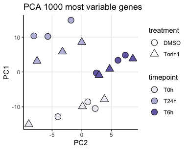
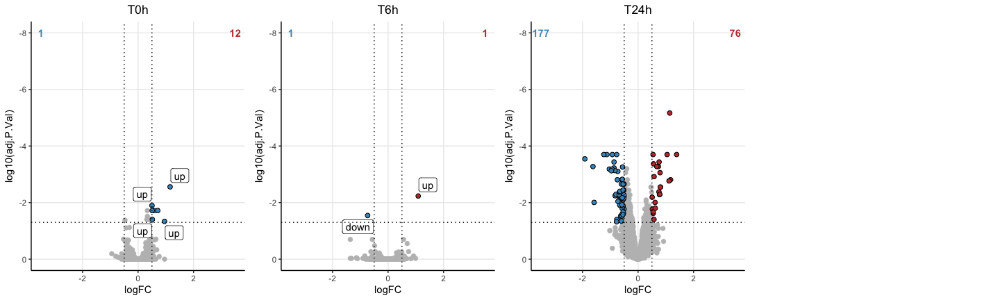
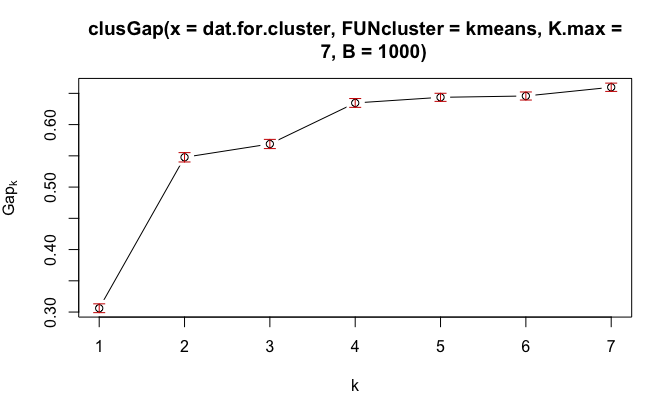
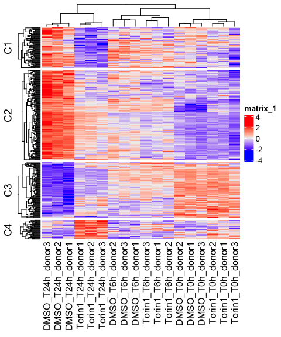
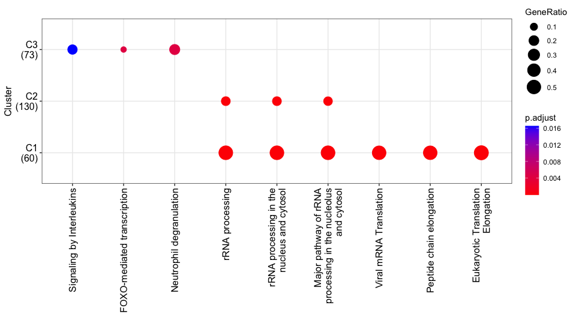
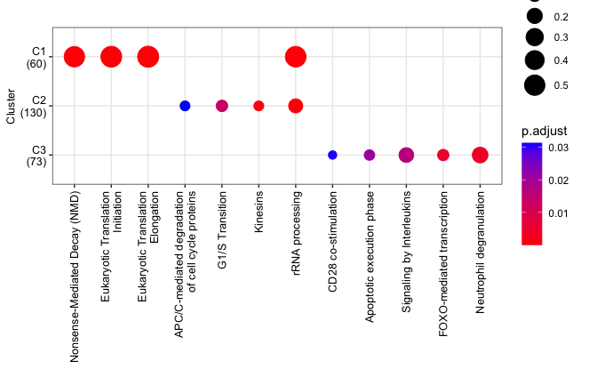
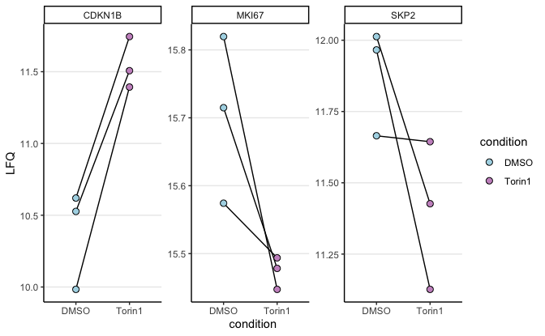
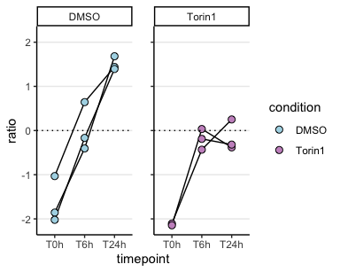
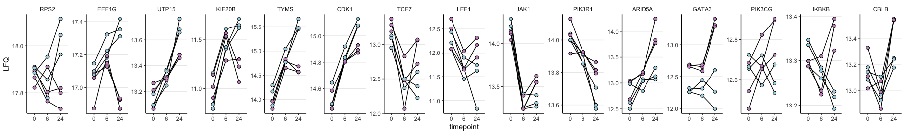

Check Torin-1 sensitive clusters
================
Kaspar Bresser

- [Import and tidy data](#import-and-tidy-data)
- [PCA](#pca)
- [Test differences](#test-differences)
- [Volcano’s](#volcanos)
- [Pathway analysis](#pathway-analysis)
  - [pca](#pca-1)
- [SKP2 analysis](#skp2-analysis)
- [Examples](#examples)

First load packages

``` r
library(tidyverse)
library(broom) 
library(limma)
library(ggrepel)
library(readxl)
library(circlize)
library(ComplexHeatmap)
library(cluster)
library(lemon)
library(gghighlight)
library(clusterProfiler)
library(org.Hs.eg.db)
library(RColorBrewer)
library(msigdbr)
library(fgsea)
```

## Import and tidy data

Select the proteins that have a “proteotypic” count of more than 1.

``` r
read_tsv("Data/20240624_TOOPS_output_report.pr_matrix.tsv") %>% 
  dplyr::select(Protein.Group, Genes, Proteotypic, Precursor.Id, matches('\\.d$')) %>%
    gather('Sample', 'Intensity', matches('\\.d$')) %>%
    filter(!is.na(Intensity)) %>%
    filter(Proteotypic == T) %>% #<< cuts a lot of proteins
    group_by(Protein.Group) %>%
    distinct(Precursor.Id, .keep_all = T) %>%
    summarise(count = n()) %>%
    filter(count > 1)  %>%
    dplyr::pull(Protein.Group) -> select.prots

str(select.prots)
```

    ##  chr [1:6945] "A0A024RBG1" "A0A075B6T6" "A0A0B4J245" "A0A0U1RRE5" "A0AVK6" ...

import LC-MS quantification data

``` r
dat <- read_tsv("Data/20240624_TOOPS_output_report.pg_matrix.tsv")

dat
```

    ## # A tibble: 8,194 × 26
    ##    Protein.Group          Protein.Ids Protein.Names Genes First.Protein.Descri…¹
    ##    <chr>                  <chr>       <chr>         <chr> <chr>                 
    ##  1 A0A024RBG1             A0A024RBG1  NUD4B_HUMAN   NUDT… Diphosphoinositol pol…
    ##  2 A0A024RBG1;O95989;Q9N… Q9NZJ9;Q8N… NUD4B_HUMAN;… NUDT… Diphosphoinositol pol…
    ##  3 A0A024RBG1;Q9NZJ9      Q9NZJ9;A0A… NUD4B_HUMAN;… NUDT… Diphosphoinositol pol…
    ##  4 A0A075B6T6             A0A075B6T6  TVAL2_HUMAN   TRAV… T cell receptor alpha…
    ##  5 A0A087WW87;P01614      P01614;A0A… KV240_HUMAN;… IGKV… Immunoglobulin kappa …
    ##  6 A0A0A6YYC5             A0A0A6YYC5  TVA14_HUMAN   TRAV… T cell receptor alpha…
    ##  7 A0A0A6YYJ7             A0A0A6YYJ7  TVA83_HUMAN   TRAV… T cell receptor alpha…
    ##  8 A0A0A6YYK7             A0A0A6YYK7  TVA19_HUMAN   TRAV… T cell receptor alpha…
    ##  9 A0A0B4J245             A0A0B4J245  TVAL1_HUMAN   TRAV… T cell receptor alpha…
    ## 10 A0A0B4J275             A0A0B4J275  TVA17_HUMAN   TRAV… T cell receptor alpha…
    ## # ℹ 8,184 more rows
    ## # ℹ abbreviated name: ¹​First.Protein.Description
    ## # ℹ 21 more variables:
    ## #   `C:\\Users\\massspecuser\\Desktop\\20240622_Carmen\\RES00360_Anouk_Jurgens\\20240620_AnoukJurgens_TOOPS\\1_0h_DMSO_donor1_S2-A10_1_9342.d` <dbl>,
    ## #   `C:\\Users\\massspecuser\\Desktop\\20240622_Carmen\\RES00360_Anouk_Jurgens\\20240620_AnoukJurgens_TOOPS\\2_0h_6hTorin1_Donor1_S2-B10_1_9343.d` <dbl>,
    ## #   `C:\\Users\\massspecuser\\Desktop\\20240622_Carmen\\RES00360_Anouk_Jurgens\\20240620_AnoukJurgens_TOOPS\\3_0h_24hTorin1_Donor1_S2-C10_1_9344.d` <dbl>,
    ## #   `C:\\Users\\massspecuser\\Desktop\\20240622_Carmen\\RES00360_Anouk_Jurgens\\20240620_AnoukJurgens_TOOPS\\4_6h_DMSO_Donor1_S2-D10_1_9345.d` <dbl>, …

Tidy up a bit, and convert abundances to log2

``` r
dat %>% 
  filter(Protein.Group %in% select.prots) %>% 
  pivot_longer(contains("Users"), names_to = "sample", values_to = "LFQ") %>% 
  mutate(sample = str_extract(sample, "\\d+_\\d+h_.+onor\\d+")) %>% 
  separate(sample, into = c("sample.nr", "timepoint", "condition", "donor")) %>% 
  mutate(donor = str_to_lower(donor)) %>% 
  mutate(LFQ = log2(LFQ)) %>% 
  mutate(condition = factor(condition, levels = c("DMSO", "6hTorin1", "24hTorin1", "Torin1"))) %>% 
  mutate(timepoint = factor(timepoint, levels = c("0h", "6h", "24h")))-> dat

dat
```

    ## # A tibble: 145,845 × 10
    ##    Protein.Group Protein.Ids Protein.Names Genes  First.Protein.Description     
    ##    <chr>         <chr>       <chr>         <chr>  <chr>                         
    ##  1 A0A024RBG1    A0A024RBG1  NUD4B_HUMAN   NUDT4B Diphosphoinositol polyphospha…
    ##  2 A0A024RBG1    A0A024RBG1  NUD4B_HUMAN   NUDT4B Diphosphoinositol polyphospha…
    ##  3 A0A024RBG1    A0A024RBG1  NUD4B_HUMAN   NUDT4B Diphosphoinositol polyphospha…
    ##  4 A0A024RBG1    A0A024RBG1  NUD4B_HUMAN   NUDT4B Diphosphoinositol polyphospha…
    ##  5 A0A024RBG1    A0A024RBG1  NUD4B_HUMAN   NUDT4B Diphosphoinositol polyphospha…
    ##  6 A0A024RBG1    A0A024RBG1  NUD4B_HUMAN   NUDT4B Diphosphoinositol polyphospha…
    ##  7 A0A024RBG1    A0A024RBG1  NUD4B_HUMAN   NUDT4B Diphosphoinositol polyphospha…
    ##  8 A0A024RBG1    A0A024RBG1  NUD4B_HUMAN   NUDT4B Diphosphoinositol polyphospha…
    ##  9 A0A024RBG1    A0A024RBG1  NUD4B_HUMAN   NUDT4B Diphosphoinositol polyphospha…
    ## 10 A0A024RBG1    A0A024RBG1  NUD4B_HUMAN   NUDT4B Diphosphoinositol polyphospha…
    ## # ℹ 145,835 more rows
    ## # ℹ 5 more variables: sample.nr <chr>, timepoint <fct>, condition <fct>,
    ## #   donor <chr>, LFQ <dbl>

``` r
write_tsv(dat, "Data/abundances_protein_all_Torin.tsv")
```

Reshape data for DE analysis

``` r
dat %>% 
  filter(condition != "6hTorin1") %>% 
  mutate(condition = case_when(condition == "24hTorin1" ~ "Torin1",
                               TRUE ~ condition)) %>% 
  mutate(timepoint = paste0("T", timepoint)) %>% 
  dplyr::select(sample.nr, Genes, timepoint, condition, donor, LFQ) %>% 
  group_by(Genes) %>%
  filter(n() < 21) %>% 
  ungroup() -> dat.forDE
```

## PCA

Tidy data for PCA analysis

``` r
dat.forDE %>% 
  dplyr::select(-sample.nr) %>% 
  pivot_wider(names_from = c(timepoint, condition, donor), values_from = LFQ) %>% 
  na.omit() %>% 
  column_to_rownames("Genes") -> dat.pca
```

Select on most variable proteins

``` r
var.genes <- apply(dat.pca, 1, var)
head(var.genes)
```

    ##        UBA6       ESYT2       MED19   UHRF1BP1L     TMEM223       ILVBL 
    ## 0.005235615 0.004826508 0.049517154 0.022181800 0.043684827 0.014639782

``` r
select.var <- names(sort(var.genes, decreasing=TRUE))[1:1000]
dat.pca <- dat.pca[select.var, ]

dat.pca %>% 
  t() %>% 
  as.data.frame() %>% 
  prcomp(center = T, scale = F) -> pca

str(pca)
```

    ## List of 5
    ##  $ sdev    : num [1:18] 8.85 5.36 3.96 2.98 2.8 ...
    ##  $ rotation: num [1:1000, 1:18] 0.1509 -0.1072 0.1044 0.1014 -0.0805 ...
    ##   ..- attr(*, "dimnames")=List of 2
    ##   .. ..$ : chr [1:1000] "EGR2" "TMSB4X" "NFKBID" "STARD4" ...
    ##   .. ..$ : chr [1:18] "PC1" "PC2" "PC3" "PC4" ...
    ##  $ center  : Named num [1:1000] 13.9 19.3 11.1 11.1 13.4 ...
    ##   ..- attr(*, "names")= chr [1:1000] "EGR2" "TMSB4X" "NFKBID" "STARD4" ...
    ##  $ scale   : logi FALSE
    ##  $ x       : num [1:18, 1:18] -10.476 -9.892 3.359 0.859 14.862 ...
    ##   ..- attr(*, "dimnames")=List of 2
    ##   .. ..$ : chr [1:18] "T0h_DMSO_donor1" "T0h_Torin1_donor1" "T6h_DMSO_donor1" "T6h_Torin1_donor1" ...
    ##   .. ..$ : chr [1:18] "PC1" "PC2" "PC3" "PC4" ...
    ##  - attr(*, "class")= chr "prcomp"

Plot

``` r
library(RColorBrewer)
as.data.frame(pca$x) %>% 
  rownames_to_column("sample") %>% 
  separate(sample, into = c("timepoint", "treatment", "donor")) %>% 
  ggplot(aes(x = PC2, y = PC1, fill = timepoint, shape = treatment))+
  geom_point( size = 4 )+
  scale_shape_manual(values = c(21, 24))+
  scale_fill_manual(values = brewer.pal(3, "Purples"))+
  ggtitle("PCA 1000 most variable genes")+
  theme_classic()+
  theme(panel.grid.major = element_line())+
  guides(fill = guide_legend("timepoint", override.aes = list(shape = 21)))
```



## Test differences

will test for differences using limma

Set up a design matrix, we want to compare Torin-1 treater versus
control

``` r
dat.forDE %>% 
  mutate(sample.id = paste0(condition, ".", timepoint)) %>% 
  dplyr::select(sample.nr, sample.id, donor) %>% 
  distinct() %>% 
  mutate(sample.id = as.factor(sample.id))-> pheno

design <- model.matrix(~0+ pheno$sample.id)
colnames(design) <- levels(pheno$sample.id)

design
```

    ##    DMSO.T0h DMSO.T24h DMSO.T6h Torin1.T0h Torin1.T24h Torin1.T6h
    ## 1         1         0        0          0           0          0
    ## 2         0         0        0          1           0          0
    ## 3         0         0        1          0           0          0
    ## 4         0         0        0          0           0          1
    ## 5         0         1        0          0           0          0
    ## 6         0         0        0          0           1          0
    ## 7         1         0        0          0           0          0
    ## 8         0         0        0          1           0          0
    ## 9         0         0        1          0           0          0
    ## 10        0         0        0          0           0          1
    ## 11        0         1        0          0           0          0
    ## 12        0         0        0          0           1          0
    ## 13        1         0        0          0           0          0
    ## 14        0         0        0          1           0          0
    ## 15        0         0        1          0           0          0
    ## 16        0         0        0          0           0          1
    ## 17        0         1        0          0           0          0
    ## 18        0         0        0          0           1          0
    ## attr(,"assign")
    ## [1] 1 1 1 1 1 1
    ## attr(,"contrasts")
    ## attr(,"contrasts")$`pheno$sample.id`
    ## [1] "contr.treatment"

Get the LFQ values for all samples and fit linear model.

lmFit needs samples to be columns, and genes to be row names.

``` r
dat.forDE %>% 
  pivot_wider(names_from = c(sample.nr, condition ,timepoint, donor), values_from = LFQ) %>% 
  na.omit() %>% 
  distinct(Genes, .keep_all = T) %>% 
  column_to_rownames("Genes") %>% 
  dplyr::select(contains("donor")) %>% 
  lmFit(., design) -> lm.fit

str(lm.fit)
```

    ## Formal class 'MArrayLM' [package "limma"] with 1 slot
    ##   ..@ .Data:List of 12
    ##   .. ..$ : num [1:6478, 1:6] 15.3 14.8 11.7 10.8 11.7 ...
    ##   .. .. ..- attr(*, "dimnames")=List of 2
    ##   .. .. .. ..$ : chr [1:6478] "UBA6" "ESYT2" "MED19" "UHRF1BP1L" ...
    ##   .. .. .. ..$ : chr [1:6] "DMSO.T0h" "DMSO.T24h" "DMSO.T6h" "Torin1.T0h" ...
    ##   .. ..$ : int 6
    ##   .. ..$ : int [1:6] 1 1 1 1 1 1
    ##   .. ..$ :List of 5
    ##   .. .. ..$ qr   : num [1:18, 1:6] -1.73 0 0 0 0 ...
    ##   .. .. .. ..- attr(*, "dimnames")=List of 2
    ##   .. .. .. .. ..$ : chr [1:18] "1" "2" "3" "4" ...
    ##   .. .. .. .. ..$ : chr [1:6] "DMSO.T0h" "DMSO.T24h" "DMSO.T6h" "Torin1.T0h" ...
    ##   .. .. .. ..- attr(*, "assign")= int [1:6] 1 1 1 1 1 1
    ##   .. .. .. ..- attr(*, "contrasts")=List of 1
    ##   .. .. .. .. ..$ pheno$sample.id: chr "contr.treatment"
    ##   .. .. ..$ qraux: num [1:6] 1.58 1 1.58 1 1 ...
    ##   .. .. ..$ pivot: int [1:6] 1 2 3 4 5 6
    ##   .. .. ..$ tol  : num 1e-07
    ##   .. .. ..$ rank : int 6
    ##   .. .. ..- attr(*, "class")= chr "qr"
    ##   .. ..$ : int [1:6478] 12 12 12 12 12 12 12 12 12 12 ...
    ##   .. ..$ : Named num [1:6478] 0.0735 0.055 0.2608 0.1708 0.2257 ...
    ##   .. .. ..- attr(*, "names")= chr [1:6478] "UBA6" "ESYT2" "MED19" "UHRF1BP1L" ...
    ##   .. ..$ : num [1:6, 1:6] 0.333 0 0 0 0 ...
    ##   .. .. ..- attr(*, "dimnames")=List of 2
    ##   .. .. .. ..$ : chr [1:6] "DMSO.T0h" "DMSO.T24h" "DMSO.T6h" "Torin1.T0h" ...
    ##   .. .. .. ..$ : chr [1:6] "DMSO.T0h" "DMSO.T24h" "DMSO.T6h" "Torin1.T0h" ...
    ##   .. ..$ : num [1:6478, 1:6] 0.577 0.577 0.577 0.577 0.577 ...
    ##   .. .. ..- attr(*, "dimnames")=List of 2
    ##   .. .. .. ..$ : chr [1:6478] "UBA6" "ESYT2" "MED19" "UHRF1BP1L" ...
    ##   .. .. .. ..$ : chr [1:6] "DMSO.T0h" "DMSO.T24h" "DMSO.T6h" "Torin1.T0h" ...
    ##   .. ..$ : int [1:6] 1 2 3 4 5 6
    ##   .. ..$ : Named num [1:6478] 15.3 14.9 11.7 10.9 11.9 ...
    ##   .. .. ..- attr(*, "names")= chr [1:6478] "UBA6" "ESYT2" "MED19" "UHRF1BP1L" ...
    ##   .. ..$ : chr "ls"
    ##   .. ..$ : num [1:18, 1:6] 1 0 0 0 0 0 1 0 0 0 ...
    ##   .. .. ..- attr(*, "dimnames")=List of 2
    ##   .. .. .. ..$ : chr [1:18] "1" "2" "3" "4" ...
    ##   .. .. .. ..$ : chr [1:6] "DMSO.T0h" "DMSO.T24h" "DMSO.T6h" "Torin1.T0h" ...
    ##   .. .. ..- attr(*, "assign")= int [1:6] 1 1 1 1 1 1
    ##   .. .. ..- attr(*, "contrasts")=List of 1
    ##   .. .. .. ..$ pheno$sample.id: chr "contr.treatment"
    ##   ..$ names: chr [1:12] "coefficients" "rank" "assign" "qr" ...

Make a contrast matrix for the comparisons of interest

``` r
contrast.matrix <- makeContrasts(
  
  Torin1.T0h - DMSO.T0h,
  Torin1.T6h - DMSO.T6h,
  Torin1.T24h - DMSO.T24h,
  
  levels = design)

contrast.matrix
```

    ##              Contrasts
    ## Levels        Torin1.T0h - DMSO.T0h Torin1.T6h - DMSO.T6h
    ##   DMSO.T0h                       -1                     0
    ##   DMSO.T24h                       0                     0
    ##   DMSO.T6h                        0                    -1
    ##   Torin1.T0h                      1                     0
    ##   Torin1.T24h                     0                     0
    ##   Torin1.T6h                      0                     1
    ##              Contrasts
    ## Levels        Torin1.T24h - DMSO.T24h
    ##   DMSO.T0h                          0
    ##   DMSO.T24h                        -1
    ##   DMSO.T6h                          0
    ##   Torin1.T0h                        0
    ##   Torin1.T24h                       1
    ##   Torin1.T6h                        0

Compute differential expression

``` r
# fit contrasts
lm.fit2 <- contrasts.fit(lm.fit, contrast.matrix)
# ebayes
lm.fit2 <- eBayes(lm.fit2)
```

Check number of significant DE proteins

``` r
results <- decideTests(lm.fit2, p.value = 0.05, adjust.method = 'BH', lfc = 0.1)
summary(results)
```

    ##        Torin1.T0h - DMSO.T0h Torin1.T6h - DMSO.T6h Torin1.T24h - DMSO.T24h
    ## Down                       1                     1                     177
    ## NotSig                  6465                  6476                    6225
    ## Up                        12                     1                      76

Extract table

``` r
comparisons <- colnames(results)


comparisons %>% 
  map( ~topTable(lm.fit2, coef = ., number = Inf, sort.by = 'none')) %>% 
  map2(comparisons, ~mutate(.x, comparison = .y)) %>% 
  map(rownames_to_column, "Genes") %>% 
  list_rbind() %>% 
  mutate(comparison = str_remove(comparison, "wt.+ - ")) %>% 
  separate(comparison, into = c("condition", "time")) -> all.results
```

    ## Warning: Expected 2 pieces. Additional pieces discarded in 19434 rows [1, 2, 3, 4, 5, 6,
    ## 7, 8, 9, 10, 11, 12, 13, 14, 15, 16, 17, 18, 19, 20, ...].

``` r
write_tsv(all.results, "Output/DE_torin_result.tsv")

all.results <- read_tsv("Output/DE_torin_result.tsv")
```

Select proteins that are Torin-1 sensitive

``` r
all.results %>% 
  filter(adj.P.Val < 0.1) %>% 
  pull(Genes) -> Torin.regulated
```

## Volcano’s

set function to plot volcano’s

``` r
plt_volcanos <- function(dat, title){
  
  dat %>% 
    group_by(col) %>%
    count(adj.P.Val < 0.05) %>% 
    pull(n) %>% 
    as.character() -> cnts
  
  ggplot(dat, aes( x = logFC, y = log10(adj.P.Val)))+ 
  geom_point(aes(fill = col), shape = 21, size = 2)+
  scale_fill_manual(values = c( "#4796C5","#C23A3B"))+
  scale_y_reverse()+
  labs(title = "")+
  gghighlight(adj.P.Val < 0.05 & abs(logFC) > 0.5,  
              unhighlighted_params = list(shape = 21, fill = "grey"),  use_group_by = F)+
  theme_classic()+
  theme(legend.position = "none", plot.title = element_text(hjust = 0.5),
        panel.grid.major = element_line())+
 #   xlim(-4,4)+
 #   ylim(0, -8)+
  geom_vline(xintercept = c(0.5, -0.5), linetype ="dotted")+
  geom_hline(yintercept = log10(0.05), linetype ="dotted")+
  annotate(geom = "text", label = cnts[2], x=-3.5, y=-8, color = "#4796C5", fontface =2)+
  annotate(geom = "text", label =cnts[4], x=3.5, y=-8, color = "#C23A3B", fontface =2)+
  ggtitle(title)

}
```

Plot

``` r
all.results %>% 
  mutate(time = factor(time, levels = c("T0h", "T6h", "T24h")),
         col = case_when(logFC > 0 ~ "up", TRUE ~ "down")) -> for.plot


for.plot %>% 
  nest(data = -time) %>% 
  mutate(plots = map2(data, time, plt_volcanos)) %>% 
  pull(plots) %>% 
  ggpubr::ggarrange(plotlist = . , ncol = 4)
```

    ## Warning: ggrepel: 3 unlabeled data points (too many overlaps). Consider
    ## increasing max.overlaps



``` r
ggsave("Figs/protein_volcanos_DE.pdf", width = 12, height = 4)
```

    ## Warning: ggrepel: 3 unlabeled data points (too many overlaps). Consider
    ## increasing max.overlaps

``` r
ggsave("Figs/protein_volcanos_DE.png", width = 8, height = 3)
```

    ## Warning: ggrepel: 6 unlabeled data points (too many overlaps). Consider
    ## increasing max.overlaps

Check appropriate amount of clusters

``` r
### gapclustering

dat.forDE %>% 
  dplyr::select(-sample.nr) %>% 
  pivot_wider(names_from = c(condition, timepoint, donor), values_from = LFQ) %>% 
  filter(Genes %in% Torin.regulated) %>% 
  column_to_rownames('Genes') %>%
                  t() %>%
                scale() %>%
                t() -> dat.for.cluster
set.seed(2112)
gap = clusGap(dat.for.cluster,
              FUN = kmeans, K.max = 7, B = 1000)

plot(gap)
```



Went with 4 clusters.

``` r
# get 'optimal' K
k=4

set.seed(2112)
cluster_allocation <-  kmeans(dat.for.cluster, k)
###

clusters <- enframe(cluster_allocation$cluster, name = "Gene", value = "cluster") %>% 
  mutate(cluster = case_when(cluster == 1 ~ "C3", 
                             cluster == 4 ~ "C4",
                             cluster == 2 ~ "C1",
                             cluster == 3 ~ "C2"))

write_tsv(clusters, "Output/cluster_annotation.tsv")

clusters <- read_tsv( "Output/cluster_annotation.tsv")


cluster_allocation$cluster <-deframe(clusters)
```

Plot heatmap

``` r
### heatmap
Heatmap(dat.for.cluster,
    #cluster_columns = F,
    cluster_column_slices = F,
    clustering_distance_columns = "spearman",
    show_row_names = F,
    show_row_dend = T,
    show_column_dend = T,
    show_column_names = T,
    # col = colorRamp2(c(-18, 0, 8),c('blue', 'white', 'red')),
 #   column_split = pheno$ct,
    row_split = cluster_allocation$cluster,
 cluster_row_slices = F,
    row_names_gp = grid::gpar(fontsize = 8))#,cluster_columns = T, km = 3)
```



``` r
###350x350
```

Output cluster annotations

``` r
clusters <- enframe(cluster_allocation$cluster, name = "Gene", value = "cluster")

write_tsv(clusters, "Output/cluster_annotation.tsv")
```

## Pathway analysis

Convert gene symbols

``` r
bitr(clusters$Gene, fromType="SYMBOL", toType="ENTREZID", OrgDb="org.Hs.eg.db") %>% 
  as_tibble() %>% 
  inner_join(clusters, by = c("SYMBOL" = "Gene")) %>% 
  distinct(ENTREZID, .keep_all = T) -> clusters
```

Set universe and perform analysis

``` r
bitr(unique(dat.forDE$Genes), fromType="SYMBOL", toType="ENTREZID", OrgDb="org.Hs.eg.db") %>% 
  as_tibble() %>% 
  pull(ENTREZID) -> uni
```

    ## Warning in bitr(unique(dat.forDE$Genes), fromType = "SYMBOL", toType =
    ## "ENTREZID", : 0.46% of input gene IDs are fail to map...

``` r
res <- compareCluster(geneClusters = ENTREZID~cluster, data = clusters, fun="enrichPathway", universe = uni, readable = TRUE)

dotplot(res, showCategory = 3, size = "geneRatio")+
 theme(axis.text.x = element_text(angle = 90, vjust = 0.5, hjust=1))+
  coord_flip()
```



More plotting

``` r
paths <- c("rRNA processing", 
           "Kinesins",
           "G1/S Transition",
           "APC/C-mediated degradation of cell cycle proteins",
           "Eukaryotic Translation Elongation",
           "Eukaryotic Translation Initiation",
           "Nonsense-Mediated Decay (NMD)",
           "Neutrophil degranulation",
           "FOXO-mediated transcription",
           "Signaling by Interleukins",
           "Apoptotic execution phase",
           "CD28 co-stimulation")

desired.order <- c("C3", 
                   "C2", 
                   "C1")


# Get the data
df <- res@compareClusterResult %>% 
  filter(!str_detect(Description, "L13a")) %>% 
  filter(Description %in% paths)


# Set Cluster order
df$Cluster <- factor(df$Cluster, levels = desired.order)

# Arrange Description factor to group by Cluster and sort within by p.adjust
df <- df %>%
  arrange(Cluster, p.adjust) %>%
  mutate(Description = factor(Description, levels = unique(Description)))

res2 <- res

res2@compareClusterResult <- df


dotplot(res2, showCategory = 10, size = "geneRatio", font.size  =9.5)+
 theme(axis.text.x = element_text(angle = 90, vjust = 0.5, hjust=1))+
  coord_flip()
```



``` r
ggsave("Figs/DE_Reactome2.pdf", width = 7, height = 4, scale = 1)
```

### pca

``` r
dat.forDE %>% 
  filter(Genes %in% Torin.regulated) %>% 
  dplyr::select(-sample.nr) %>% 
  pivot_wider(names_from = c(timepoint, condition, donor), values_from = LFQ) %>% 
  na.omit() %>% 
  column_to_rownames("Genes") -> dat.pca
```

## SKP2 analysis

Abundance of proteins

``` r
dat.forDE %>% 
  filter(Genes %in% c("MKI67", "SKP2", "CDKN1B")) %>%
  filter(timepoint == "T24h") %>% 
#  mutate(timepoint = factor(timepoint, levels = c("T0h", "T6h", "T24h"))) %>% 
ggplot(aes(x = condition, y = LFQ))+
  geom_line(aes(group = donor))+
  geom_point(aes(fill = condition), size = 2.5, shape = 21)+
  scale_fill_manual(values = c("lightblue", "#C994C7"))+
  
  facet_rep_wrap(~Genes, scales = "free_y", )+
  theme_classic()+
  theme(panel.grid.major.y = element_line())
```



Ratio between SKP2 and p27

``` r
dat.forDE %>% 
  filter(Genes %in% c("SKP2", "CDKN1B")) %>%
  mutate(LFQ = 2^LFQ) %>% 
  pivot_wider(names_from = Genes, values_from = LFQ) %>% 
  mutate(ratio = log2(SKP2/CDKN1B)) %>% 
  mutate(timepoint = factor(timepoint, levels = c("T0h", "T6h", "T24h"))) %>% 
ggplot(aes(x = timepoint, y = ratio))+
  geom_line(aes(group = paste0(donor, condition)))+
  geom_point(aes(fill = condition), size = 2.5, shape = 21)+
  scale_fill_manual(values = c("lightblue", "#C994C7"))+
  facet_rep_wrap(~condition )+
  scale_y_symmetric()+
  theme_classic()+
  theme(panel.grid.major.y = element_line())+
  geom_hline(yintercept = 0, linetype = "dotted")
```

    ## Warning: Removed 1 row containing missing values or values outside the scale range
    ## (`geom_line()`).

    ## Warning: Removed 1 row containing missing values or values outside the scale range
    ## (`geom_point()`).



## Examples

``` r
genes <- c("RPS2","EEF1G","UTP15",#"FTSJ3",
           "KIF20B","TYMS", "CDK1",#"PSMB5",
           "TCF7","LEF1","JAK1","PIK3R1",#"ADAM10",
           "ARID5A","GATA3","PIK3CG","IKBKB","CBLB")
```

``` r
library(scales)
dat.forDE %>% 
    dplyr::filter(Genes %in% genes) %>% 
 # left_join(clusters %>% dplyr::select(SYMBOL, cluster), by = c("Genes" = "SYMBOL")) %>% 
  mutate(timepoint = str_remove_all(timepoint, "T|h")) %>% 
  mutate(timepoint = factor(timepoint, levels = c("0", "6", "24"))) %>% 
    mutate(Genes = factor(Genes, levels = genes)) %>% 
ggplot(aes(x = timepoint, y = LFQ, fill = condition))+
  geom_line(aes(group = fct_cross(condition,donor)))+
  geom_point(shape = 21, size = 2.1)+
  facet_rep_wrap(~Genes, scales = "free_y", nrow = 1, dir = "h")+
    scale_y_continuous(
    labels = scales::number_format(accuracy = .1),
    breaks = scales::breaks_pretty(n = 3))+
    scale_fill_manual(values = c("lightblue", "#C994C7"))+
  theme_classic()+
  theme(panel.grid.major.y = element_line(), strip.background = element_blank(), 
        legend.position = "none", panel.spacing.y = unit(-.36, "lines"))
```



``` r
ggsave("Figs/DEcluster_examples.pdf", width = 16, height = 1.8)
```
