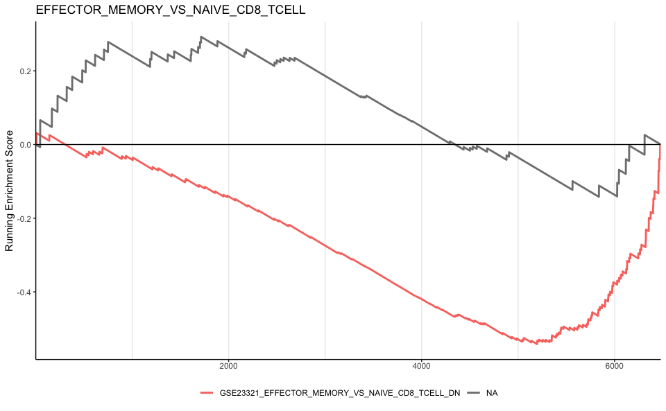
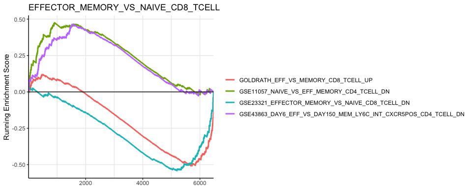

DE analysis Torin-1 treatment
================
Kaspar Bresser

- [Import data](#import-data)
- [GSEA](#gsea)

First load packages

``` r
library(tidyverse)
library(msigdbr)
library(fgsea)
library(enrichplot)
library(clusterProfiler)
```

## Import data

Import differential expression data

``` r
all.results <- read_tsv("Output/DE_torin_result.tsv")
```

## GSEA

Get Immune pathways (T cell specific)

``` r
pathways <- msigdbr(species = "Homo sapiens", 
                    db_species = "HS", 
                    collection = "C7",
                    subcollection =  "IMMUNESIGDB") %>% 
  filter(str_detect(gs_description, "T cell"))%>% 
  filter(str_detect(gs_description, "effector"))%>% 
  filter(str_detect(gs_description, "memory"))
```

``` r
# Convert to list for clusterProfiler
m.t2 <-  pathways[, c("gs_name", "gene_symbol")]

T24.res <- all.results %>% filter(time == "T24h")

gene.list.vec <- T24.res$logFC
names(gene.list.vec) <- T24.res$Genes
gene.list.vec <- sort(gene.list.vec, decreasing = TRUE)

gsea.res <- GSEA(
  geneList = gene.list.vec, # logFC ranked
  TERM2GENE = m.t2,
  pvalueCutoff = 0.05
)
```

``` r
ID <- "EFFECTOR_MEMORY_VS_NAIVE_CD8_TCELL"

pathways %>% 
  filter(str_detect(gs_name, ID)) %>% 
  pull(gs_name) %>% 
  unique() -> IDs


gseaplot2(gsea.res, geneSetID = IDs, 
          title = ID, pvalue_table = F,
          subplots = 1)+
  geom_hline(yintercept = 0, linetype = "solid")+
  theme(legend.position = "bottom")
```



GSE23321_EFFECTOR_MEMORY_VS_NAIVE_CD8_TCELL_DN
GOLDRATH_EFF_VS_MEMORY_CD8_TCELL_UP
GSE11057_NAIVE_VS_EFF_MEMORY_CD4_TCELL_DN
GSE43863_DAY6_EFF_VS_DAY150_MEM_LY6C_INT_CXCR5POS_CD4_TCELL_DN

``` r
IDs <- c('GSE23321_EFFECTOR_MEMORY_VS_NAIVE_CD8_TCELL_DN',
'GOLDRATH_EFF_VS_MEMORY_CD8_TCELL_UP',
'GSE11057_NAIVE_VS_EFF_MEMORY_CD4_TCELL_DN',
'GSE43863_DAY6_EFF_VS_DAY150_MEM_LY6C_INT_CXCR5POS_CD4_TCELL_DN')


gseaplot2(gsea.res, geneSetID = IDs, 
          title = ID, pvalue_table = F,
          subplots = 1)+
  geom_hline(yintercept = 0, linetype = "solid")+
  theme(legend.position = "right", panel.grid.major.y = element_line())
```



``` r
ggsave("Figs/GSEA_mult_term.pdf", width = 11, height = 3.5)
```
