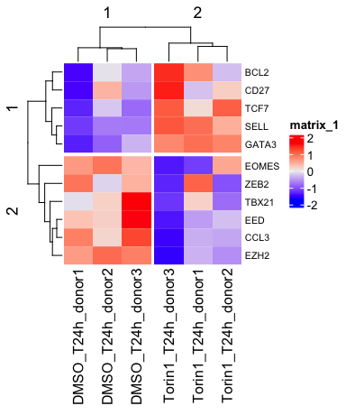
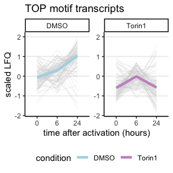
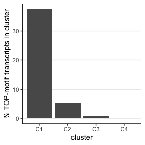
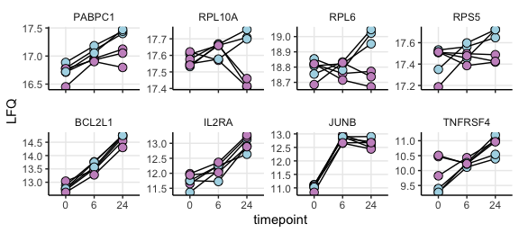
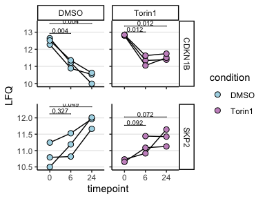
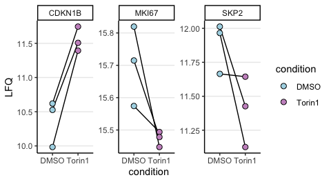
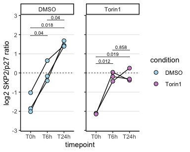

Misc analyses on Torin sensitive clusters
================
Kaspar Bresser

- [Import and tidy data](#import-and-tidy-data)
- [Differentiation](#differentiation)
- [Translation (TOP-motif)](#translation-top-motif)
- [Proliferation (SKP2)](#proliferation-skp2)

First load packages

``` r
library(tidyverse)
library(lemon)
library(gghighlight)
library(RColorBrewer)
library(msigdbr)
library(ComplexHeatmap)
library(rstatix)
library(ggpubr)
```

## Import and tidy data

Select proteins that have a “proteotypic” count of more than 1.

``` r
read_tsv("Data/20240624_TOOPS_output_report.pr_matrix.tsv") %>% 
  dplyr::select(Protein.Group, Genes, Proteotypic, Precursor.Id, matches('\\.d$')) %>%
    gather('Sample', 'Intensity', matches('\\.d$')) %>%
    filter(!is.na(Intensity)) %>%
    filter(Proteotypic == T) %>% #<< cuts a lot of proteins
    group_by(Protein.Group) %>%
    distinct(Precursor.Id, .keep_all = T) %>%
    summarise(count = n()) %>%
    filter(count > 1)  %>%
    dplyr::pull(Protein.Group) -> select.prots

str(select.prots)
```

    ##  chr [1:6945] "A0A024RBG1" "A0A075B6T6" "A0A0B4J245" "A0A0U1RRE5" "A0AVK6" ...

Import proteomic quantification data

``` r
dat <- read_tsv("Data/20240624_TOOPS_output_report.pg_matrix.tsv")

dat
```

    ## # A tibble: 8,194 × 26
    ##    Protein.Group          Protein.Ids Protein.Names Genes First.Protein.Descri…¹
    ##    <chr>                  <chr>       <chr>         <chr> <chr>                 
    ##  1 A0A024RBG1             A0A024RBG1  NUD4B_HUMAN   NUDT… Diphosphoinositol pol…
    ##  2 A0A024RBG1;O95989;Q9N… Q9NZJ9;Q8N… NUD4B_HUMAN;… NUDT… Diphosphoinositol pol…
    ##  3 A0A024RBG1;Q9NZJ9      Q9NZJ9;A0A… NUD4B_HUMAN;… NUDT… Diphosphoinositol pol…
    ##  4 A0A075B6T6             A0A075B6T6  TVAL2_HUMAN   TRAV… T cell receptor alpha…
    ##  5 A0A087WW87;P01614      P01614;A0A… KV240_HUMAN;… IGKV… Immunoglobulin kappa …
    ##  6 A0A0A6YYC5             A0A0A6YYC5  TVA14_HUMAN   TRAV… T cell receptor alpha…
    ##  7 A0A0A6YYJ7             A0A0A6YYJ7  TVA83_HUMAN   TRAV… T cell receptor alpha…
    ##  8 A0A0A6YYK7             A0A0A6YYK7  TVA19_HUMAN   TRAV… T cell receptor alpha…
    ##  9 A0A0B4J245             A0A0B4J245  TVAL1_HUMAN   TRAV… T cell receptor alpha…
    ## 10 A0A0B4J275             A0A0B4J275  TVA17_HUMAN   TRAV… T cell receptor alpha…
    ## # ℹ 8,184 more rows
    ## # ℹ abbreviated name: ¹​First.Protein.Description
    ## # ℹ 21 more variables:
    ## #   `C:\\Users\\massspecuser\\Desktop\\20240622_Carmen\\RES00360_Anouk_Jurgens\\20240620_AnoukJurgens_TOOPS\\1_0h_DMSO_donor1_S2-A10_1_9342.d` <dbl>,
    ## #   `C:\\Users\\massspecuser\\Desktop\\20240622_Carmen\\RES00360_Anouk_Jurgens\\20240620_AnoukJurgens_TOOPS\\2_0h_6hTorin1_Donor1_S2-B10_1_9343.d` <dbl>,
    ## #   `C:\\Users\\massspecuser\\Desktop\\20240622_Carmen\\RES00360_Anouk_Jurgens\\20240620_AnoukJurgens_TOOPS\\3_0h_24hTorin1_Donor1_S2-C10_1_9344.d` <dbl>,
    ## #   `C:\\Users\\massspecuser\\Desktop\\20240622_Carmen\\RES00360_Anouk_Jurgens\\20240620_AnoukJurgens_TOOPS\\4_6h_DMSO_Donor1_S2-D10_1_9345.d` <dbl>, …

Tidy up a bit, and convert abundances to log2

``` r
dat %>% 
  filter(Protein.Group %in% select.prots) %>% 
  pivot_longer(contains("Users"), names_to = "sample", values_to = "LFQ") %>% 
  mutate(sample = str_extract(sample, "\\d+_\\d+h_.+onor\\d+")) %>% 
  separate(sample, into = c("sample.nr", "timepoint", "condition", "donor")) %>% 
  mutate(donor = str_to_lower(donor)) %>% 
  mutate(LFQ = log2(LFQ)) %>% 
  mutate(condition = factor(condition, levels = c("DMSO", "6hTorin1", "24hTorin1", "Torin1"))) %>% 
  mutate(timepoint = factor(timepoint, levels = c("0h", "6h", "24h")))-> dat

dat
```

    ## # A tibble: 145,845 × 10
    ##    Protein.Group Protein.Ids Protein.Names Genes  First.Protein.Description     
    ##    <chr>         <chr>       <chr>         <chr>  <chr>                         
    ##  1 A0A024RBG1    A0A024RBG1  NUD4B_HUMAN   NUDT4B Diphosphoinositol polyphospha…
    ##  2 A0A024RBG1    A0A024RBG1  NUD4B_HUMAN   NUDT4B Diphosphoinositol polyphospha…
    ##  3 A0A024RBG1    A0A024RBG1  NUD4B_HUMAN   NUDT4B Diphosphoinositol polyphospha…
    ##  4 A0A024RBG1    A0A024RBG1  NUD4B_HUMAN   NUDT4B Diphosphoinositol polyphospha…
    ##  5 A0A024RBG1    A0A024RBG1  NUD4B_HUMAN   NUDT4B Diphosphoinositol polyphospha…
    ##  6 A0A024RBG1    A0A024RBG1  NUD4B_HUMAN   NUDT4B Diphosphoinositol polyphospha…
    ##  7 A0A024RBG1    A0A024RBG1  NUD4B_HUMAN   NUDT4B Diphosphoinositol polyphospha…
    ##  8 A0A024RBG1    A0A024RBG1  NUD4B_HUMAN   NUDT4B Diphosphoinositol polyphospha…
    ##  9 A0A024RBG1    A0A024RBG1  NUD4B_HUMAN   NUDT4B Diphosphoinositol polyphospha…
    ## 10 A0A024RBG1    A0A024RBG1  NUD4B_HUMAN   NUDT4B Diphosphoinositol polyphospha…
    ## # ℹ 145,835 more rows
    ## # ℹ 5 more variables: sample.nr <chr>, timepoint <fct>, condition <fct>,
    ## #   donor <chr>, LFQ <dbl>

``` r
write_tsv(dat, "Data/abundances_protein_all_Torin.tsv")
```

Make table to use for plots

``` r
dat %>% 
  filter(condition != "6hTorin1") %>% 
  mutate(condition = case_when(condition == "24hTorin1" ~ "Torin1",
                               TRUE ~ condition)) %>% 
  mutate(timepoint = paste0("T", timepoint)) %>% 
  dplyr::select(sample.nr, Genes, timepoint, condition, donor, LFQ) %>% 
  group_by(Genes) %>%
  filter(n() < 21) %>% 
  ungroup() -> dat.forDE
```

## Differentiation

Select on some example proteins that are nice markers for T cell
differentiation

``` r
genes <- c( "TCF7", "LEF", "CCR7",  "ZEB2", "TBX21", "BCL2",  "EOMES",   "SELL", "CCR2", "EZH2", "EED", "GATA3",   "CD27",  "CCL3")

dat.forDE %>% 
  dplyr::select(-sample.nr) %>% 
  pivot_wider(names_from = c(condition, timepoint, donor), values_from = LFQ) %>% 
  dplyr::select(Genes, contains("24h")) %>% 
  filter(Genes %in% genes) %>% 
  column_to_rownames('Genes') %>%
                  t() %>%
                scale() %>%
                t() -> dat.for.cluster
```

Plot heatmap

``` r
Heatmap(dat.for.cluster,
    cluster_columns = T,
    clustering_distance_columns = "euclidean",
    show_row_names = T,
    show_row_dend = T,
    show_column_dend = T,
    show_column_names = T,
    # col = colorRamp2(c(-18, 0, 8),c('blue', 'white', 'red')),
 #   column_split = pheno$ct,
    row_split = 2,
 column_split = 2,
    row_names_gp = grid::gpar(fontsize = 8))
```



## Translation (TOP-motif)

Get protein cluster annotations

``` r
clusters <- read_tsv("Output/cluster_annotation.tsv")
```

set function for scaling

``` r
scale_this <- function(x){
  (x - mean(x, na.rm=TRUE)) / sd(x, na.rm=TRUE)
}
```

Import TOP protein annotation and plot expression of those.

``` r
tmp <- read_tsv("Data/TOP_proteins.tsv") %>% pull(Gene.symbol) %>% str_to_upper()

dat.forDE %>% 
  filter(Genes %in% tmp) %>% 
  group_by(Genes) %>% 
  mutate(scaled.LFQ = scale_this(LFQ)) %>% 
  group_by(Genes,  timepoint, condition) %>% 
  summarise(LFQ = mean(LFQ),
            scaled.LFQ = mean(scaled.LFQ)) %>% 
  mutate(timepoint = factor(timepoint, levels = c("T0h", "T6h", "T24h")),
         timepoint = fct_relabel(timepoint, str_remove_all, "T|h")) %>% 
ggplot(aes(x = timepoint, y = scaled.LFQ, color = condition))+
 # geom_line(aes(group = paste0(Genes, condition)))+
  geom_line(color = "lightgrey", linewidth = .1, aes(group = paste0(Genes, condition)))+
  stat_summary(aes(group=condition, color = factor(condition)), fun = median, geom = "line", linewidth = 1.5)+
  facet_rep_wrap(~condition, nrow = 1, repeat.tick.labels = T)+
    scale_color_manual(values = c("lightblue", "#C994C7"))+
  theme_classic()+
  theme(panel.grid.major.y = element_line(), legend.position = "bottom")+
  labs(x = "time after activation (hours)", y = "scaled LFQ", title = "TOP motif transcripts")
```



``` r
ggsave("Figs/TOP_induction.pdf", width = 2.5, height = 3)
```

plot presence of TOP motif transcripts in the clusters

``` r
clusters %>% 
  mutate(TOP = case_when(Gene %in% tmp ~ "TOP", TRUE ~ "nonTOP")) %>% 
  count(cluster, TOP) %>% 
  pivot_wider(names_from = TOP, values_from = n, values_fill = 0) %>% 
  mutate(perc = (TOP/nonTOP)*100) %>% 
ggplot(aes(x = cluster, y = perc))+
  geom_bar(stat = "identity")+
  theme_classic()+
  theme(panel.grid.major.y = element_line(), legend.position = "bottom")+
  labs(y = "% TOP-motif transcripts in cluster")
```



``` r
ggsave("Figs/TOP_percentage_clusters.pdf", width = 2.5, height = 3)
```

## Proliferation (SKP2)

Example proteins of T cell activation

``` r
genes <- c("PABPC1", "RPL10A", "RPL6", "RPS5",
           "BCL2L1", "IL2RA", "JUNB", "TNFRSF4")

dat.forDE %>% 
  filter(Genes %in% genes) %>% 
  mutate(timepoint = factor(timepoint, levels = c("T0h", "T6h", "T24h")),
         timepoint = fct_relabel(timepoint, str_remove_all, "T|h")) %>% 
  mutate(Genes = factor(Genes, levels = genes)) %>% 
ggplot(aes(x = timepoint, y = LFQ))+
  geom_line(aes( group = paste0(condition,donor)))+
  geom_point(shape = 21, size = 3, aes(fill = condition))+
  facet_rep_wrap(~Genes, nrow = 2, scales = "free_y")+
  scale_fill_manual(values = c("lightblue", "#C994C7"))+
  scale_y_continuous(
    labels = scales::number_format(accuracy = .1),
    breaks = scales::breaks_pretty(n = 4))+
  theme_classic()+
  theme(panel.grid.major = element_line(), legend.position = "none",
        strip.background = element_blank())
```



``` r
ggsave("Figs/pathways_activation_examples.pdf", width = 5.6, height = 5.3, scale = 1)
```

SKP2 plots

``` r
dat.forDE %>% 
  filter(Genes %in% c("SKP2", "CDKN1B")) %>% 
  mutate(timepoint = factor(timepoint, levels = c("T0h", "T6h", "T24h")),
         timepoint = fct_relabel(timepoint, str_remove_all, "T|h")) %>% 
  group_by(Genes, condition) %>% 
  t_test(LFQ~timepoint, ref.group = "0") %>% 
  add_xy_position(step.increase = .14, scales = "free_y") -> stat.test


dat.forDE %>% 
  filter(Genes %in% c("SKP2", "CDKN1B")) %>% 
  mutate(timepoint = factor(timepoint, levels = c("T0h", "T6h", "T24h")),
         timepoint = fct_relabel(timepoint, str_remove_all, "T|h")) %>% 
ggplot(aes(x = timepoint, y = LFQ))+
  geom_line(aes( group = paste0(condition,donor)))+
  geom_point(shape = 21, size = 2.5, aes(fill = condition))+
  facet_rep_grid(Genes~condition,  scales = "free_y")+
  scale_fill_manual(values = c("lightblue", "#C994C7"))+
  theme_classic()+
  theme(panel.grid.major.y = element_line())+
  stat_pvalue_manual(data = stat.test,  label = "p.adj", 
                     tip.length = 0, hide.ns = F, label.size = 2.5 )
```

    ## Warning: Removed 1 row containing missing values or values outside the scale range
    ## (`geom_point()`).



``` r
ggsave("Figs/examples_proliferation_time.pdf", width = 3, height = 4)
```

    ## Warning: Removed 1 row containing missing values or values outside the scale range
    ## (`geom_point()`).

``` r
dat.forDE %>% 
  filter(Genes %in% c("MKI67", "SKP2", "CDKN1B")) %>%
  filter(timepoint == "T24h") %>% 
#  mutate(timepoint = factor(timepoint, levels = c("T0h", "T6h", "T24h"))) %>% 
ggplot(aes(x = condition, y = LFQ))+
  geom_line(aes(group = donor))+
  geom_point(aes(fill = condition), size = 2.5, shape = 21)+
  scale_fill_manual(values = c("lightblue", "#C994C7"))+

  facet_rep_wrap(~Genes, scales = "free_y", )+
  theme_classic()+
  theme(panel.grid.major.y = element_line())
```



``` r
ggsave("Figs/examples_proliferation_24h.pdf", width = 4.5, height = 3)
```

``` r
dat.forDE %>% 
  filter(Genes %in% c("SKP2", "CDKN1B")) %>%
  mutate(LFQ = 2^LFQ) %>% 
  pivot_wider(names_from = Genes, values_from = LFQ) %>% 
  mutate(ratio = log2(SKP2/CDKN1B)) %>% 
  mutate(timepoint = factor(timepoint, levels = c("T0h", "T6h", "T24h"))) %>% 
  group_by(condition) %>% 
  t_test(ratio~timepoint) %>% 
  add_xy_position(step.increase = .1, scales = "free_y") -> stat.test


dat.forDE %>% 
  filter(Genes %in% c("SKP2", "CDKN1B")) %>%
  mutate(LFQ = 2^LFQ) %>% 
  pivot_wider(names_from = Genes, values_from = LFQ) %>% 
  mutate(ratio = log2(SKP2/CDKN1B)) %>% 
  mutate(timepoint = factor(timepoint, levels = c("T0h", "T6h", "T24h"))) %>% 
ggplot(aes(x = timepoint, y = ratio))+
  geom_line(aes(group = paste0(donor, condition)))+
  geom_point(aes(fill = condition), size = 2.5, shape = 21)+
  scale_fill_manual(values = c("lightblue", "#C994C7"))+
  facet_rep_wrap(~condition )+
  scale_y_symmetric()+
  theme_classic()+
  theme(panel.grid.major.y = element_line())+
  geom_hline(yintercept = 0, linetype = "dotted")+
  labs(y = "log2 SKP2/p27 ratio")+
  stat_pvalue_manual(data = stat.test,  label = "p.adj", 
                     tip.length = 0, hide.ns = F, label.size = 2.5 )
```

    ## Warning: Removed 1 row containing missing values or values outside the scale range
    ## (`geom_line()`).

    ## Warning: Removed 1 row containing missing values or values outside the scale range
    ## (`geom_point()`).



``` r
ggsave("Figs/examples_proliferation_ratio.pdf", width = 3.4, height = 2.5)
```

    ## Warning: Removed 1 row containing missing values or values outside the scale range
    ## (`geom_line()`).
    ## Removed 1 row containing missing values or values outside the scale range
    ## (`geom_point()`).
