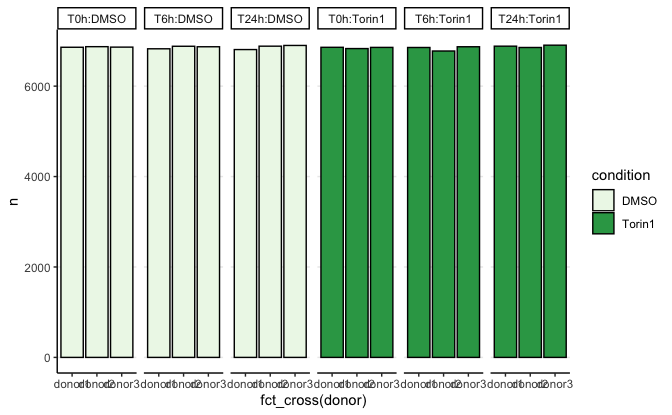
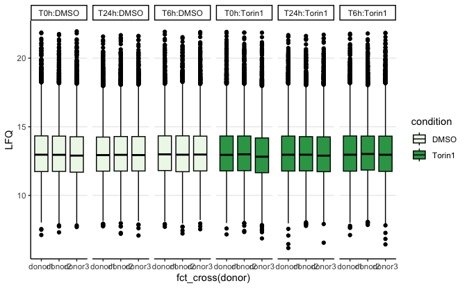
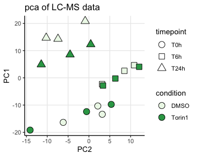
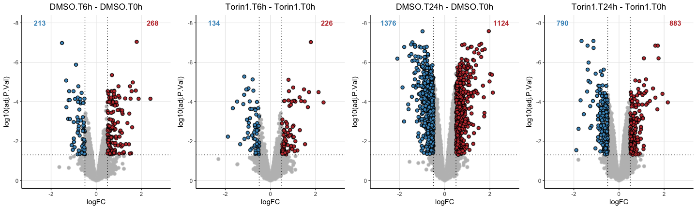
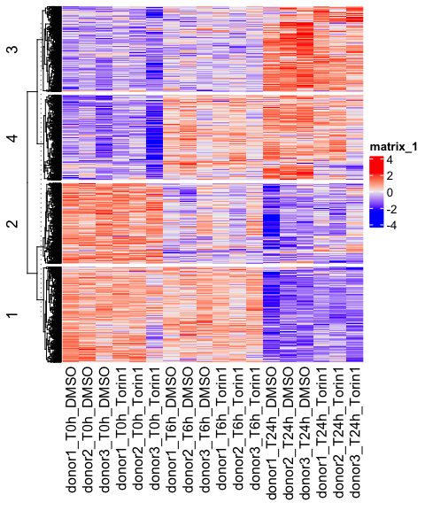

Supplementary figure Torin-1 LC-MS data
================
Kaspar Bresser

- [Import and tidy data](#import-and-tidy-data)
  - [number of proteins](#number-of-proteins)
  - [Abundance LFQ](#abundance-lfq)
  - [PCA](#pca)
- [Test differences](#test-differences)
  - [plotting](#plotting)

First load packages

``` r
library(tidyverse)
library(broom) 
library(limma)
library(ggrepel)
library(readxl)
library(circlize)
library(ComplexHeatmap)
library(cluster)
library(lemon)
library(gghighlight)
library(RColorBrewer)
library(ggrastr)
```

## Import and tidy data

Select the proteins that have a “proteotypic” count of more than 1.

``` r
read_tsv("Data/20240624_TOOPS_output_report.pr_matrix.tsv") %>% 
  dplyr::select(Protein.Group, Genes, Proteotypic, Precursor.Id, matches('\\.d$')) %>%
    gather('Sample', 'Intensity', matches('\\.d$')) %>%
    filter(!is.na(Intensity)) %>%
    filter(Proteotypic == T) %>% #<< cuts a lot of proteins
    group_by(Protein.Group) %>%
    distinct(Precursor.Id, .keep_all = T) %>%
    summarise(count = n()) %>%
    filter(count > 1)  %>%
    dplyr::pull(Protein.Group) -> select.prots

str(select.prots)
```

    ##  chr [1:6945] "A0A024RBG1" "A0A075B6T6" "A0A0B4J245" "A0A0U1RRE5" "A0AVK6" ...

import proteomic quantification data

``` r
dat <- read_tsv("Data/20240624_TOOPS_output_report.pg_matrix.tsv")

dat
```

    ## # A tibble: 8,194 × 26
    ##    Protein.Group          Protein.Ids Protein.Names Genes First.Protein.Descri…¹
    ##    <chr>                  <chr>       <chr>         <chr> <chr>                 
    ##  1 A0A024RBG1             A0A024RBG1  NUD4B_HUMAN   NUDT… Diphosphoinositol pol…
    ##  2 A0A024RBG1;O95989;Q9N… Q9NZJ9;Q8N… NUD4B_HUMAN;… NUDT… Diphosphoinositol pol…
    ##  3 A0A024RBG1;Q9NZJ9      Q9NZJ9;A0A… NUD4B_HUMAN;… NUDT… Diphosphoinositol pol…
    ##  4 A0A075B6T6             A0A075B6T6  TVAL2_HUMAN   TRAV… T cell receptor alpha…
    ##  5 A0A087WW87;P01614      P01614;A0A… KV240_HUMAN;… IGKV… Immunoglobulin kappa …
    ##  6 A0A0A6YYC5             A0A0A6YYC5  TVA14_HUMAN   TRAV… T cell receptor alpha…
    ##  7 A0A0A6YYJ7             A0A0A6YYJ7  TVA83_HUMAN   TRAV… T cell receptor alpha…
    ##  8 A0A0A6YYK7             A0A0A6YYK7  TVA19_HUMAN   TRAV… T cell receptor alpha…
    ##  9 A0A0B4J245             A0A0B4J245  TVAL1_HUMAN   TRAV… T cell receptor alpha…
    ## 10 A0A0B4J275             A0A0B4J275  TVA17_HUMAN   TRAV… T cell receptor alpha…
    ## # ℹ 8,184 more rows
    ## # ℹ abbreviated name: ¹​First.Protein.Description
    ## # ℹ 21 more variables:
    ## #   `C:\\Users\\massspecuser\\Desktop\\20240622_Carmen\\RES00360_Anouk_Jurgens\\20240620_AnoukJurgens_TOOPS\\1_0h_DMSO_donor1_S2-A10_1_9342.d` <dbl>,
    ## #   `C:\\Users\\massspecuser\\Desktop\\20240622_Carmen\\RES00360_Anouk_Jurgens\\20240620_AnoukJurgens_TOOPS\\2_0h_6hTorin1_Donor1_S2-B10_1_9343.d` <dbl>,
    ## #   `C:\\Users\\massspecuser\\Desktop\\20240622_Carmen\\RES00360_Anouk_Jurgens\\20240620_AnoukJurgens_TOOPS\\3_0h_24hTorin1_Donor1_S2-C10_1_9344.d` <dbl>,
    ## #   `C:\\Users\\massspecuser\\Desktop\\20240622_Carmen\\RES00360_Anouk_Jurgens\\20240620_AnoukJurgens_TOOPS\\4_6h_DMSO_Donor1_S2-D10_1_9345.d` <dbl>, …

Tidy up a bit, and convert abundances to log2

``` r
dat %>% 
  filter(Protein.Group %in% select.prots) %>% 
  pivot_longer(contains("Users"), names_to = "sample", values_to = "LFQ") %>% 
  mutate(sample = str_extract(sample, "\\d+_\\d+h_.+onor\\d+")) %>% 
  separate(sample, into = c("sample.nr", "timepoint", "condition", "donor")) %>% 
  mutate(donor = str_to_lower(donor)) %>% 
  mutate(LFQ = log2(LFQ)) %>% 
  mutate(condition = factor(condition, levels = c("DMSO", "6hTorin1", "24hTorin1", "Torin1"))) %>% 
  mutate(timepoint = factor(timepoint, levels = c("0h", "6h", "24h")))-> dat

dat
```

    ## # A tibble: 145,845 × 10
    ##    Protein.Group Protein.Ids Protein.Names Genes  First.Protein.Description     
    ##    <chr>         <chr>       <chr>         <chr>  <chr>                         
    ##  1 A0A024RBG1    A0A024RBG1  NUD4B_HUMAN   NUDT4B Diphosphoinositol polyphospha…
    ##  2 A0A024RBG1    A0A024RBG1  NUD4B_HUMAN   NUDT4B Diphosphoinositol polyphospha…
    ##  3 A0A024RBG1    A0A024RBG1  NUD4B_HUMAN   NUDT4B Diphosphoinositol polyphospha…
    ##  4 A0A024RBG1    A0A024RBG1  NUD4B_HUMAN   NUDT4B Diphosphoinositol polyphospha…
    ##  5 A0A024RBG1    A0A024RBG1  NUD4B_HUMAN   NUDT4B Diphosphoinositol polyphospha…
    ##  6 A0A024RBG1    A0A024RBG1  NUD4B_HUMAN   NUDT4B Diphosphoinositol polyphospha…
    ##  7 A0A024RBG1    A0A024RBG1  NUD4B_HUMAN   NUDT4B Diphosphoinositol polyphospha…
    ##  8 A0A024RBG1    A0A024RBG1  NUD4B_HUMAN   NUDT4B Diphosphoinositol polyphospha…
    ##  9 A0A024RBG1    A0A024RBG1  NUD4B_HUMAN   NUDT4B Diphosphoinositol polyphospha…
    ## 10 A0A024RBG1    A0A024RBG1  NUD4B_HUMAN   NUDT4B Diphosphoinositol polyphospha…
    ## # ℹ 145,835 more rows
    ## # ℹ 5 more variables: sample.nr <chr>, timepoint <fct>, condition <fct>,
    ## #   donor <chr>, LFQ <dbl>

``` r
dat %>% 
  filter(condition != "6hTorin1") %>% 
  mutate(condition = case_when(condition == "24hTorin1" ~ "Torin1",
                               TRUE ~ condition)) %>% 
  mutate(timepoint = paste0("T", timepoint)) %>% 
  dplyr::select(sample.nr, Genes, timepoint, condition, donor, LFQ) %>% 
  group_by(Genes) %>%
  filter(n() < 21) %>% 
  ungroup() -> dat.forDE
```

### number of proteins

``` r
library(RColorBrewer)
library(ggh4x)

dat.forDE %>% 
  na.omit() %>% 
  count(timepoint, donor, condition) %>% 
  mutate(timepoint = factor(timepoint, levels = c("T0h", "T6h", "T24h"))) %>% 
  ggplot(aes(x = fct_cross(donor), y = n, fill = condition))+
    geom_bar(stat = "identity", color = "black")+
    scale_fill_manual(values = brewer.pal(5, "Greens")[c(1,4)])+
    theme_classic()+
    theme(panel.grid.major.y = element_line())+
    facet_grid2(~fct_cross(timepoint, condition), scales = "free_x", space = "free_x")
```



``` r
ggsave("Figs/Supplementary3/protein_detected.pdf", width = 5.4, height = 2.3)
```

### Abundance LFQ

``` r
dat.forDE %>% 
  ggplot(aes(x = fct_cross(donor), y = LFQ, fill = condition))+
    geom_boxplot( color = "black")+
    scale_fill_manual(values = brewer.pal(5, "Greens")[c(1,4)])+
    theme_classic()+
    theme(panel.grid.major.y = element_line())+
    facet_grid2(~fct_cross(timepoint, condition), scales = "free_x", space = "free_x")
```

    ## Warning: Removed 1277 rows containing non-finite outside the scale range
    ## (`stat_boxplot()`).



``` r
ggsave("Figs/Supplementary3/protein_abundance.pdf", width = 5.4, height = 2.3)
```

    ## Warning: Removed 1277 rows containing non-finite outside the scale range
    ## (`stat_boxplot()`).

### PCA

``` r
dat.forDE %>% 
  group_by(Genes, timepoint, donor, condition) %>% 
  summarise(LFQ = median(LFQ)) %>% 
  ungroup() %>% 
  pivot_wider(names_from = c(donor, timepoint, condition), values_from = LFQ) %>% 
  na.omit() %>% 
  column_to_rownames("Genes") -> dat.pca
```

``` r
dat.pca %>% 
  t() %>% 
  as.data.frame() %>% 
  prcomp(center = T, scale = F) -> pca
```

``` r
library(RColorBrewer)
as.data.frame(pca$x) %>% 
  rownames_to_column("sample") %>% 
  separate(sample, into = c("donor", "timepoint", "condition")) %>% 
  mutate(timepoint = factor(timepoint, levels = c("T0h",  "T6h", "T24h"))) %>% 
ggplot(aes(x = PC2, y = PC1, fill = condition, shape = timepoint))+
  geom_point(size = 4)+
  scale_shape_manual(values = c(21, 22, 24))+
    scale_fill_manual(values = brewer.pal(5, "Greens")[c(1,4)])+
  ggtitle("pca of LC-MS data")+
  theme_classic()+
  theme(panel.grid.major = element_line())+
  guides(fill = guide_legend("condition", override.aes = list(shape = 21)))
```



``` r
ggsave("Figs/Supplementary3/protein_pca.pdf", width = 3.5, height = 2.5)
```

## Test differences

will test for differences using limma

Set up a design matrix, we want to compare between time-points

``` r
dat.forDE %>% 
  mutate(sample.id = paste0(condition, ".", timepoint)) %>% 
  dplyr::select(sample.nr, sample.id, donor) %>% 
  distinct() %>% 
  mutate(sample.id = as.factor(sample.id))-> pheno

design <- model.matrix(~0+ pheno$sample.id)
colnames(design) <- levels(pheno$sample.id)

design
```

    ##    DMSO.T0h DMSO.T24h DMSO.T6h Torin1.T0h Torin1.T24h Torin1.T6h
    ## 1         1         0        0          0           0          0
    ## 2         0         0        0          1           0          0
    ## 3         0         0        1          0           0          0
    ## 4         0         0        0          0           0          1
    ## 5         0         1        0          0           0          0
    ## 6         0         0        0          0           1          0
    ## 7         1         0        0          0           0          0
    ## 8         0         0        0          1           0          0
    ## 9         0         0        1          0           0          0
    ## 10        0         0        0          0           0          1
    ## 11        0         1        0          0           0          0
    ## 12        0         0        0          0           1          0
    ## 13        1         0        0          0           0          0
    ## 14        0         0        0          1           0          0
    ## 15        0         0        1          0           0          0
    ## 16        0         0        0          0           0          1
    ## 17        0         1        0          0           0          0
    ## 18        0         0        0          0           1          0
    ## attr(,"assign")
    ## [1] 1 1 1 1 1 1
    ## attr(,"contrasts")
    ## attr(,"contrasts")$`pheno$sample.id`
    ## [1] "contr.treatment"

Get the LFQ values for all samples and fit linear model.

lmFit needs samples to be columns, and genes to be row names.

``` r
dat.forDE %>% 
  pivot_wider(names_from = c(sample.nr, condition ,timepoint, donor), values_from = LFQ) %>% 
  na.omit() %>% 
  distinct(Genes, .keep_all = T) %>% 
  column_to_rownames("Genes") %>% 
  dplyr::select(contains("donor")) %>% 
  lmFit(., design) -> lm.fit

str(lm.fit)
```

    ## Formal class 'MArrayLM' [package "limma"] with 1 slot
    ##   ..@ .Data:List of 12
    ##   .. ..$ : num [1:6478, 1:6] 15.3 14.8 11.7 10.8 11.7 ...
    ##   .. .. ..- attr(*, "dimnames")=List of 2
    ##   .. .. .. ..$ : chr [1:6478] "UBA6" "ESYT2" "MED19" "UHRF1BP1L" ...
    ##   .. .. .. ..$ : chr [1:6] "DMSO.T0h" "DMSO.T24h" "DMSO.T6h" "Torin1.T0h" ...
    ##   .. ..$ : int 6
    ##   .. ..$ : int [1:6] 1 1 1 1 1 1
    ##   .. ..$ :List of 5
    ##   .. .. ..$ qr   : num [1:18, 1:6] -1.73 0 0 0 0 ...
    ##   .. .. .. ..- attr(*, "dimnames")=List of 2
    ##   .. .. .. .. ..$ : chr [1:18] "1" "2" "3" "4" ...
    ##   .. .. .. .. ..$ : chr [1:6] "DMSO.T0h" "DMSO.T24h" "DMSO.T6h" "Torin1.T0h" ...
    ##   .. .. .. ..- attr(*, "assign")= int [1:6] 1 1 1 1 1 1
    ##   .. .. .. ..- attr(*, "contrasts")=List of 1
    ##   .. .. .. .. ..$ pheno$sample.id: chr "contr.treatment"
    ##   .. .. ..$ qraux: num [1:6] 1.58 1 1.58 1 1 ...
    ##   .. .. ..$ pivot: int [1:6] 1 2 3 4 5 6
    ##   .. .. ..$ tol  : num 1e-07
    ##   .. .. ..$ rank : int 6
    ##   .. .. ..- attr(*, "class")= chr "qr"
    ##   .. ..$ : int [1:6478] 12 12 12 12 12 12 12 12 12 12 ...
    ##   .. ..$ : Named num [1:6478] 0.0735 0.055 0.2608 0.1708 0.2257 ...
    ##   .. .. ..- attr(*, "names")= chr [1:6478] "UBA6" "ESYT2" "MED19" "UHRF1BP1L" ...
    ##   .. ..$ : num [1:6, 1:6] 0.333 0 0 0 0 ...
    ##   .. .. ..- attr(*, "dimnames")=List of 2
    ##   .. .. .. ..$ : chr [1:6] "DMSO.T0h" "DMSO.T24h" "DMSO.T6h" "Torin1.T0h" ...
    ##   .. .. .. ..$ : chr [1:6] "DMSO.T0h" "DMSO.T24h" "DMSO.T6h" "Torin1.T0h" ...
    ##   .. ..$ : num [1:6478, 1:6] 0.577 0.577 0.577 0.577 0.577 ...
    ##   .. .. ..- attr(*, "dimnames")=List of 2
    ##   .. .. .. ..$ : chr [1:6478] "UBA6" "ESYT2" "MED19" "UHRF1BP1L" ...
    ##   .. .. .. ..$ : chr [1:6] "DMSO.T0h" "DMSO.T24h" "DMSO.T6h" "Torin1.T0h" ...
    ##   .. ..$ : int [1:6] 1 2 3 4 5 6
    ##   .. ..$ : Named num [1:6478] 15.3 14.9 11.7 10.9 11.9 ...
    ##   .. .. ..- attr(*, "names")= chr [1:6478] "UBA6" "ESYT2" "MED19" "UHRF1BP1L" ...
    ##   .. ..$ : chr "ls"
    ##   .. ..$ : num [1:18, 1:6] 1 0 0 0 0 0 1 0 0 0 ...
    ##   .. .. ..- attr(*, "dimnames")=List of 2
    ##   .. .. .. ..$ : chr [1:18] "1" "2" "3" "4" ...
    ##   .. .. .. ..$ : chr [1:6] "DMSO.T0h" "DMSO.T24h" "DMSO.T6h" "Torin1.T0h" ...
    ##   .. .. ..- attr(*, "assign")= int [1:6] 1 1 1 1 1 1
    ##   .. .. ..- attr(*, "contrasts")=List of 1
    ##   .. .. .. ..$ pheno$sample.id: chr "contr.treatment"
    ##   ..$ names: chr [1:12] "coefficients" "rank" "assign" "qr" ...

Make a contrast matrix for the comparisons of interest

``` r
contrast.matrix <- makeContrasts(
  
  Torin1.T6h - Torin1.T0h,
  Torin1.T24h - Torin1.T0h,
  DMSO.T6h - DMSO.T0h,
  DMSO.T24h -DMSO.T0h,
    Torin1.T0h - DMSO.T0h,
  Torin1.T6h - DMSO.T6h,
  Torin1.T24h - DMSO.T24h,
  
  levels = design)

contrast.matrix
```

    ##              Contrasts
    ## Levels        Torin1.T6h - Torin1.T0h Torin1.T24h - Torin1.T0h
    ##   DMSO.T0h                          0                        0
    ##   DMSO.T24h                         0                        0
    ##   DMSO.T6h                          0                        0
    ##   Torin1.T0h                       -1                       -1
    ##   Torin1.T24h                       0                        1
    ##   Torin1.T6h                        1                        0
    ##              Contrasts
    ## Levels        DMSO.T6h - DMSO.T0h DMSO.T24h - DMSO.T0h Torin1.T0h - DMSO.T0h
    ##   DMSO.T0h                     -1                   -1                    -1
    ##   DMSO.T24h                     0                    1                     0
    ##   DMSO.T6h                      1                    0                     0
    ##   Torin1.T0h                    0                    0                     1
    ##   Torin1.T24h                   0                    0                     0
    ##   Torin1.T6h                    0                    0                     0
    ##              Contrasts
    ## Levels        Torin1.T6h - DMSO.T6h Torin1.T24h - DMSO.T24h
    ##   DMSO.T0h                        0                       0
    ##   DMSO.T24h                       0                      -1
    ##   DMSO.T6h                       -1                       0
    ##   Torin1.T0h                      0                       0
    ##   Torin1.T24h                     0                       1
    ##   Torin1.T6h                      1                       0

Compute differential expression

``` r
# fit contrasts
lm.fit2 <- contrasts.fit(lm.fit, contrast.matrix)
# ebayes
lm.fit2 <- eBayes(lm.fit2)
```

Check number of significant DE proteins

``` r
results <- decideTests(lm.fit2, p.value = 0.05, adjust.method = 'BH', lfc = 0.1)
summary(results)
```

    ##        Torin1.T6h - Torin1.T0h Torin1.T24h - Torin1.T0h DMSO.T6h - DMSO.T0h
    ## Down                       134                      790                 213
    ## NotSig                    6118                     4805                5997
    ## Up                         226                      883                 268
    ##        DMSO.T24h - DMSO.T0h Torin1.T0h - DMSO.T0h Torin1.T6h - DMSO.T6h
    ## Down                   1376                     1                     1
    ## NotSig                 3978                  6465                  6476
    ## Up                     1124                    12                     1
    ##        Torin1.T24h - DMSO.T24h
    ## Down                       177
    ## NotSig                    6225
    ## Up                          76

``` r
get_signifs <- function(fit, comp){
  
  topTable(fit, number = Inf, coef = comp, sort.by = 'none') %>% 
    filter(adj.P.Val < 0.05 & abs(logFC) > 0.5) %>% 
    rownames()
}
```

``` r
comparisons <- colnames(results)


comparisons %>% 
  map( ~topTable(lm.fit2, coef = ., number = Inf, sort.by = 'none')) %>% 
  map2(comparisons, ~mutate(.x, comparison = .y)) %>% 
  map(rownames_to_column, "Genes") %>% 
  list_rbind() %>% 
  mutate(treatment = case_when(str_detect(comparison, "Torin") ~ "Torin", TRUE ~ "DMSO")) -> all.DE.protein
```

### plotting

Function to plot volcano’s with counts

``` r
plt_volcanos <- function(dat, title){
  
  dat %>% 
    group_by(col) %>%
    count(adj.P.Val < 0.05) %>% 
    pull(n) %>% 
    as.character() -> cnts
  
  ggplot(dat, aes( x = logFC, y = log10(adj.P.Val)))+ 
  rasterise(geom_point(aes(fill = col), shape = 21, size = 2), dpi = 300, scale = 1.0)+
  scale_fill_manual(values = c( "#4796C5","#C23A3B"))+
  scale_y_reverse()+
  labs(title = "")+
  gghighlight(adj.P.Val < 0.05 & abs(logFC) > 0.5,  
              unhighlighted_params = list(shape = 21, fill = "grey"),  use_group_by = F)+
  theme_classic()+
  theme(legend.position = "none", plot.title = element_text(hjust = 0.5),
        panel.grid.major = element_line())+
    xlim(-3,3)+
    ylim(0, -8)+
  geom_vline(xintercept = c(0.5, -0.5), linetype ="dotted")+
  geom_hline(yintercept = log10(0.05), linetype ="dotted")+
  annotate(geom = "text", label = cnts[2], x=-2.5, y=-8, color = "#4796C5", fontface =2)+
  annotate(geom = "text", label =cnts[4], x=2.5, y=-8, color = "#C23A3B", fontface =2)+
  ggtitle(title)

}
```

Plot volcano’s with counts

``` r
comps <- c("Torin1.T0h - DMSO.T0h",
           "Torin1.T6h - DMSO.T6h",
           "Torin1.T24h - DMSO.T24h")

comps <- c("DMSO.T6h - DMSO.T0h",
           "Torin1.T6h - Torin1.T0h",
           "DMSO.T24h - DMSO.T0h",
           "Torin1.T24h - Torin1.T0h")
 
all.DE.protein %>% 
  filter(comparison %in% comps) %>% 
  mutate(comparison = fct_relevel(comparison, comps),
      #   comparison = fct_recode(comparison, T2h = "T2h - T0h", T4h = "T4h - T0h", T6h = "T6h - T0h", T24h = "T24h - T0h"),
         col = case_when(logFC > 0 ~ "up", TRUE ~ "down")) -> for.plot


for.plot %>% 
  nest(data = -comparison) %>% 
  mutate(comparison = factor(comparison, levels = comps)) %>% 
  arrange(comparison) %>% 
  mutate(plots = map2(data, comparison, plt_volcanos)) %>% 
  pull(plots) %>% 
  ggpubr::ggarrange(plotlist = . , ncol = 4)
```

    ## Warning: Removed 1 row containing missing values or values outside the scale range
    ## (`geom_point()`).
    ## Removed 1 row containing missing values or values outside the scale range
    ## (`geom_point()`).
    ## Removed 1 row containing missing values or values outside the scale range
    ## (`geom_point()`).
    ## Removed 1 row containing missing values or values outside the scale range
    ## (`geom_point()`).

    ## Warning: Removed 3 rows containing missing values or values outside the scale range
    ## (`geom_point()`).
    ## Removed 3 rows containing missing values or values outside the scale range
    ## (`geom_point()`).

    ## Warning: Removed 1 row containing missing values or values outside the scale range
    ## (`geom_point()`).
    ## Removed 1 row containing missing values or values outside the scale range
    ## (`geom_point()`).



``` r
ggsave("Figs/Supplementary3/protein_volcanos_DE.pdf", width = 12, height = 4)
```

``` r
all.DE.protein %>% 
  filter(adj.P.Val < 0.05) %>% 
  pull(Genes) -> genes


dat.forDE %>% 
  group_by(Genes, timepoint,condition, donor) %>% 
  summarise(LFQ = median(LFQ)) %>% 
  ungroup() %>% 
  mutate(timepoint = factor(timepoint, levels = c("T0h", "T6h", "T24h"))) %>% 
  arrange(timepoint,condition, donor) %>% 
  pivot_wider(names_from = c(donor, timepoint, condition), values_from = LFQ) %>% 
  na.omit() %>% 
  filter(Genes %in% genes) %>% 
  column_to_rownames("Genes") %>% 
  t() %>%
  scale() %>%
  t() -> dat.for.cluster
```

``` r
### heatmap
Heatmap(dat.for.cluster,
    cluster_columns = F,
    cluster_column_slices = F,
  #  clustering_distance_columns = "euclidean",
  use_raster = T,
  raster_quality = 10, 
  row_km = 4,
    show_row_names = F,
    show_row_dend = T,
    show_column_dend = T,
    show_column_names = T,
    # col = colorRamp2(c(-18, 0, 8),c('blue', 'white', 'red')),
 #   column_split = pheno$ct,
    row_names_gp = grid::gpar(fontsize = 8))#,cluster_columns = T, km = 3)
```



``` r
###350x350
```
